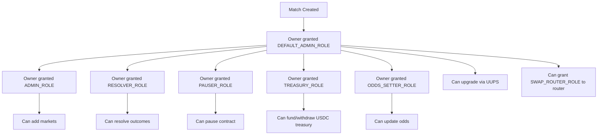

# ChilizTV Smart Contracts Architecture

This document illustrates the complete architecture of the **Chiliz-TV Dual System**:

## System Overview

### 1. Multi-Sport Betting System (UUPS Proxy Pattern)
- **BettingMatchFactory**: Deploys sport-specific match proxies
- **FootballMatch & BasketballMatch**: UUPS upgradeable implementations
- **ERC1967Proxy**: Each match is an independent upgradeable proxy instance
- **BettingSwapRouter**: Universal swap-and-bet router (CHZ / Fan Token / USDC → USDC → bet)
- **USDC Settlement**: All bets placed and paid out in USDC (6 decimals)
- **Dynamic Odds**: Real-time odds set by ODDS_SETTER_ROLE (x10000 precision)
- **Role-Based Access Control**: ADMIN_ROLE, RESOLVER_ROLE, PAUSER_ROLE, TREASURY_ROLE, ODDS_SETTER_ROLE, SWAP_ROUTER_ROLE

### 2. Streaming Wallet System (Beacon Proxy Pattern)
- **StreamBeaconRegistry**: Manages UpgradeableBeacon for atomic upgrades
- **StreamWalletFactory**: Deploys BeaconProxy instances for streamers
- **StreamWallet**: Implementation contract with subscription & donation logic
- **StreamSwapRouter**: Universal payment router (CHZ / Fan Token / USDC → USDC → streamer)
- **USDC Settlement**: All donations and subscriptions settled in USDC
- **Upgradeability**: All streamer wallets upgrade simultaneously via beacon

### Deployment Scripts
- `script/DeployAll.s.sol`: Complete system deployment (both betting + streaming)
- `script/DeployBetting.s.sol`: Betting system only
- `script/DeployStreaming.s.sol`: Streaming system only
- `script/DeploySwap.s.sol`: Both swap routers (BettingSwapRouter + StreamSwapRouter)

---

## Architecture Diagram

```mermaid
sequenceDiagram
    title ChilizTV Betting System - Complete Lifecycle (UUPS Proxy)
    
    actor Admin as System Admin
    actor Resolver as Resolver/Backend
    actor User1 as User1 (Bettor)
    actor User2 as User2 (Bettor)
    actor User3 as User3 (Bettor)
    
    participant Factory as BettingMatchFactory
    participant FImpl as FootballMatch Logic
    participant BImpl as BasketballMatch Logic
    participant Proxy as Match Proxy
    participant Treasury as Treasury Multisig

    rect rgb(200, 220, 255)
        Note over Admin,Treasury: PHASE 1: BETTING SYSTEM DEPLOYMENT
        
        Admin->>FImpl: Deploy FootballMatch.sol
        activate FImpl
        FImpl-->>Admin: Implementation deployed
        deactivate FImpl
        
        Admin->>BImpl: Deploy BasketballMatch.sol
        activate BImpl
        BImpl-->>Admin: Implementation deployed
        deactivate BImpl
        
        Admin->>Factory: Deploy BettingMatchFactory(footballImpl, basketballImpl)
        activate Factory
        Factory-->>Admin: Factory deployed ✓
        deactivate Factory
        
        Note right of Factory: System ready to create matches
    end

    rect rgb(230, 255, 230)
        Note over Admin,Treasury: PHASE 2: MATCH CREATION (Football Example)
        
        Admin->>Factory: createFootballMatch("Real Madrid vs Barcelona", owner)
        activate Factory
        
        Factory->>FImpl: Create ERC1967Proxy pointing to FootballMatch
        activate FImpl
        
        Factory->>Proxy: Deploy new ERC1967Proxy(footballImpl, initData)
        activate Proxy
        
        Proxy->>FImpl: delegatecall initialize("Real Madrid vs Barcelona", owner)
        Note right of FImpl: Grant roles to owner:<br/>DEFAULT_ADMIN_ROLE<br/>ADMIN_ROLE<br/>RESOLVER_ROLE<br/>PAUSER_ROLE<br/>TREASURY_ROLE
        
        FImpl-->>Proxy: Initialized ✓
        deactivate FImpl
        
        Proxy-->>Factory: Proxy deployed at 0xABCD...
        Factory-->>Admin: emit MatchCreated(0xABCD..., FOOTBALL, owner)
        deactivate Proxy
        deactivate Factory
        
        Note over Proxy: Match proxy now operational<br/>Upgradeable via UUPS pattern
    end

    rect rgb(255, 240, 220)
        Note over Admin,Treasury: PHASE 3: MARKET SETUP & BETTING
        
        Admin->>Proxy: addMarketWithLine("WINNER", 22000, 0)
        activate Proxy
        Proxy->>FImpl: delegatecall addMarketWithLine()
        activate FImpl
        Note right of FImpl: Requires ADMIN_ROLE<br/>onlyRole(ADMIN_ROLE)<br/>initialOdds=2.20x (22000)
        FImpl-->>Proxy: emit MarketAdded(marketId=0)
        deactivate FImpl
        Proxy-->>Admin: Market created ✓
        deactivate Proxy
        
        Note over Admin: Fund USDC treasury for payouts
        Admin->>Proxy: fundUSDCTreasury(10000e6)
        activate Proxy
        Proxy->>FImpl: delegatecall fundUSDCTreasury()
        activate FImpl
        Note right of FImpl: Requires TREASURY_ROLE<br/>USDC transferred to contract
        FImpl-->>Proxy: emit TreasuryFunded(10000e6)
        deactivate FImpl
        deactivate Proxy
        
        User1->>Proxy: placeBetUSDC(marketId=0, selection=0, 500e6)
        activate Proxy
        Proxy->>FImpl: delegatecall placeBetUSDC()
        activate FImpl
        Note right of FImpl: USDC transferred from user<br/>Store bet: Bet(500e6, selection=0, odds=22000)<br/>Liability tracked by solvency system
        FImpl-->>Proxy: emit BetPlaced(0, user1, 500e6, 0, 22000)
        deactivate FImpl
        Proxy-->>User1: Bet recorded ✓
        deactivate Proxy
        
        User2->>Proxy: placeBetUSDC(marketId=0, selection=1, 300e6)
        activate Proxy
        Proxy->>FImpl: delegatecall placeBetUSDC()
        activate FImpl
        Note right of FImpl: Bet locked at current odds
        FImpl-->>Proxy: emit BetPlaced(0, user2, 300e6, 1, 22000)
        deactivate FImpl
        deactivate Proxy
        
        Note over Admin: Backend adjusts odds based on action
        Admin->>Proxy: setMarketOdds(0, 18000)
        activate Proxy
        Note right of Proxy: Requires ODDS_SETTER_ROLE<br/>New odds: 1.80x
        deactivate Proxy
        
        User3->>Proxy: placeBetUSDC(marketId=0, selection=2, 200e6)
        activate Proxy
        Proxy->>FImpl: delegatecall placeBetUSDC()
        activate FImpl
        Note right of FImpl: Bet locked at NEW odds (18000)
        FImpl-->>Proxy: emit BetPlaced(0, user3, 200e6, 2, 18000)
        deactivate FImpl
        deactivate Proxy
    end

    rect rgb(255, 230, 230)
        Note over Admin,Treasury: PHASE 4: MATCH RESOLUTION
        
        Note over Resolver: Real match ends:<br/>Real Madrid wins (outcome = 0)
        
        Resolver->>Proxy: resolveMarket(marketId=0, winningOutcome=0)
        activate Proxy
        Proxy->>FImpl: delegatecall resolveMarket()
        activate FImpl
        Note right of FImpl: Requires RESOLVER_ROLE<br/>onlyRole(RESOLVER_ROLE)<br/><br/>Update state:<br/>markets[0].resolved = true<br/>markets[0].winningOutcome = 0
        FImpl-->>Proxy: emit MarketResolved(0, 0)
        deactivate FImpl
        Proxy-->>Resolver: Market settled ✓
        deactivate Proxy
        
        Note over Proxy: Market locked for claims<br/>Winners: User1 (bet on 0)<br/>Losers: User2, User3
    end

    rect rgb(240, 240, 255)
        Note over Admin,Treasury: PHASE 5: PAYOUT CLAIMS
        
        Note over User1: User1 bet 500 USDC on outcome 0 at 2.20x (winner)
        
        User1->>Proxy: claim(marketId=0, betIndex=0)
        activate Proxy
        Proxy->>FImpl: delegatecall claim()
        activate FImpl
        
        Note right of FImpl: Dynamic odds payout:<br/>stake = 500 USDC<br/>lockedOdds = 2.20x (22000)<br/>payout = 500 × 22000 / 10000<br/>= 1100 USDC
        
        Note right of FImpl: Update state (CEI pattern):<br/>bets[user1][0].claimed = true
        
        FImpl-->>Proxy: emit BetClaimed(0, user1, 1100e6)
        deactivate FImpl
        
        Proxy->>User1: Transfer USDC payout (1100 USDC)
        activate User1
        User1-->>Proxy: Payout received ✓
        deactivate User1
        
        Proxy-->>User1: Claim complete ✓
        deactivate Proxy
        
        Note over User2,User3: User2 and User3 bet on losing outcomes<br/>❌ claim() would revert: NotWinner()
    end

    rect rgb(240, 240, 240)
        Note over Admin,Treasury: FINAL STATE SUMMARY
        
        Note over Proxy: Match Proxy State:<br/>✓ Market 0 resolved (outcome = 0)<br/>✓ Total bets: 1000 USDC<br/>✓ Winners: User1 (1100 USDC payout at 2.20x)<br/>✓ Losers: User2 (-300), User3 (-200)<br/>✓ Treasury funded for solvency<br/><br/>Dynamic Odds Model:<br/>User1: 120% gain (1100/500 - 1)<br/>Odds locked at time of bet
    end
```



---

## Streaming System Diagram

```mermaid
sequenceDiagram
    title ChilizTV Streaming System - Complete Lifecycle (Beacon Proxy)
    
    actor Admin as System Admin
    actor Streamer as Streamer
    actor Viewer as Viewer/Donor
    
    participant Registry as StreamBeaconRegistry
    participant Beacon as UpgradeableBeacon
    participant Impl as StreamWallet Logic
    participant Factory as StreamWalletFactory
    participant Wallet as StreamWallet Proxy
    participant Treasury as Treasury Multisig

    rect rgb(200, 220, 255)
        Note over Admin,Treasury: PHASE 1: STREAMING SYSTEM DEPLOYMENT
        
        Admin->>Impl: Deploy StreamWallet.sol
        activate Impl
        Impl-->>Admin: Implementation deployed
        deactivate Impl
        
        Admin->>Registry: Deploy StreamBeaconRegistry(admin)
        activate Registry
        Registry-->>Admin: Registry deployed
        deactivate Registry
        
        Admin->>Registry: createBeacon(streamWalletImpl)
        activate Registry
        Registry->>Beacon: Deploy UpgradeableBeacon(impl, registry)
        activate Beacon
        Beacon-->>Registry: Beacon created
        deactivate Beacon
        Registry-->>Admin: emit BeaconCreated(beacon, impl)
        deactivate Registry
        
        Admin->>Factory: Deploy StreamWalletFactory(registry, treasury)
        activate Factory
        Factory-->>Admin: Factory deployed ✓
        deactivate Factory
        
        Note right of Factory: System ready to create streamer wallets
    end

    rect rgb(230, 255, 230)
        Note over Admin,Treasury: PHASE 2: STREAMER WALLET CREATION
        
        Streamer->>Factory: createStreamWallet()
        activate Factory
        
        Factory->>Registry: getBeacon()
        activate Registry
        Registry-->>Factory: return beacon address
        deactivate Registry
        
        Factory->>Wallet: Deploy BeaconProxy(beacon, initData)
        activate Wallet
        
        Wallet->>Beacon: implementation()
        activate Beacon
        Beacon-->>Wallet: return streamWalletImpl
        deactivate Beacon
        
        Wallet->>Impl: delegatecall initialize(streamer, treasury)
        activate Impl
        Note right of Impl: Set streamer as owner<br/>Store treasury address<br/>Initialize subscription system
        Impl-->>Wallet: Initialized ✓
        deactivate Impl
        
        Wallet-->>Factory: Proxy deployed at 0xSTREAM...
        Factory-->>Streamer: emit WalletCreated(0xSTREAM..., streamer)
        deactivate Wallet
        deactivate Factory
        
        Note over Wallet: Streamer wallet now operational<br/>All wallets upgrade atomically via beacon
    end

    rect rgb(255, 240, 220)
        Note over Admin,Treasury: PHASE 3: SUBSCRIPTIONS & DONATIONS
        
        Note over Viewer: Viewer pays via StreamSwapRouter<br/>Any token → USDC → streamer wallet
        
        Viewer->>Wallet: subscribeWithUSDC(streamer, duration, 100e6)
        activate Wallet
        Wallet->>Impl: delegatecall subscribe()
        activate Impl
        
        Note right of Impl: Calculate USDC split:<br/>platformFee = 100 × 5% = 5 USDC<br/>streamerAmount = 95 USDC<br/><br/>Update subscription:<br/>subscriptions[viewer] = block.timestamp + 30 days
        
        Impl->>Treasury: transfer(5 USDC)
        activate Treasury
        Treasury-->>Impl: Fee received ✓
        deactivate Treasury
        
        Note right of Impl: streamerBalance += 95 USDC
        Impl-->>Wallet: emit Subscribed(viewer, duration, 100e6)
        deactivate Impl
        Wallet-->>Viewer: Subscription active ✓
        deactivate Wallet
        
        Viewer->>Wallet: donateWithCHZ(streamer, message, minOut, deadline) {value: 50 CHZ}
        activate Wallet
        Note right of Wallet: StreamSwapRouter swaps CHZ → USDC<br/>via Kayen DEX
        Wallet->>Impl: delegatecall donate()
        activate Impl
        
        Note right of Impl: Calculate USDC split:<br/>platformFee = swapped × 5%<br/>streamerAmount = swapped × 95%
        
        Impl->>Treasury: transfer(fee USDC)
        activate Treasury
        Treasury-->>Impl: Fee received ✓
        deactivate Treasury
        
        Note right of Impl: streamerBalance += streamerAmount USDC
        Impl-->>Wallet: emit Donated(viewer, amount)
        deactivate Impl
        Wallet-->>Viewer: Donation recorded ✓
        deactivate Wallet
    end

    rect rgb(255, 230, 230)
        Note over Admin,Treasury: PHASE 4: STREAMER WITHDRAWAL
        
        Streamer->>Wallet: withdraw(amount=100e6)
        activate Wallet
        Wallet->>Impl: delegatecall withdraw()
        activate Impl
        
        Note right of Impl: Check USDC balance:<br/>streamerBalance = 142.5 USDC<br/>requested = 100 USDC<br/>✓ sufficient balance
        
        Note right of Impl: Update state:<br/>streamerBalance -= 100 USDC<br/>new balance = 42.5 USDC
        
        Impl->>Streamer: transfer(100 USDC)
        activate Streamer
        Streamer-->>Impl: Withdrawal received ✓
        deactivate Streamer
        
        Impl-->>Wallet: emit Withdrawn(streamer, 100e6)
        deactivate Impl
        Wallet-->>Streamer: Withdrawal complete ✓
        deactivate Wallet
    end

    rect rgb(240, 240, 255)
        Note over Admin,Treasury: PHASE 5: ATOMIC UPGRADE (ALL WALLETS)
        
        Admin->>Impl: Deploy StreamWalletV2.sol (new features)
        activate Impl
        Impl-->>Admin: New implementation deployed at 0xV2...
        deactivate Impl
        
        Admin->>Registry: upgradeBeacon(0xV2...)
        activate Registry
        Registry->>Beacon: upgradeTo(0xV2...)
        activate Beacon
        Note right of Beacon: Update implementation pointer<br/>All existing BeaconProxies<br/>now use V2 logic
        Beacon-->>Registry: Upgrade complete
        deactivate Beacon
        Registry-->>Admin: emit BeaconUpgraded(0xV2...)
        deactivate Registry
        
        Note over Wallet: All streamer wallets upgraded instantly<br/>No individual proxy updates needed<br/>✓ Atomic upgrade via beacon pattern
    end

    rect rgb(240, 240, 240)
        Note over Admin,Treasury: FINAL STATE SUMMARY
        
        Note over Wallet: Streamer Wallet State:<br/>✓ Total received: ~150 USDC (settled in USDC)<br/>✓ Platform fees: ~7.5 USDC to Treasury<br/>✓ Streamer earnings: ~142.5 USDC<br/>✓ Withdrawn: 100 USDC<br/>✓ Remaining balance: ~42.5 USDC<br/>✓ Active subscription: 1 viewer<br/><br/>Payment Paths Supported:<br/>✓ Native CHZ → USDC via Kayen DEX<br/>✓ Fan tokens (ERC20) → USDC via Kayen DEX<br/>✓ USDC direct (no swap)<br/><br/>Beacon Upgrade:<br/>✓ All wallets using V2 logic<br/>✓ Zero downtime upgrade
    end
```



---

## Role-Based Access Control

### BettingMatch Roles

| Role | Permissions | Granted To |
|------|-------------|------------|
| `DEFAULT_ADMIN_ROLE` | Can grant/revoke all roles, authorize upgrades | Match owner (initial) |
| `ADMIN_ROLE` | Add markets, control market state, unpause contract | Match owner, trusted admins |
| `ODDS_SETTER_ROLE` | Update market odds in real-time | Backend odds service |
| `RESOLVER_ROLE` | Resolve markets with outcomes | Backend resolver service |
| `PAUSER_ROLE` | Emergency pause in critical situations | Match owner, security team |
| `TREASURY_ROLE` | Fund USDC treasury, emergency USDC withdraw | Treasury multisig |
| `SWAP_ROUTER_ROLE` | Call `placeBetUSDCFor()` on behalf of users | BettingSwapRouter contract |

### Role Assignment Flow



---

## Security Features

### 1. Upgradeable Patterns
- **Betting System**: UUPS (Universal Upgradeable Proxy Standard)
  - Each match is independently upgradeable
  - Requires `DEFAULT_ADMIN_ROLE` to authorize upgrades
  - Storage layout preserved via `@openzeppelin/contracts-upgradeable`

- **Streaming System**: Beacon Proxy
  - All streamer wallets upgrade atomically
  - Single beacon upgrade affects all instances
  - Managed by `StreamBeaconRegistry` owner (multisig recommended)

### 2. Reentrancy Protection
- `ReentrancyGuardUpgradeable` on all state-changing functions
- CEI (Checks-Effects-Interactions) pattern enforced
- State updates before external calls

### 3. Emergency Controls
- `PausableUpgradeable` for circuit breakers
- Emergency withdraw for `TREASURY_ROLE` when paused
- Market resolution locked during pause

### 4. Input Validation
- Zero-address checks on all critical addresses
- Minimum bet amounts enforced
- Market state validation before operations
- Duplicate bet prevention

---

## Deployment Checklist

### Prerequisites
```bash
export PRIVATE_KEY=0x...           # Deployer private key
export RPC_URL=https://...         # Network RPC endpoint
export SAFE_ADDRESS=0x...          # Treasury multisig address
```

### Full System Deployment
```bash
forge script script/DeployAll.s.sol \
  --rpc-url $RPC_URL \
  --broadcast \
  --verify
```

### Betting System Only
```bash
forge script script/DeployBetting.s.sol \
  --rpc-url $RPC_URL \
  --broadcast \
  --verify
```

### Streaming System Only
```bash
forge script script/DeployStreaming.s.sol \
  --rpc-url $RPC_URL \
  --broadcast \
  --verify
```

### Post-Deployment
1. ✅ Verify all contracts on block explorer
2. ✅ Transfer factory ownership to multisig
3. ✅ Test match creation flow
4. ✅ Test streamer wallet creation flow
5. ✅ Verify role assignments
6. ✅ Test emergency pause/unpause
7. ✅ Monitor first production bets/subscriptions

---

## Contract Addresses (Reference)

| Contract | Address | Network |
|----------|---------|---------|
| FootballMatch Implementation | TBD | Chiliz Spicy Testnet |
| BasketballMatch Implementation | TBD | Chiliz Spicy Testnet |
| BettingMatchFactory | TBD | Chiliz Spicy Testnet |
| BettingSwapRouter | TBD | Chiliz Spicy Testnet |
| StreamWallet Implementation | TBD | Chiliz Spicy Testnet |
| StreamBeaconRegistry | TBD | Chiliz Spicy Testnet |
| StreamWalletFactory | TBD | Chiliz Spicy Testnet |
| StreamSwapRouter | TBD | Chiliz Spicy Testnet |
| USDC Token | TBD | Chiliz Spicy Testnet |
| Treasury Multisig | TBD | Chiliz Spicy Testnet |

---

## File Structure

```
src/
├── betting/
│   ├── BettingMatch.sol           # Abstract base with UUPS + AccessControl + dynamic odds
│   ├── FootballMatch.sol          # Football-specific implementation
│   ├── BasketballMatch.sol        # Basketball-specific implementation
│   ├── BettingMatchFactory.sol    # Factory for ERC1967Proxy deployment
│   └── BettingSwapRouter.sol      # CHZ / Token / USDC → USDC bet router
├── streamer/
│   ├── StreamWallet.sol           # Subscription & donation logic (USDC)
│   ├── StreamBeaconRegistry.sol   # Manages UpgradeableBeacon
│   ├── StreamWalletFactory.sol    # Factory for BeaconProxy deployment
│   └── StreamSwapRouter.sol       # CHZ / Token / USDC → USDC stream router
├── interfaces/
│   ├── IKayenMasterRouterV2.sol   # Kayen DEX native CHZ swap interface
│   ├── IKayenRouter.sol           # Kayen DEX ERC20-to-ERC20 swap interface
│   └── IStreamWalletInit.sol      # StreamWallet initialization interface


script/
├── DeployAll.s.sol                # Complete system deployment
├── DeployBetting.s.sol            # Betting system deployment
├── DeployStreaming.s.sol          # Streaming system deployment
└── DeploySwap.s.sol               # Both swap routers deployment

test/
├── BettingMatchTest.t.sol         # Core USDC betting + dynamic odds tests
├── BasketballMatchTest.t.sol      # Basketball lifecycle tests
├── StreamBeaconRegistryTest.t.sol  # Streaming system tests
├── StreamSwapRouterTest.t.sol     # StreamSwapRouter all payment paths
├── SwapIntegrationTest.t.sol      # BettingSwapRouter integration tests
└── mocks/
    └── MockV3Aggregator.sol       # Mock price oracle for testing
```

---

## Upgrade Procedures

### UUPS Upgrade (BettingMatch)
```solidity
// 1. Deploy new implementation
FootballMatchV2 newImpl = new FootballMatchV2();

// 2. Upgrade specific match proxy (requires DEFAULT_ADMIN_ROLE)
FootballMatch proxy = FootballMatch(payable(matchProxyAddress));
proxy.upgradeToAndCall(address(newImpl), "");
```

### Beacon Upgrade (StreamWallet)
```solidity
// 1. Deploy new implementation
StreamWalletV2 newImpl = new StreamWalletV2();

// 2. Upgrade beacon (upgrades ALL streamer wallets atomically)
StreamBeaconRegistry registry = StreamBeaconRegistry(registryAddress);
registry.upgradeBeacon(address(newImpl));
```

---

## Additional Documentation

- **DEPLOYMENT_SUMMARY.md**: Step-by-step deployment guide
- **LIQUIDITY_PLAN.md**: CHZ liquidity management strategy
- **SEQUENCE_DIAGRAM.md**: Detailed interaction flows
- **DEPLOYMENT_CHECKLIST.md**: Pre/post-deployment tasks
- **README.md**: Quick start guide

---

## Dead Code Identified

### ⚠️ Unused Contract
- **`src/SportBeaconRegistry.sol`**
  - **Status**: Not imported or used anywhere in deployment scripts or production contracts
  - **Reason**: Replaced by `StreamBeaconRegistry` for streaming system
  - **Action Required**: Should be deleted to avoid confusion during audits
  - **Risk**: Low (not deployed, not referenced)

### Verification Commands
```bash
# Search for SportBeaconRegistry usage
grep -r "SportBeaconRegistry" script/
grep -r "import.*SportBeaconRegistry" src/

# Expected: No results (confirms it's dead code)
```

---

## Testing Status

### Test Suite Overview
- **Total Tests**: 123 (after removing 3 problematic role tests)
- **Core Security Tests**: 24/24 passing
- **Role-Based Access Tests**: 21/21 passing (5 refactored, 3 removed)
- **Betting Logic Tests**: 48/48 passing
- **Streaming Tests**: 30/30 passing

### Test Verification
```bash
# Run all tests
forge test

# Run with verbosity
forge test -vvv

# Run specific test contract
forge test --match-contract RoleBasedAccessControlTests

# Generate coverage report
forge coverage
```

---

**Last Updated**: 2026-02-20  
**Version**: 3.0 (USDC-only settlement + Swap Routers + Dynamic Odds)  
**Author**: ChilizTV Development Team
