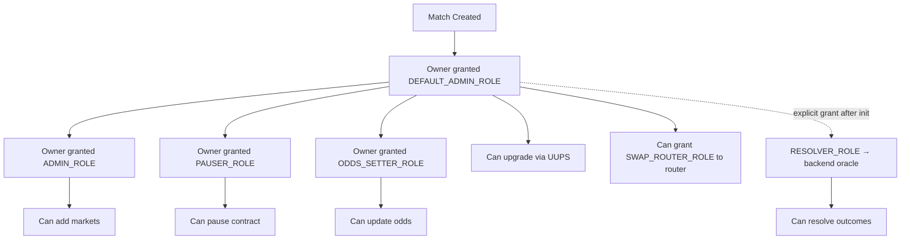

# ChilizTV Smart Contracts Architecture

This document illustrates the complete architecture of the **Chiliz-TV Dual System**:

## System Overview

### 1. Multi-Sport Betting System (UUPS Proxy Pattern)
- **BettingMatchFactory**: Deploys sport-specific match proxies
- **FootballMatch & BasketballMatch**: UUPS upgradeable implementations
- **ERC1967Proxy**: Each match is an independent upgradeable proxy instance
- **USDC Settlement**: All bets placed and paid out in USDC (6 decimals)
- **Dynamic Odds**: Real-time odds set by ODDS_SETTER_ROLE (x10000 precision)
- **Role-Based Access Control**: ADMIN_ROLE, RESOLVER_ROLE, PAUSER_ROLE, ODDS_SETTER_ROLE, SWAP_ROUTER_ROLE
  - `TREASURY_ROLE` was removed when USDC custody migrated to `LiquidityPool`. Match proxies hold no USDC; treasury accounting lives on the pool.

### 2. Streaming Wallet System (UUPS Proxy Pattern, factory-gated upgrades)
- **StreamWalletFactory**: Deploys `ERC1967Proxy` instances for streamers and holds the current implementation pointer
- **StreamWallet**: UUPS upgradeable implementation with subscription & donation logic
- **USDC Settlement**: All donations and subscriptions settled in USDC
- **Upgradeability**: Each streamer wallet is an independent UUPS proxy. `StreamWallet._authorizeUpgrade()` is locked to the factory, so only the factory owner (via `StreamWalletFactory.upgradeWallet(streamer, newImpl)`) can upgrade a wallet. Streamers cannot self-upgrade. Upgrading many wallets is an **O(N) operation** — one transaction per wallet — not atomic. There is no `StreamBeaconRegistry`; it was designed but not built.

### 3. Unified Swap Router
- **ChilizSwapRouter** (`src/swap/ChilizSwapRouter.sol`): Single swap adapter for the entire platform
- Handles **betting** (CHZ / Fan Token / USDC → USDC → BettingMatch) and **streaming** (CHZ / Fan Token / USDC → USDC → streamer/treasury) in one contract
- Swaps via Kayen DEX (IKayenMasterRouterV2 for native CHZ, IKayenRouter for ERC20)
- Ownable + ReentrancyGuard; platform fee + treasury config for streaming flows
- Requires SWAP_ROUTER_ROLE on each BettingMatch proxy

### 4. Liquidity Pool System
- **LiquidityPool**: Single ERC-4626 vault that backs all bet payouts. LPs deposit USDC and receive transferable `ctvLP` shares that auto-compound the house edge priced into fixed odds.
- **BettingMatch proxies hold no USDC** — all stake enters the pool; all payouts leave the pool.
- NAV model: `totalAssets() = USDC.balanceOf(pool) - totalLiabilities`
- Roles: `DEFAULT_ADMIN_ROLE` (Safe multisig), `MATCH_ROLE` (one per authorized match proxy), `ROUTER_ROLE` (ChilizSwapRouter), `PAUSER_ROLE` (emergency stop)
- Match-facing API: `recordBet()`, `settleMarket()`, `payWinner()`, `payRefund()`
- Withdrawal gated on `freeBalance` (unreserved USDC) and per-depositor cooldown to prevent flash-NAV manipulation
- Per-market and per-match liability caps (in bps of `totalAssets()`) enforce solvency at bet time
- **Reservation model is sum-based**: `recordBet` adds `netExposure` to `totalLiabilities` for every bet on every side of every market. The pool reserves capital as if every open position on every selection could win — only one side actually does, but the conservative reservation simplifies solvency invariants and makes per-market/per-match caps strict upper bounds. Releases happen on `settleMarket` (losing side) and `payWinner` / `payRefund` (per-bet).
- Treasury and admin are separated: an **admin key** holds `DEFAULT_ADMIN_ROLE` (authorize/revoke matches, parameter knobs, upgrades), and the **Safe** is the `treasury` (receives `accruedTreasury` via pull-claim only). The Safe is never `DEFAULT_ADMIN_ROLE` on the pool.

### Deployment Scripts
- `script/DeployAll.s.sol`: Complete system deployment (betting + streaming + swap router)
- `script/DeployBetting.s.sol`: Betting system only
- `script/DeployStreaming.s.sol`: Streaming system only
- `script/DeploySwap.s.sol`: Unified ChilizSwapRouter (Kayen DEX integration)
- `script/DeployLiquidityPool.s.sol`: LiquidityPool deployment + configuration

---

## Architecture Diagram

```mermaid
sequenceDiagram
    title ChilizTV Betting System - Complete Lifecycle (UUPS Proxy)
    
    actor Admin as System Admin
    actor Resolver as Resolver/Backend
    actor User1 as User1 (Bettor)
    actor User2 as User2 (Bettor)
    actor User3 as User3 (Bettor)
    
    participant Factory as BettingMatchFactory
    participant FImpl as FootballMatch Logic
    participant BImpl as BasketballMatch Logic
    participant Proxy as Match Proxy
    participant Treasury as Treasury Multisig

    rect rgb(200, 220, 255)
        Note over Admin,Treasury: PHASE 1: BETTING SYSTEM DEPLOYMENT
        
        Admin->>FImpl: Deploy FootballMatch.sol
        activate FImpl
        FImpl-->>Admin: Implementation deployed
        deactivate FImpl
        
        Admin->>BImpl: Deploy BasketballMatch.sol
        activate BImpl
        BImpl-->>Admin: Implementation deployed
        deactivate BImpl
        
        Admin->>Factory: Deploy BettingMatchFactory(footballImpl, basketballImpl)
        activate Factory
        Factory-->>Admin: Factory deployed ✓
        deactivate Factory
        
        Note right of Factory: System ready to create matches
    end

    rect rgb(230, 255, 230)
        Note over Admin,Treasury: PHASE 2: MATCH CREATION (Football Example)
        
        Admin->>Factory: createFootballMatch("Real Madrid vs Barcelona", owner)
        activate Factory
        
        Factory->>FImpl: Create ERC1967Proxy pointing to FootballMatch
        activate FImpl
        
        Factory->>Proxy: Deploy new ERC1967Proxy(footballImpl, initData)
        activate Proxy
        
        Proxy->>FImpl: delegatecall initialize("Real Madrid vs Barcelona", owner)
        Note right of FImpl: Grant roles to owner:<br/>DEFAULT_ADMIN_ROLE<br/>ADMIN_ROLE<br/>PAUSER_ROLE<br/>ODDS_SETTER_ROLE<br/>(RESOLVER_ROLE granted post-init to backend oracle)
        
        FImpl-->>Proxy: Initialized ✓
        deactivate FImpl
        
        Proxy-->>Factory: Proxy deployed at 0xABCD...
        Factory-->>Admin: emit MatchCreated(0xABCD..., FOOTBALL, owner)
        deactivate Proxy
        deactivate Factory
        
        Note over Proxy: Match proxy now operational<br/>Upgradeable via UUPS pattern
    end

    rect rgb(255, 240, 220)
        Note over Admin,Treasury: PHASE 3: MARKET SETUP & BETTING
        
        Admin->>Proxy: addMarketWithLine("WINNER", 22000, 0)
        activate Proxy
        Proxy->>FImpl: delegatecall addMarketWithLine()
        activate FImpl
        Note right of FImpl: Requires ADMIN_ROLE<br/>onlyRole(ADMIN_ROLE)<br/>initialOdds=2.20x (22000)
        FImpl-->>Proxy: emit MarketAdded(marketId=0)
        deactivate FImpl
        Proxy-->>Admin: Market created ✓
        deactivate Proxy
        
        Note over Admin: USDC custody lives on LiquidityPool — no per-match treasury funding step.<br/>LPs deposit() to the pool; pool pays winners directly via payWinner().
        
        User1->>Proxy: placeBetUSDC(marketId=0, selection=0, 500e6)
        activate Proxy
        Proxy->>FImpl: delegatecall placeBetUSDC()
        activate FImpl
        Note right of FImpl: USDC transferred from user<br/>Store bet: Bet(500e6, selection=0, odds=22000)<br/>Liability tracked by solvency system
        FImpl-->>Proxy: emit BetPlaced(0, user1, 500e6, 0, 22000)
        deactivate FImpl
        Proxy-->>User1: Bet recorded ✓
        deactivate Proxy
        
        User2->>Proxy: placeBetUSDC(marketId=0, selection=1, 300e6)
        activate Proxy
        Proxy->>FImpl: delegatecall placeBetUSDC()
        activate FImpl
        Note right of FImpl: Bet locked at current odds
        FImpl-->>Proxy: emit BetPlaced(0, user2, 300e6, 1, 22000)
        deactivate FImpl
        deactivate Proxy
        
        Note over Admin: Backend adjusts odds based on action
        Admin->>Proxy: setMarketOdds(0, 18000)
        activate Proxy
        Note right of Proxy: Requires ODDS_SETTER_ROLE<br/>New odds: 1.80x
        deactivate Proxy
        
        User3->>Proxy: placeBetUSDC(marketId=0, selection=2, 200e6)
        activate Proxy
        Proxy->>FImpl: delegatecall placeBetUSDC()
        activate FImpl
        Note right of FImpl: Bet locked at NEW odds (18000)
        FImpl-->>Proxy: emit BetPlaced(0, user3, 200e6, 2, 18000)
        deactivate FImpl
        deactivate Proxy
    end

    rect rgb(255, 230, 230)
        Note over Admin,Treasury: PHASE 4: MATCH RESOLUTION
        
        Note over Resolver: Real match ends:<br/>Real Madrid wins (outcome = 0)
        
        Resolver->>Proxy: resolveMarket(marketId=0, winningOutcome=0)
        activate Proxy
        Proxy->>FImpl: delegatecall resolveMarket()
        activate FImpl
        Note right of FImpl: Requires RESOLVER_ROLE<br/>onlyRole(RESOLVER_ROLE)<br/><br/>Update state:<br/>markets[0].resolved = true<br/>markets[0].winningOutcome = 0
        FImpl-->>Proxy: emit MarketResolved(0, 0)
        deactivate FImpl
        Proxy-->>Resolver: Market settled ✓
        deactivate Proxy
        
        Note over Proxy: Market locked for claims<br/>Winners: User1 (bet on 0)<br/>Losers: User2, User3
    end

    rect rgb(240, 240, 255)
        Note over Admin,Treasury: PHASE 5: PAYOUT CLAIMS
        
        Note over User1: User1 bet 500 USDC on outcome 0 at 2.20x (winner)
        
        User1->>Proxy: claim(marketId=0, betIndex=0)
        activate Proxy
        Proxy->>FImpl: delegatecall claim()
        activate FImpl
        
        Note right of FImpl: Dynamic odds payout:<br/>stake = 500 USDC<br/>lockedOdds = 2.20x (22000)<br/>payout = 500 x 22000 / 10000<br/>= 1100 USDC<br/>netExposure = payout - stake = 600 USDC
        
        Note right of FImpl: Update state (CEI pattern):<br/>bets[user1][0].claimed = true
        
        FImpl->>FImpl: pool.payWinner(match, 0, user1, 1100e6, 600e6)
        Note right of FImpl: Pool releases 600 USDC from liabilities<br/>Pool transfers 1100 USDC directly to User1<br/>LP NAV drops by 500 USDC (realised loss = stake)
        
        FImpl-->>Proxy: emit BetClaimed(0, user1, 1100e6)
        deactivate FImpl
        
        Proxy-->>User1: Claim complete ✓
        deactivate Proxy
        
        Note over User2,User3: User2 and User3 bet on losing outcomes<br/>❌ claim() would revert: NotWinner()
    end

    rect rgb(240, 240, 240)
        Note over Admin,Treasury: FINAL STATE SUMMARY
        
        Note over Proxy: Match Proxy State:<br/>✓ Market 0 resolved (outcome = 0)<br/>✓ Total bets: 1000 USDC<br/>✓ Winners: User1 (1100 USDC payout at 2.20x)<br/>✓ Losers: User2 (-300), User3 (-200)<br/>✓ Treasury funded for solvency<br/><br/>Dynamic Odds Model:<br/>User1: 120% gain (1100/500 - 1)<br/>Odds locked at time of bet
    end
```

---

## Streaming System Diagram

```mermaid
sequenceDiagram
    title ChilizTV Streaming System - Complete Lifecycle (UUPS Proxy, factory-gated)

    actor Admin as System Admin
    actor Streamer as Streamer
    actor Viewer as Viewer/Donor

    participant Impl as StreamWallet Logic
    participant Factory as StreamWalletFactory
    participant Router as ChilizSwapRouter
    participant Wallet as StreamWallet Proxy (ERC1967)
    participant Treasury as Treasury Multisig

    rect rgb(200, 220, 255)
        Note over Admin,Treasury: PHASE 1: STREAMING SYSTEM DEPLOYMENT

        Admin->>Factory: Deploy StreamWalletFactory(treasury, defaultFeeBps, kayenRouter, usdc)
        activate Factory
        Factory->>Impl: new StreamWallet()   (implementation deployed inside constructor)
        activate Impl
        Impl-->>Factory: impl address
        deactivate Impl
        Factory-->>Admin: Factory deployed, implementation pinned
        deactivate Factory

        Note right of Factory: Implementation is mutable on the factory<br/>(setImplementation) — used for NEW proxies only.<br/>Existing proxies are upgraded individually<br/>via factory.upgradeWallet(streamer, newImpl).
    end

    rect rgb(230, 255, 230)
        Note over Admin,Treasury: PHASE 2: STREAMER WALLET CREATION

        Viewer->>Factory: subscribeToStream(streamer, duration, amount, ...) {token or CHZ}
        activate Factory
        Note right of Factory: If streamer has no wallet yet,<br/>factory lazily deploys ERC1967Proxy,<br/>then forwards the call.

        Factory->>Wallet: new ERC1967Proxy(impl, initData)
        activate Wallet
        Wallet->>Impl: delegatecall initialize(streamer, treasury, feeBps, kayenRouter, usdc)
        activate Impl
        Note right of Impl: streamer = beneficiary<br/>factory = upgrade authority<br/>treasury = fee recipient
        Impl-->>Wallet: Initialized ✓
        deactivate Impl
        Wallet-->>Factory: proxy address
        deactivate Wallet

        Factory-->>Viewer: emit StreamWalletCreated(streamer, wallet)
        deactivate Factory
    end

    rect rgb(255, 240, 220)
        Note over Admin,Treasury: PHASE 3: SUBSCRIPTIONS & DONATIONS (all settle in USDC)

        Note over Viewer: Preferred path — all entrypoints live on ChilizSwapRouter<br/>Any token / CHZ / USDC → swap → USDC → split → wallet

        Viewer->>Router: donateWithCHZ(streamer, message, minOut, deadline) {value: 50 CHZ}
        activate Router
        Note right of Router: Swap CHZ → USDC via Kayen (masterRouter)<br/>Split: fee = usdc × feeBps / 10_000<br/>streamerAmount = usdc - fee
        Router->>Treasury: USDC fee transfer
        Router->>Wallet: USDC streamer-amount transfer
        Router->>Wallet: recordDonationByRouter(donor, usdc, message)
        activate Wallet
        Wallet-->>Router: state updated (lifetimeDonations, totalRevenue)
        deactivate Wallet
        Router-->>Viewer: emit DonationWithCHZ(...)
        deactivate Router

        Viewer->>Router: subscribeWithUSDC(streamer, duration, 100e6)
        activate Router
        Router->>Wallet: USDC split transfers (fee → treasury, rest → wallet)
        Router->>Wallet: recordSubscriptionByRouter(subscriber, usdc, duration)
        activate Wallet
        Note right of Wallet: Update subscriptions[viewer]:<br/>if active & not expired → extend from expiry<br/>else → start from block.timestamp
        Wallet-->>Router: state updated
        deactivate Wallet
        Router-->>Viewer: emit SubscriptionWithUSDCEvent(...)
        deactivate Router

        Note over Viewer,Factory: Legacy direct-from-factory path (fan-token only):<br/>Factory.subscribeToStream / donateToStream pulls the token,<br/>approves the wallet, then calls wallet.recordSubscription / donateFor —<br/>the wallet itself swaps via IKayenRouter.
    end

    rect rgb(255, 230, 230)
        Note over Admin,Treasury: PHASE 4: STREAMER WITHDRAWAL

        Streamer->>Wallet: withdrawRevenue()
        activate Wallet
        Note right of Wallet: Drains full USDC balance of the wallet<br/>to the streamer (no amount parameter).<br/>totalWithdrawn accounting updated.
        Wallet->>Streamer: safeTransfer(usdc, balance)
        Wallet-->>Streamer: emit RevenueWithdrawn(streamer, amount)
        deactivate Wallet
    end

    rect rgb(240, 240, 255)
        Note over Admin,Treasury: PHASE 5: PER-WALLET UPGRADE (NOT ATOMIC)

        Admin->>Impl: Deploy StreamWalletV2.sol
        activate Impl
        Impl-->>Admin: new impl at 0xV2...
        deactivate Impl

        Admin->>Factory: setImplementation(0xV2...)
        Note right of Factory: Only changes the impl used for<br/>NEW proxies. Existing wallets untouched.

        Admin->>Factory: upgradeWallet(streamer, 0xV2...)
        Factory->>Wallet: upgradeToAndCall(0xV2...)
        Note right of Wallet: StreamWallet._authorizeUpgrade<br/>enforces msg.sender == factory.<br/>Repeat once PER wallet — there is no beacon,<br/>so upgrading N wallets is N transactions.
    end

    rect rgb(240, 240, 240)
        Note over Admin,Treasury: FINAL STATE SUMMARY

        Note over Wallet: Streamer Wallet State:<br/>✓ Revenue settled in USDC (6 decimals)<br/>✓ Platform fees sent to Treasury on every payment<br/>✓ Streamer share accumulates in wallet; withdrawRevenue() drains it<br/><br/>Payment Paths Supported (via ChilizSwapRouter):<br/>✓ Native CHZ → USDC<br/>✓ Any ERC20 / Fan Token → USDC<br/>✓ USDC direct (no swap)<br/><br/>Upgrade Model:<br/>✓ Per-wallet UUPS, factory-gated<br/>✗ NOT atomic — no beacon, no StreamBeaconRegistry<br/>✓ Streamer cannot self-upgrade (factory-only authorize)
    end
```

---

## Role-Based Access Control

### BettingMatch Roles

| Role | Permissions | Granted To |
|------|-------------|------------|
| `DEFAULT_ADMIN_ROLE` | Can grant/revoke all roles, authorize upgrades | Match owner (initial) |
| `ADMIN_ROLE` | Add markets, control market state, unpause contract, `setUSDCToken`, `setLiquidityPool`, `setMaxAllowedOdds` | Match owner, trusted admins |
| `ODDS_SETTER_ROLE` | Update market odds in real-time | Backend odds service |
| `RESOLVER_ROLE` | Resolve markets with outcomes | Backend resolver service (NOT auto-granted at init — must be granted explicitly) |
| `PAUSER_ROLE` | Emergency pause in critical situations | Match owner, security team |
| `SWAP_ROUTER_ROLE` | Call `placeBetUSDCFor()` on behalf of users | ChilizSwapRouter contract |

> `TREASURY_ROLE` no longer exists — it was retired when bet custody moved to `LiquidityPool`. The match contract is pure bookkeeping and never holds USDC; emergency-fund and treasury-related operations live on the pool.

### Role Assignment Flow


```mermaid
graph TD
    A[Match Created] --> B[Owner granted DEFAULT_ADMIN_ROLE]
    B --> C[Owner granted ADMIN_ROLE]
    B --> E[Owner granted PAUSER_ROLE]
    B --> G[Owner granted ODDS_SETTER_ROLE]
    C --> H[Can add markets]
    G --> I[Can update odds]
    E --> K[Can pause contract]
    B --> M[Can upgrade via UUPS]
    B --> N[Can grant SWAP_ROUTER_ROLE to router]
    B -. explicit grant after init .-> D[RESOLVER_ROLE → backend oracle]
    D --> J[Can resolve outcomes]
```

---

## Security Features

### 1. Upgradeable Patterns
- **Betting System**: UUPS (Universal Upgradeable Proxy Standard)
  - Each match is independently upgradeable
  - Requires `DEFAULT_ADMIN_ROLE` to authorize upgrades
  - Storage layout preserved via `@openzeppelin/contracts-upgradeable`

- **Streaming System**: UUPS per wallet, factory-gated
  - Each streamer wallet is an independent ERC1967 proxy
  - `_authorizeUpgrade` is locked to the `StreamWalletFactory`
  - Upgrades are applied one wallet at a time via `StreamWalletFactory.upgradeWallet(streamer, newImpl)` (multisig recommended as factory owner). **Not atomic** across wallets.

#### ADR — Why some contracts are not UUPS

UUPS is reserved for contracts where redeploying would lose unrecoverable
state. Factories and the swap router are intentionally **not** upgradeable:
they hold near-zero state that can't be reconstructed, and upgradeability
would add (a) an upgrade key with full code-replacement power, (b) a frozen
storage layout that's a known footgun on every future change, and (c) more
audit surface — for marginal benefit. When a bug is found, the fix is a
redeploy + a small number of repointing transactions, not a UUPS upgrade.

| Contract | Pattern | If a bug appears, fix is… |
|---|---|---|
| `LiquidityPool` | **UUPS** behind `ERC1967Proxy` | UUPS upgrade — redeploy would orphan LP shares + every open bet liability. |
| `FootballMatch` / `BasketballMatch` | **UUPS** (per-match `ERC1967Proxy`) | UUPS upgrade — redeploy would abandon every active bet for that match. |
| `StreamWallet` | **UUPS** (per-streamer `ERC1967Proxy`, factory-gated) | UUPS upgrade — redeploy would abandon subscriptions, donation history, USDC balance for that streamer. |
| `BettingMatchFactory` | Plain `Ownable` | Redeploy + 3 txs: `pool.grantRole(MATCH_AUTHORIZER_ROLE, newFactory)`, `swapRouter.setMatchFactory(newFactory)`, point future `setWiring` calls at it. Existing matches don't care which factory created them. |
| `StreamWalletFactory` | Plain `Ownable + ReentrancyGuard` | Redeploy + repoint `swapRouter.setStreamWalletFactory(newFactory)`. The streamer→wallet mapping is rebuildable from `StreamWalletCreated` events; existing wallets keep working since each is its own UUPS proxy. |
| `ChilizSwapRouter` | Plain `Ownable + ReentrancyGuard` | Redeploy + repoint streaming/factory wiring + re-grant `SWAP_ROUTER_ROLE` on each match. Cost scales with match count — see "future considerations" below. |

**Future consideration** — once the platform has many matches deployed (say
>20), the swap-router redeploy cost (`2 × N` txs to rotate `SWAP_ROUTER_ROLE`
across every match) starts to outweigh the UUPS risk. At that point,
migrating the router to UUPS in a planned upgrade window is a reasonable
v2 change. Pre-launch / single-digit-matches it's not worth the extra
upgrade-key surface.

### 2. Reentrancy Protection
- `ReentrancyGuardUpgradeable` on all state-changing functions
- CEI (Checks-Effects-Interactions) pattern enforced
- State updates before external calls

### 3. Emergency Controls
- `PausableUpgradeable` for circuit breakers on both the match and the pool
- Pool-side emergency drain is **not** a role on the match — it's a pool admin operation, separate from the betting flow
- Market resolution locked during pause

### 4. Input Validation
- Zero-address checks on all critical addresses
- Minimum bet amounts enforced
- Market state validation before operations
- Duplicate bet prevention

---

## Deployment Checklist

### Prerequisites
```bash
export PRIVATE_KEY=0x...           # Deployer private key
export RPC_URL=https://...         # Network RPC endpoint
export SAFE_ADDRESS=0x...          # Treasury multisig address
```

### Full System Deployment
```bash
forge script script/DeployAll.s.sol \
  --rpc-url $RPC_URL \
  --broadcast \
  --verify
```

### Betting System Only
```bash
forge script script/DeployBetting.s.sol \
  --rpc-url $RPC_URL \
  --broadcast \
  --verify
```

### Streaming System Only
```bash
forge script script/DeployStreaming.s.sol \
  --rpc-url $RPC_URL \
  --broadcast \
  --verify
```

### Post-Deployment

**Generic checks**
1. Verify all contracts on block explorer
2. Transfer factory ownerships (Betting + Stream) to the multisig
3. Verify role assignments
4. Test emergency pause/unpause
5. Monitor first production bets/subscriptions

**⚠ Required wiring — every new BettingMatch proxy**
These calls are NOT done by the factory and, if skipped, will silently break bets or claims:

| # | Call | Who | Consequence if skipped |
|---|------|-----|------------------------|
| 1 | `match.setUSDCToken(usdc)` | `ADMIN_ROLE` | `placeBetUSDC` reverts `USDCNotConfigured` |
| 2 | `pool.authorizeMatch(match)` | `DEFAULT_ADMIN_ROLE` (Safe on pool) | Pool refuses `recordBet` / `payWinner` → reverts `MatchNotAuthorized` |
| 4 | `match.grantRole(RESOLVER_ROLE, oracle)` | `DEFAULT_ADMIN_ROLE` | `resolveMarket` reverts (RESOLVER is **not** auto-granted at init by design; see Role-Based Access Control) |
| 5 | `match.grantRole(SWAP_ROUTER_ROLE, ChilizSwapRouter)` | `DEFAULT_ADMIN_ROLE` | Any `placeBetWith*` through the router reverts |
| 6 | (optional M-02) `ChilizSwapRouter.setMatchFactory(bettingFactory)` | router owner | Router will forward USDC to any address, not only factory-registered matches |

**⚠ Required wiring — ChilizSwapRouter ↔ StreamWalletFactory**
The router verifies that the factory knows about it before accepting the registration. Correct order:

1. `StreamWalletFactory.setSwapRouter(chilizSwapRouter)`
2. `ChilizSwapRouter.setStreamWalletFactory(streamWalletFactory)` — this reverts `RouterNotConfiguredOnFactory` if step 1 was skipped.

---

## Contract Addresses (Reference)

| Contract | Address | Network |
|----------|---------|---------|
| FootballMatch Implementation | TBD | Chiliz Spicy Testnet |
| BasketballMatch Implementation | TBD | Chiliz Spicy Testnet |
| BettingMatchFactory | TBD | Chiliz Spicy Testnet |
| ChilizSwapRouter | TBD | Chiliz Spicy Testnet |
| StreamWallet Implementation | TBD | Chiliz Spicy Testnet |
| StreamWalletFactory | TBD | Chiliz Spicy Testnet |
| USDC Token | TBD | Chiliz Spicy Testnet |
| LiquidityPool | TBD | Chiliz Spicy Testnet |
| Treasury Multisig | TBD | Chiliz Spicy Testnet |

---

## File Structure

```
src/
├── betting/
│   ├── BettingMatch.sol           # Abstract base with UUPS + AccessControl + dynamic odds
│   ├── FootballMatch.sol          # Football-specific implementation
│   ├── BasketballMatch.sol        # Basketball-specific implementation
│   ├── BettingMatchFactory.sol    # Factory for ERC1967Proxy deployment
├── swap/
│   └── ChilizSwapRouter.sol       # Unified CHZ / Token / USDC swap router (betting + streaming)
├── streamer/
│   ├── StreamWallet.sol           # Subscription & donation logic, UUPS (USDC-denominated)
│   └── StreamWalletFactory.sol    # Factory for ERC1967Proxy deployment + per-wallet upgrades
├── interfaces/
│   ├── IKayenMasterRouterV2.sol   # Kayen DEX native CHZ swap interface
│   ├── IKayenRouter.sol           # Kayen DEX ERC20-to-ERC20 swap interface
│   ├── │   └── IStreamWalletInit.sol      # StreamWallet initialization interface


script/
├── DeployAll.s.sol                # Complete system deployment
├── DeployBetting.s.sol            # Betting system deployment
├── DeployLiquidityPool.s.sol      # LiquidityPool deployment + authorization
├── DeployStreaming.s.sol          # Streaming system deployment
└── DeploySwap.s.sol               # ChilizSwapRouter deployment

test/
├── BettingMatchTest.t.sol         # Core USDC betting + dynamic odds tests
├── BasketballMatchTest.t.sol      # Basketball lifecycle tests
├── LiquidityPoolTest.t.sol        # LiquidityPool deposit/withdraw, bet lifecycle, solvency caps
├── StreamWalletTest.t.sol         # StreamWallet + StreamWalletFactory UUPS upgrade tests
├── ChilizSwapRouterTest.t.sol     # ChilizSwapRouter betting + streaming payment paths
├── SwapIntegrationTest.t.sol      # ChilizSwapRouter betting integration tests
└── mocks/
    └── MockUSDC.sol               # Mock USDC token for testing
```

---

## Upgrade Procedures

### UUPS Upgrade (BettingMatch)
```solidity
// 1. Deploy new implementation
FootballMatchV2 newImpl = new FootballMatchV2();

// 2. Upgrade specific match proxy (requires DEFAULT_ADMIN_ROLE)
FootballMatch proxy = FootballMatch(payable(matchProxyAddress));
proxy.upgradeToAndCall(address(newImpl), "");
```

### UUPS Upgrade (StreamWallet — per-wallet, factory-gated)
```solidity
// 1. Deploy new implementation
StreamWalletV2 newImpl = new StreamWalletV2();

// 2. (Optional) Point the factory at it for FUTURE wallet deployments
StreamWalletFactory factory = StreamWalletFactory(factoryAddress);
factory.setImplementation(address(newImpl));

// 3. Upgrade each existing streamer wallet individually
//    `_authorizeUpgrade` on StreamWallet is locked to the factory, so this
//    MUST go through the factory. Upgrading N wallets = N transactions.
for (address streamer : existingStreamers) {
    factory.upgradeWallet(streamer, address(newImpl));
}
```
> **Not a beacon.** There is no `StreamBeaconRegistry` and no `UpgradeableBeacon`. A Beacon-based atomic-upgrade model was considered but not implemented — upgrades are per-wallet by design so that an individual streamer can be rolled back if needed.

---

## Additional Documentation

- **DEPLOYMENT_SUMMARY.md**: Step-by-step deployment guide
- **LIQUIDITY_PLAN.md**: CHZ liquidity management strategy
- **SEQUENCE_DIAGRAM.md**: Detailed interaction flows
- **DEPLOYMENT_CHECKLIST.md**: Pre/post-deployment tasks
- **README.md**: Quick start guide

---

## Dead Code Identified

No dead code identified. All contracts, functions, and interfaces are actively used in deployment scripts and/or test suites. LiquidityPool tracking mappings (`totalLiabilities`, `matchLiability`, `marketLiability`) serve both on-chain solvency enforcement and off-chain monitoring. All are actively read.

---

## Testing Status

### Test Suite Overview
- **Total Tests**: 119
- **Core Security Tests**: 24/24 passing
- **Role-Based Access Tests**: 21/21 passing
- **Betting Logic Tests**: 48/48 passing
- **Streaming Tests**: 30/30 passing

### Test Verification
```bash
# Run all tests
forge test

# Run with verbosity
forge test -vvv

# Run specific test contract
forge test --match-contract RoleBasedAccessControlTests

# Generate coverage report
forge coverage
```

---

**Last Updated**: 2026-06-17  
**Version**: 5.0 (USDC-only settlement + Swap Routers + Dynamic Odds + LiquidityPool)  
**Author**: ChilizTV Development Team
