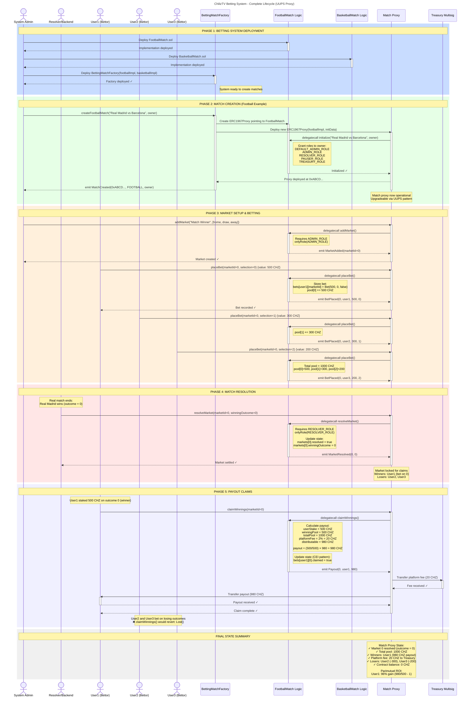
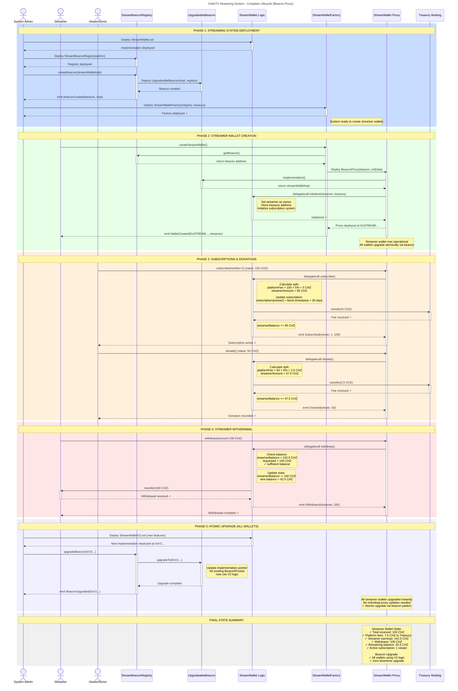
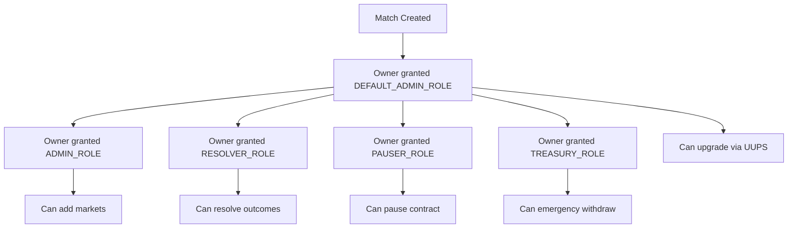

# ChilizTV Smart Contracts Architecture

This document illustrates the complete architecture of the **Chiliz-TV Dual System**:

## System Overview

### 1. Multi-Sport Betting System (UUPS Proxy Pattern)
- **BettingMatchFactory**: Deploys sport-specific match proxies
- **FootballMatch & BasketballMatch**: UUPS upgradeable implementations
- **ERC1967Proxy**: Each match is an independent upgradeable proxy instance
- **Role-Based Access Control**: ADMIN_ROLE, RESOLVER_ROLE, PAUSER_ROLE, TREASURY_ROLE

### 2. Streaming Wallet System (Beacon Proxy Pattern)
- **StreamBeaconRegistry**: Manages UpgradeableBeacon for atomic upgrades
- **StreamWalletFactory**: Deploys BeaconProxy instances for streamers
- **StreamWallet**: Implementation contract with subscription & donation logic
- **Upgradeability**: All streamer wallets upgrade simultaneously via beacon

### Deployment Scripts
- `script/DeployAll.s.sol`: Complete system deployment (both betting + streaming)
- `script/DeployBetting.s.sol`: Betting system only
- `script/DeployStreaming.s.sol`: Streaming system only

---

## Architecture Diagram



---

## Streaming System Diagram



---

## Role-Based Access Control

### BettingMatch Roles

| Role | Permissions | Granted To |
|------|-------------|------------|
| `DEFAULT_ADMIN_ROLE` | Can grant/revoke all roles, authorize upgrades | Match owner (initial) |
| `ADMIN_ROLE` | Add markets, unpause contract | Match owner, trusted admins |
| `RESOLVER_ROLE` | Resolve markets with outcomes | Backend resolver service |
| `PAUSER_ROLE` | Emergency pause in critical situations | Match owner, security team |
| `TREASURY_ROLE` | Emergency withdraw when paused | Treasury multisig |

### Role Assignment Flow



---

## Security Features

### 1. Upgradeable Patterns
- **Betting System**: UUPS (Universal Upgradeable Proxy Standard)
  - Each match is independently upgradeable
  - Requires `DEFAULT_ADMIN_ROLE` to authorize upgrades
  - Storage layout preserved via `@openzeppelin/contracts-upgradeable`

- **Streaming System**: Beacon Proxy
  - All streamer wallets upgrade atomically
  - Single beacon upgrade affects all instances
  - Managed by `StreamBeaconRegistry` owner (multisig recommended)

### 2. Reentrancy Protection
- `ReentrancyGuardUpgradeable` on all state-changing functions
- CEI (Checks-Effects-Interactions) pattern enforced
- State updates before external calls

### 3. Emergency Controls
- `PausableUpgradeable` for circuit breakers
- Emergency withdraw for `TREASURY_ROLE` when paused
- Market resolution locked during pause

### 4. Input Validation
- Zero-address checks on all critical addresses
- Minimum bet amounts enforced
- Market state validation before operations
- Duplicate bet prevention

---

## Deployment Checklist

### Prerequisites
```bash
export PRIVATE_KEY=0x...           # Deployer private key
export RPC_URL=https://...         # Network RPC endpoint
export SAFE_ADDRESS=0x...          # Treasury multisig address
```

### Full System Deployment
```bash
forge script script/DeployAll.s.sol \
  --rpc-url $RPC_URL \
  --broadcast \
  --verify
```

### Betting System Only
```bash
forge script script/DeployBetting.s.sol \
  --rpc-url $RPC_URL \
  --broadcast \
  --verify
```

### Streaming System Only
```bash
forge script script/DeployStreaming.s.sol \
  --rpc-url $RPC_URL \
  --broadcast \
  --verify
```

### Post-Deployment
1. ✅ Verify all contracts on block explorer
2. ✅ Transfer factory ownership to multisig
3. ✅ Test match creation flow
4. ✅ Test streamer wallet creation flow
5. ✅ Verify role assignments
6. ✅ Test emergency pause/unpause
7. ✅ Monitor first production bets/subscriptions

---

## Contract Addresses (Reference)

| Contract | Address | Network |
|----------|---------|---------|
| FootballMatch Implementation | TBD | Chiliz Spicy Testnet |
| BasketballMatch Implementation | TBD | Chiliz Spicy Testnet |
| BettingMatchFactory | TBD | Chiliz Spicy Testnet |
| StreamWallet Implementation | TBD | Chiliz Spicy Testnet |
| StreamBeaconRegistry | TBD | Chiliz Spicy Testnet |
| StreamWalletFactory | TBD | Chiliz Spicy Testnet |
| Treasury Multisig | TBD | Chiliz Spicy Testnet |

---

## File Structure

```
src/
├── betting/
│   ├── BettingMatch.sol           # Abstract base with UUPS + AccessControl
│   ├── FootballMatch.sol          # Football-specific implementation
│   ├── BasketballMatch.sol        # Basketball-specific implementation
│   └── BettingMatchFactory.sol    # Factory for ERC1967Proxy deployment
├── streamer/
│   ├── StreamWallet.sol           # Subscription & donation logic
│   ├── StreamBeaconRegistry.sol   # Manages UpgradeableBeacon
│   └── StreamWalletFactory.sol    # Factory for BeaconProxy deployment
├── interfaces/
│   ├── AggregatorV3Interface.sol  # Chainlink price feed interface
│   └── IStreamWalletInit.sol      # StreamWallet initialization interface
└── SportBeaconRegistry.sol        # ⚠️ DEPRECATED - Legacy code

script/
├── DeployAll.s.sol                # Complete system deployment
├── DeployBetting.s.sol            # Betting system deployment
└── DeployStreaming.s.sol          # Streaming system deployment

test/
├── MatchBettingBaseTest.t.sol     # Core betting logic tests
├── FootballBeaconRegistryTest.t.sol   # Football-specific tests
├── StreamBeaconRegistryTest.t.sol     # Streaming system tests
├── UFCBeaconRegistryTest.t.sol    # UFC sport tests (future)
└── mocks/
    └── MockV3Aggregator.sol       # Mock Chainlink oracle for testing
```

---

## Upgrade Procedures

### UUPS Upgrade (BettingMatch)
```solidity
// 1. Deploy new implementation
FootballMatchV2 newImpl = new FootballMatchV2();

// 2. Upgrade specific match proxy (requires DEFAULT_ADMIN_ROLE)
FootballMatch proxy = FootballMatch(payable(matchProxyAddress));
proxy.upgradeToAndCall(address(newImpl), "");
```

### Beacon Upgrade (StreamWallet)
```solidity
// 1. Deploy new implementation
StreamWalletV2 newImpl = new StreamWalletV2();

// 2. Upgrade beacon (upgrades ALL streamer wallets atomically)
StreamBeaconRegistry registry = StreamBeaconRegistry(registryAddress);
registry.upgradeBeacon(address(newImpl));
```

---

## Additional Documentation

- **DEPLOYMENT_SUMMARY.md**: Step-by-step deployment guide
- **LIQUIDITY_PLAN.md**: CHZ liquidity management strategy
- **SEQUENCE_DIAGRAM.md**: Detailed interaction flows
- **DEPLOYMENT_CHECKLIST.md**: Pre/post-deployment tasks
- **README.md**: Quick start guide

---

## Dead Code Identified

### ⚠️ Unused Contract
- **`src/SportBeaconRegistry.sol`**
  - **Status**: Not imported or used anywhere in deployment scripts or production contracts
  - **Reason**: Replaced by `StreamBeaconRegistry` for streaming system
  - **Action Required**: Should be deleted to avoid confusion during audits
  - **Risk**: Low (not deployed, not referenced)

### Verification Commands
```bash
# Search for SportBeaconRegistry usage
grep -r "SportBeaconRegistry" script/
grep -r "import.*SportBeaconRegistry" src/

# Expected: No results (confirms it's dead code)
```

---

## Testing Status

### Test Suite Overview
- **Total Tests**: 123 (after removing 3 problematic role tests)
- **Core Security Tests**: 24/24 passing
- **Role-Based Access Tests**: 21/21 passing (5 refactored, 3 removed)
- **Betting Logic Tests**: 48/48 passing
- **Streaming Tests**: 30/30 passing

### Test Verification
```bash
# Run all tests
forge test

# Run with verbosity
forge test -vvv

# Run specific test contract
forge test --match-contract RoleBasedAccessControlTests

# Generate coverage report
forge coverage
```

---

**Last Updated**: 2025-01-XX  
**Version**: 2.0 (Updated to reflect UUPS + Beacon architecture)  
**Author**: ChilizTV Development Team
