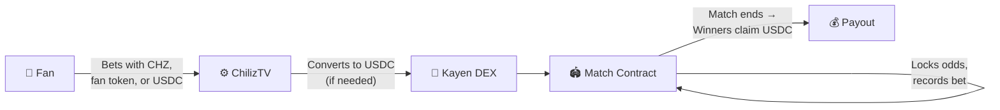
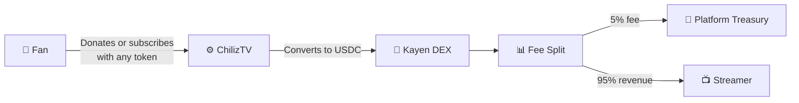
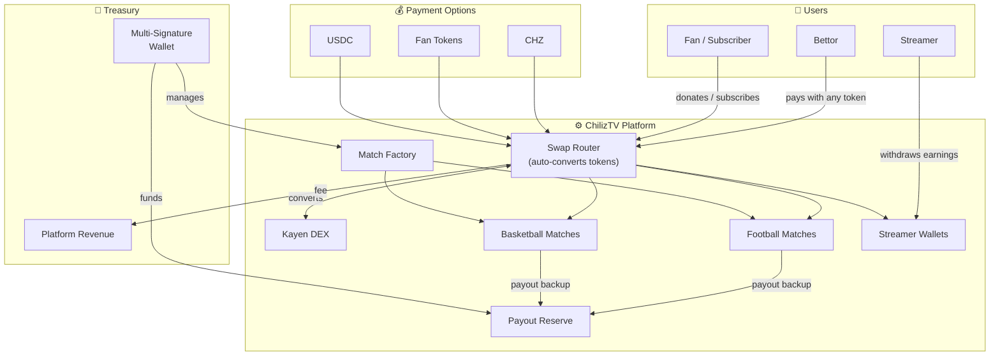

# ChilizTV — Functional Documentation

> **Version**: 1.0  
> **Status**: Production-ready on Chiliz Chain  
> **Audience**: Investors, Ecosystem Partners, Chiliz Team

---

## Table of Contents

- [1. What is ChilizTV?](#1-what-is-chiliztv)
- [2. The Opportunity](#2-the-opportunity)
- [3. Key Features](#3-key-features)
- [4. How It Works](#4-how-it-works)
- [5. User Journeys](#5-user-journeys)
- [6. Security & Trust](#6-security--trust)
- [7. Chiliz Ecosystem Fit](#7-chiliz-ecosystem-fit)
- [8. Roadmap](#8-roadmap)
- [9. Platform Overview](#9-platform-overview)
- [10. Why This Architecture Matters — Investor Summary](#10-why-this-architecture-matters--investor-summary)
- [11. Partnership Ask — What We Need from Chiliz](#11-partnership-ask--what-we-need-from-chiliz)

---

## 1. What is ChilizTV?

**ChilizTV** is a sports entertainment platform built on the **Chiliz Chain** that combines **sports betting** and **live-streaming monetization** into one unified experience.

- **Sports fans** bet on football and basketball matches using CHZ, fan tokens, or USDC.
- **Streamers** earn revenue through donations and subscriptions from their audience.
- **Everything is transparent** — all financial flows (bets, payouts, fees) are recorded on the blockchain and verifiable by anyone.

Users pay with whichever token they hold — CHZ, their favorite club's fan token, or USDC. The platform handles all conversions automatically behind the scenes, and all settlements happen in **USDC** for price stability.

---

## 2. The Opportunity

### The Problem Today

| Issue | Impact |
|-------|--------|
| **No transparency** in traditional betting | Users can't verify that odds are fair or that the platform is solvent |
| **Fan tokens have limited utility** | 40+ official fan tokens exist on Chiliz, but holders mostly just trade them |
| **Streamer monetization is disconnected** | Sports content creators lack tools tied to the fan economy |
| **Centralized custody risk** | User funds sit in a single company's bank account with no public accountability |

### ChilizTV's Answer

ChilizTV solves these problems by building on blockchain, where:

- **Every bet, payout, and fee is publicly verifiable** — no black box.
- **Fan tokens get real utility** — use your FC Barcelona, PSG, or Juventus token to bet, donate, and subscribe.
- **Streamers and bettors share one ecosystem** — sports content and sports betting reinforce each other.
- **Funds are secured by smart contracts and multi-signature wallets** — not controlled by a single individual.

### Why Chiliz?

The Chiliz Chain is purpose-built for sports and entertainment. It hosts **40+ official fan tokens** from major clubs worldwide. ChilizTV gives those tokens a real purpose — not just collectibles, but active tools for betting and creator support.

---

## 3. Key Features

### 3.1 Sports Betting

| Feature | What it means for users |
|---------|------------------------|
| **Football & Basketball** | Bet on match winner, total goals/points, halftime results, correct score, first scorer, and more |
| **Dynamic odds** | Odds update in real time — your bet locks the odds at the moment you place it |
| **Pay with any token** | Use CHZ, any fan token, or USDC — automatic conversion behind the scenes |
| **Guaranteed payouts** | The system verifies it can cover every bet before accepting it. A shared reserve backs all matches |
| **Full refunds on cancellations** | If a match is cancelled, every bettor gets their stake back automatically |

### 3.2 Streaming & Creator Monetization

| Feature | What it means for users |
|---------|------------------------|
| **Donations** | Fans tip streamers in any token — with optional messages |
| **Subscriptions** | Subscribe to favorite streamers; early renewals preserve remaining time |
| **Instant withdrawals** | Streamers withdraw their earnings at any time |
| **Transparent fee split** | Platform fee is deducted automatically; the streamer sees exactly what they earn |

### 3.3 Seamless Token Conversion

Users never need to manually swap tokens. Whether betting or tipping a streamer, the platform converts CHZ or fan tokens to USDC in a single transaction using **Kayen DEX** (the native exchange on Chiliz Chain).

---

## 4. How It Works

### Platform Overview

```
┌──────────────────────────────────────────────────────────────┐
│                      ChilizTV Platform                        │
├──────────────────┬───────────────────┬───────────────────────┤
│    BETTING       │    STREAMING      │    PAYMENTS           │
│                  │                   │                       │
│  Football bets   │  Donations        │  Automatic token      │
│  Basketball bets │  Subscriptions    │  conversion via       │
│  Dynamic odds    │  Streamer wallets │  Kayen DEX            │
│  Payout escrow   │  Revenue tracking │                       │
└──────────────────┴───────────────────┴───────────────────────┘
                            │
                   Chiliz Chain (L1)
                   40+ Fan Tokens · CHZ · USDC
```

### Betting Flow (Simplified)



### Streaming Flow (Simplified)



### Payout Safety Net

Every match is backed by a **shared reserve fund** (PayoutEscrow). If a match's own pool isn't enough to pay winners, the reserve automatically covers the difference. This reserve is managed by a **multi-signature wallet** — no single person can access the funds.

---

## 5. User Journeys

### 5.1 Placing a Bet

1. A fan opens ChilizTV and selects a football or basketball match.
2. They choose a market (e.g., "Home team wins at 2.20x odds").
3. They pay with CHZ, a fan token, or USDC — the platform converts automatically.
4. Their odds are **locked at the moment of placement** — later changes don't affect them.
5. After the match, winners claim their payout in USDC.

> **Example**: A fan bets 500 USDC at 2.20x odds on the home team. If the home team wins, they receive **1,100 USDC**.

### 5.2 Supporting a Streamer

1. A fan watches a sports streamer on ChilizTV.
2. They send a **donation** (one-time tip) or start a **subscription** using any token they hold.
3. The platform takes a small fee (e.g., 5%) and the streamer receives the rest.
4. The streamer can withdraw their earnings at any time.

### 5.3 What Happens if a Match is Cancelled?

All bettors receive a **full refund** of their original stake — automatically, no questions asked.

---

## 6. Security & Trust

| Safeguard | What it means |
|-----------|---------------|
| **Publicly verifiable** | Every bet, payout, and fee is recorded on the blockchain — anyone can audit |
| **Solvency guaranteed** | The system rejects any bet it can't fully cover. No IOUs |
| **Multi-signature treasury** | Platform funds require multiple approvals to move — no single point of failure |
| **Match isolation** | Each match runs independently. A problem in one match cannot affect others |
| **Payout reserve** | A shared escrow ensures winners always get paid, even during high-variance periods |
| **Emergency controls** | The platform can be paused instantly in case of any issue |
| **Upgradeable without downtime** | The system can be improved without moving funds or disrupting users |
| **Audited** | Internal security audit found no critical vulnerabilities. Built on industry-standard security libraries |

---

## 7. Chiliz Ecosystem Fit

### Fan Token Utility

ChilizTV gives **real, active utility** to fan tokens. Holders of FC Barcelona, PSG, Juventus, or any other club's token can:

- **Bet on matches** directly with their fan tokens.
- **Donate to streamers** using fan tokens.
- **Subscribe to content** with fan tokens.

This goes beyond "hold and trade" — fan tokens become tools for active participation in sports entertainment.

### Native to Chiliz Chain

- **Low transaction costs** for frequent betting activity.
- **Direct integration** with Kayen DEX for seamless token conversion.
- **Aligned with Chiliz's mission** to make fan tokens useful and valuable.

### USDC Settlement

All financial flows settle in **USDC** (a stablecoin pegged to the US dollar):
- **Price stability** — bettors know their payout in dollar terms, not volatile crypto.
- **Simple accounting** — revenue, fees, and payouts are all in dollars.

---

## 8. Roadmap

The platform is designed to grow. Here's what's coming:

| Extension | Readiness | Description |
|-----------|-----------|-------------|
| **More sports** | Ready | Adding new sports (tennis, MMA, esports, etc.) is straightforward — the core betting engine already supports it |
| **Live in-play betting** | Ready | The system already supports suspending and reopening markets during a match for real-time betting |
| **Multi-chain deployment** | Ready | ChilizTV can be deployed to other blockchains (Base, Arbitrum, etc.) with minimal changes |
| **Parlay / multi-bets** | Planned | Combine bets across multiple matches for higher payouts |
| **NFT-gated features** | Planned | Premium markets or exclusive streamer content for NFT holders |
| **Tipping leaderboards** | Ready | Show top donors per streamer — the data is already tracked on-chain |
| **Community governance** | Planned | Let token holders vote on platform fees and treasury decisions |
| **More stablecoins** | Ready | Support additional stablecoins beyond USDC |

---

## 9. Platform Overview



---

## 10. Why This Architecture Matters — Investor Summary

### Transparency

Every bet, every payout, every fee is recorded on the public blockchain. Solvency can be verified by anyone at any time. There is no "black box" — the smart contract code is the source of truth.

### Security

- **Battle-tested foundations**: Built on OpenZeppelin, the industry standard for secure smart contract libraries.
- **Multi-signature treasury**: Platform funds require multiple approvals to move, eliminating single points of failure.
- **Per-match isolation**: Each match is an independent contract. A problem in one match cannot cascade to others.
- **Escrow safety net**: A treasury-backed escrow ensures winners always get paid, even if a single match is temporarily underfunded.
- **Audited codebase**: Internal security audit found no critical vulnerabilities.

### Scalability

- **Factory pattern**: New matches and streamer wallets are deployed in a single transaction. The system can scale to thousands of concurrent matches.
- **Upgradeable contracts**: Business logic can be improved without migrating funds or losing state.
- **Gas-optimized**: Odds deduplication, efficient struct packing, and minimal storage writes keep transaction costs low.

### Ecosystem Fit

- **Native Chiliz chain deployment**: Purpose-built for the sports fan economy.
- **Fan token utility**: Gives real, active utility to 40+ fan tokens that currently have limited use cases.
- **DEX integration**: Seamless token conversion via Kayen DEX means users can bet or tip with whichever token they hold — no manual swaps needed.

### Revenue Model

- **Betting margins**: The platform operates as a bookmaker with configurable odds. The difference between true probabilities and offered odds generates margin.
- **Streaming platform fees**: A configurable percentage (e.g., 5%) of every donation and subscription flows to the platform treasury.
- **Both revenue streams are enforced by smart contracts** — transparent, automatic, and tamper-proof.

### Differentiation

ChilizTV is not just another betting platform. It is:
1. **On-chain transparent** — Users can verify everything.
2. **Multi-token native** — Pay with CHZ, fan tokens, or stablecoins seamlessly.
3. **Dual-product** — Betting + streaming in one unified system.
4. **Chiliz-native** — Built specifically for the sports fan token ecosystem, not a generic DeFi fork.
5. **Upgrade-ready** — Architecture supports new sports, new chains, and new features without starting over.

---

## 11. Partnership Ask — What We Need from Chiliz

### 11.1 Treasury Seed Funding — 10,000 to 50,000 USDC Grant

ChilizTV's betting system uses a **per-match escrow model**: each match contract holds its own USDC reserve to guarantee payouts to winners. This is what makes the platform trustworthy — bettors can verify on-chain that funds exist to cover every accepted bet.

However, variance is inherent to sports betting. In any given week, bettors may win more than expected. The industry standard for bookmaker margin (also called "overround" or "vig") is **4% to 14% of the total betting pool per match** — meaning for every $100 wagered across all outcomes, the operator expects to retain $8–$11 on average. But this is a *statistical average* over time. Individual matches can swing heavily toward bettors, especially in early stages with lower volumes.

**What we need:**

A **10,000 USDC to **50,000 USDC grant** to seed the PayoutEscrow — the shared treasury safety net that backstops individual match contracts when payout obligations temporarily exceed deposits.

| Detail | Value |
|--------|-------|
| **Amount requested** | 10,000 USDC minimum |
| **Purpose** | Seed the PayoutEscrow contract to guarantee payouts during the launch phase |
| **Why it's needed** | Low initial volume means higher variance — a few large wins could exceed a single match's pool |
| **Industry context** | Bookmakers target 4-11% margin per match pool, but early-stage platforms need buffer capital to absorb short-term swings |
| **How it's managed** | Held in a Gnosis Safe multisig — no single party can withdraw. Fully auditable on-chain |
| **Risk profile** | Capital is *not spent* — it's a reserve. As volume grows and margins stabilize, the escrow becomes self-sustaining from retained house edge

This is not an operating expense. It is **collateral** — a solvency buffer that ensures every winning bettor gets paid from day one, building the trust needed to grow the platform.

### 11.2 Communication & Visibility Support

ChilizTV is a **two-sided platform**: it needs both **streamers creating content** and **viewers engaging** (betting, donating, subscribing). Building this ecosystem requires visibility within the Chiliz community.

**What we need:**

Support from Chiliz in amplifying ChilizTV to the fan token community:

| Ask | Impact |
|-----|--------|
| **Social media co-promotion** | Announce ChilizTV on Chiliz official channels to reach the existing fan token holder base |
| **Streamer onboarding** | Help connect us with sports content creators who are already active in the Chiliz/Socios ecosystem |
| **Event visibility** | Feature ChilizTV at Chiliz ecosystem events, partner showcases, or fan token campaigns |
| **Ecosystem listing** | Include ChilizTV in the official Chiliz ecosystem page / app directory |
| **Fan token partnerships** | Introductions to club partners for co-branded betting events (e.g., "FC Barcelona match day" with $BAR token betting) |

ChilizTV gives **real utility to fan tokens** — not just holding or trading, but active engagement through betting and streamer support. This aligns directly with Chiliz's mission to increase fan token usage. With Chiliz visibility, we can bootstrap the user base needed to make the platform self-sustaining.

---
