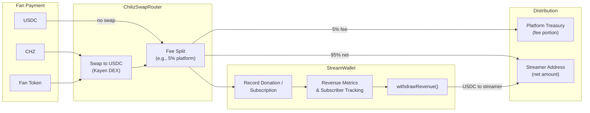
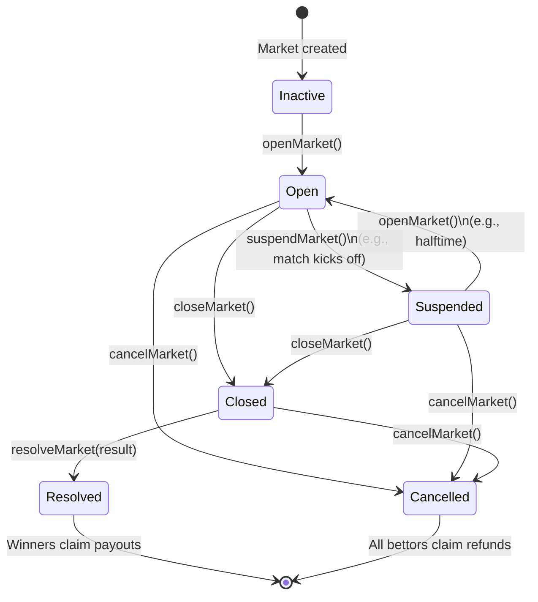

# ChilizTV — Functional Documentation

> **Version**: 1.0  
> **Status**: Production-ready smart contracts on Chiliz Chain  
> **Audience**: Investors, Ecosystem Partners, Technical Stakeholders

---

## Table of Contents

- [1. Project Overview](#1-project-overview)
- [2. Problem & Vision](#2-problem--vision)
- [3. Key Features](#3-key-features)
- [4. System Architecture](#4-system-architecture)
- [5. Process Flows](#5-process-flows)
- [6. Smart Contract Overview](#6-smart-contract-overview)
- [7. Security & Design Considerations](#7-security--design-considerations)
- [8. Ecosystem Integration](#8-ecosystem-integration)
- [9. Future Extensions](#9-future-extensions)
- [10. Diagrams](#10-diagrams)
- [11. Why This Architecture Matters — Investor Summary](#11-why-this-architecture-matters--investor-summary)

---

## 1. Project Overview

**ChilizTV** is a blockchain-powered platform built on the **Chiliz Chain** that combines **sports betting** and **live-streaming monetization** into a single on-chain ecosystem.

In simple terms, ChilizTV enables:

- **Sports fans** to place bets on football and basketball matches using any token in the Chiliz ecosystem (CHZ, fan tokens, or USDC).
- **Streamers** to receive donations and subscriptions from their audience, settled transparently on-chain.
- **The platform** to automatically handle all token conversions, fee collection, and payouts through smart contracts — no intermediaries needed.

All financial settlements happen in **USDC** (a stable US dollar token), providing price stability for all participants. Users can pay with native CHZ, any fan token, or USDC — the system automatically converts everything behind the scenes.

---

## 2. Problem & Vision

### The Problem

Traditional sports betting and streaming platforms suffer from:

1. **Lack of transparency** — Users cannot verify that odds are fair, that payouts are solvent, or that platform fees are correctly applied.
2. **Centralized custody risk** — User funds are held by a single entity with no public accountability.
3. **Fragmented payment systems** — Fan token holders in the Chiliz ecosystem have limited utility for their tokens beyond trading.
4. **Streamer monetization friction** — Content creators on sports platforms lack native, transparent revenue tools tied to the fan economy.

### The Vision

ChilizTV brings **trust, transparency, and composability** to sports entertainment by:

- Settling all bets and payouts through **auditable smart contracts** on the Chiliz Chain.
- Enabling **any Chiliz ecosystem token** (CHZ, FC Barcelona Fan Token, PSG Fan Token, etc.) to be used seamlessly for betting and streaming.
- Providing **real-time solvency guarantees** — the contracts enforce that funds are available before accepting bets.
- Creating a **unified economic layer** that ties sports betting, content creation, and fan engagement together within the Chiliz ecosystem.

### Why Chiliz?

The Chiliz Chain is purpose-built for sports and entertainment. It hosts **40+ official fan tokens** from major sports organizations. ChilizTV sits at the intersection of this ecosystem, giving fan tokens real utility — not just as collectibles, but as active financial instruments for betting and creator support.

---

## 3. Key Features

### 3.1 Multi-Sport Betting

| Feature | Description |
|---------|-------------|
| **Football betting** | Winner (1X2), total goals (over/under), both teams to score, halftime result, correct score, first scorer |
| **Basketball betting** | Winner, total points, point spread, quarter winner, first to score, highest-scoring quarter |
| **Dynamic odds** | Odds update in real time; each bet locks its odds at the moment of placement |
| **Multi-token payments** | Bet with CHZ, any fan token, or USDC — all automatically converted to USDC |
| **Solvency enforcement** | The contract verifies it can cover all potential payouts before accepting any bet |
| **Escrow fallback** | A treasury-funded escrow contract backstops payouts if a match contract needs additional liquidity |

### 3.2 Streaming Monetization

| Feature | Description |
|---------|-------------|
| **Donations** | Fans send one-time tips to streamers with optional messages |
| **Subscriptions** | Fans subscribe for a defined period; renewals extend remaining time (no time lost) |
| **Multi-token payments** | Pay with CHZ, fan tokens, or USDC |
| **Automatic fee splitting** | Platform fee is deducted automatically; the streamer receives the rest |
| **Streamer withdrawals** | Streamers can withdraw their accumulated revenue at any time |

### 3.3 Unified Swap Router

A single smart contract handles **all token conversions** for both betting and streaming, routing through the **Kayen DEX** (the native decentralized exchange on Chiliz Chain). Users never need to manually swap tokens — the platform does it in one transaction.

---

## 4. System Architecture

ChilizTV's smart contract system is composed of four interconnected modules:

### 4.1 Module Overview

```
┌──────────────────────────────────────────────────────────────────────┐
│                         ChilizTV Platform                            │
├──────────────────┬──────────────────┬────────────────────────────────┤
│  BETTING MODULE  │ STREAMING MODULE │     INFRASTRUCTURE            │
│                  │                  │                                │
│ BettingMatch-    │ StreamWallet-    │ ChilizSwapRouter               │
│   Factory        │   Factory        │   (Kayen DEX integration)     │
│ FootballMatch    │ StreamWallet     │                                │
│ BasketballMatch  │                  │ PayoutEscrow                   │
│                  │                  │   (Treasury safety net)        │
└──────────────────┴──────────────────┴────────────────────────────────┘
                              │
                     Chiliz Chain (L1)
                     Fan Tokens + CHZ + USDC
```

### 4.2 Betting Module

**Pattern**: UUPS Upgradeable Proxy (per-match isolation)

Each sports match is a **separate smart contract** (proxy) that is independently upgradeable. This means:

- A bug in one match cannot affect another match.
- Each match holds its own funds and manages its own markets.
- The system admin can upgrade match logic without redeploying.

**Key contracts**:
- **BettingMatchFactory** — Creates new match contracts. Internally deploys `FootballMatch` and `BasketballMatch` logic contracts once. Each call to `createFootballMatch()` or `createBasketballMatch()` spawns a lightweight proxy pointing to the shared logic.
- **FootballMatch** — Football-specific market types and validation logic.
- **BasketballMatch** — Basketball-specific market types (spreads, quarters, etc.).
- **BettingMatch** (abstract base) — Core betting engine: odds management, bet placement, solvency tracking, claims, refunds.

### 4.3 Streaming Module

**Pattern**: UUPS Proxy (per-streamer wallet)

Each streamer gets their own **StreamWallet** proxy — a smart wallet that tracks subscriptions, donations, revenue, and allows withdrawals.

**Key contracts**:
- **StreamWalletFactory** — Deploys new StreamWallet proxies for streamers. Handles fan-token-based subscriptions and donations (swapping to USDC via Kayen DEX inside the wallet).
- **StreamWallet** — Per-streamer revenue wallet. Tracks subscribers, donation history, platform fees, and accumulated balance. Supports withdrawals by the streamer.

### 4.4 Unified Swap Router

**ChilizSwapRouter** is a single contract that serves as the payment gateway for the entire platform:

- **For betting**: Accepts CHZ or any ERC20 token, swaps to USDC via Kayen DEX, and places the bet on the user's behalf.
- **For streaming**: Accepts CHZ or any ERC20, swaps to USDC, splits the platform fee to the treasury, and sends the remainder to the streamer.
- **For direct USDC**: Passes through without any swap.

This design means users interact with a **single entry point** regardless of which token they hold.

### 4.5 Payout Escrow (Treasury Safety Net)

**PayoutEscrow** is a shared USDC reserve controlled by a **Gnosis Safe multisig** (multi-signature wallet). If a match contract doesn't have enough USDC to pay a winner, it automatically pulls the shortfall from the escrow.

- The multisig controls which matches are authorized to draw from the escrow.
- The escrow can be paused in emergencies.
- All disbursements are tracked per-match for full auditability.

### 4.6 Off-Chain Components

The smart contracts are the settlement layer. The following components operate off-chain:

| Component | Role |
|-----------|------|
| **Backend / Admin Service** | Creates matches, adds markets, opens/closes/resolves markets, adjusts odds |
| **Odds Engine** | Calculates dynamic odds based on betting activity; pushes updates on-chain via `ODDS_SETTER_ROLE` |
| **Gnosis Safe Multisig** | Treasury management. Controls PayoutEscrow funding, match authorization, emergency pause |
| **Frontend / App** | User interface for placing bets, viewing matches, managing subscriptions, streaming |

---

## 5. Process Flows

### 5.1 Creating a Match

1. The **admin** calls the BettingMatchFactory to create a new match (football or basketball).
2. The factory deploys a **new proxy contract** initialized with the match name and owner.
3. The admin configures the match:
   - Sets the USDC token address.
   - Connects the PayoutEscrow for payout fallback.
   - Grants the Swap Router permission to place bets on behalf of users.
   - Authorizes the match on the PayoutEscrow (via the Gnosis Safe).
4. The admin adds **betting markets** (e.g., "Winner at 2.20x odds", "Total Goals Over/Under 2.5 at 1.85x").
5. The admin **opens** the markets for betting.
6. The treasury **funds** the match contract with USDC to cover initial liabilities.

### 5.2 Placing a Bet

A user can bet through three paths — all converge to USDC settlement:

| Path | User action | What happens |
|------|-------------|--------------|
| **Direct USDC** | User approves USDC, calls `placeBetUSDC()` | USDC transferred directly to match contract |
| **Via CHZ** | User sends CHZ to `placeBetWithCHZ()` on the Swap Router | CHZ → USDC swap via Kayen DEX → bet placed on match |
| **Via Fan Token** | User approves token, calls `placeBetWithToken()` on the Swap Router | Token → USDC swap via Kayen DEX → bet placed on match |

In every case:
- The **odds are locked** at the exact moment the bet is placed.
- A **solvency check** ensures the contract can cover the potential payout.
- The bet is recorded on-chain with the user's address, amount, selection, and locked odds.

### 5.3 Odds Updates

- The odds engine (off-chain) monitors betting activity and calculates new odds.
- It pushes updated odds on-chain via the `ODDS_SETTER_ROLE`.
- **Existing bets are not affected** — each bet retains the odds it was placed at.
- New bets are placed at the new odds.

### 5.4 Resolving a Match

1. The real-world match concludes.
2. The admin **closes** the market (no more bets accepted).
3. The **resolver** sets the result on-chain (e.g., "Home team wins" = outcome 0).
4. Losing bets' liabilities are automatically deducted from the contract's tracking.
5. The market enters the **Resolved** state.

### 5.5 Claiming Winnings

1. A winning bettor calls `claim(marketId, betIndex)`.
2. The contract verifies:
   - The market is resolved.
   - The bet's selection matches the result.
   - The bet hasn't already been claimed.
3. **Payout is calculated**: `betAmount × lockedOdds / 10,000`.
   - Example: 500 USDC bet at 2.20x odds → 500 × 22,000 / 10,000 = **1,100 USDC payout**.
4. If the contract has enough USDC, it pays directly.
5. If not, it pulls the shortfall from the **PayoutEscrow**, then pays the winner.
6. A `claimAll()` function allows claiming all winning bets in a single transaction.

### 5.6 Market Cancellation & Refunds

If a match is cancelled or a market is voided:
1. The admin sets the market state to **Cancelled**.
2. All bettors can call `claimRefund()` to recover their original stake (not the potential payout).

### 5.7 Donations to Streamers

1. A fan sends a donation through the Swap Router (CHZ, fan token, or USDC).
2. Non-USDC tokens are swapped to USDC via Kayen DEX.
3. The platform fee is deducted and sent to the **treasury**.
4. The remaining amount is sent to the **streamer's address**.
5. The donation is recorded in the streamer's **StreamWallet** for tracking.

### 5.8 Subscriptions

1. A fan subscribes through the Swap Router or Factory.
2. Token conversion + fee split happens (same as donations).
3. The subscription is recorded with an **expiry time**.
4. If the fan renews before expiry, the remaining time is **preserved and extended** (no time lost).
5. The streamer's StreamWallet tracks active subscribers and revenue metrics.

### 5.9 Streamer Withdrawals

Streamers call `withdrawRevenue()` on their StreamWallet at any time to withdraw accumulated USDC to their own address.

---

## 6. Smart Contract Overview

| Contract | Module | Purpose |
|----------|--------|---------|
| **BettingMatch** | Betting | Abstract base: dynamic odds engine, bet placement, solvency tracking, claim/refund logic, market lifecycle |
| **FootballMatch** | Betting | Football-specific markets: Winner (1X2), Total Goals, Both Teams Score, Halftime, Correct Score, First Scorer |
| **BasketballMatch** | Betting | Basketball-specific markets: Winner, Total Points, Spread, Quarter Winner, First to Score, Highest Quarter |
| **BettingMatchFactory** | Betting | Deploys per-match proxy contracts. Stores immutable implementation references. Tracks all deployed matches |
| **PayoutEscrow** | Betting | Shared USDC reserve funded by Gnosis Safe. Whitelisted match contracts draw from it as a fallback for payouts |
| **ChilizSwapRouter** | Swap | Unified payment gateway. Swaps CHZ/fan tokens to USDC via Kayen DEX for both betting and streaming |
| **StreamWallet** | Streaming | Per-streamer revenue wallet. Records subscriptions, donations, revenue metrics. Supports withdrawals |
| **StreamWalletFactory** | Streaming | Deploys StreamWallet proxies. Handles fan-token-based subscriptions/donations with in-wallet swaps |

### Role-Based Access Control (Betting)

| Role | Permissions |
|------|-------------|
| `ADMIN_ROLE` | Create markets, configure USDC/escrow, manage market states, pause |
| `RESOLVER_ROLE` | Set match results (resolve markets) |
| `ODDS_SETTER_ROLE` | Update market odds in real time |
| `TREASURY_ROLE` | Fund and withdraw from match treasury |
| `PAUSER_ROLE` | Emergency pause of all operations |
| `SWAP_ROUTER_ROLE` | Place bets on behalf of users (granted to ChilizSwapRouter) |

---

## 7. Security & Design Considerations

### 7.1 Upgradeability

- **Betting contracts** use the **UUPS proxy pattern** (ERC1967). Each match is an independent proxy. The admin can upgrade match logic without redeploying or migrating funds.
- **Streaming wallets** also use **UUPS proxies**. Each streamer has their own independently upgradeable wallet.
- Upgrade authority is controlled via `onlyOwner`, typically a **Gnosis Safe multisig**.

### 7.2 Solvency Enforcement

Before any USDC bet is accepted, the contract checks:

```
totalOutstandingLiabilities + potentialNewPayout ≤ contractUSDCBalance + incomingDeposit
```

If this check fails, the bet is **rejected**. This prevents the contract from ever accepting bets it cannot cover.

### 7.3 Reentrancy Protection

All state-changing external functions use OpenZeppelin's `ReentrancyGuard`. The **Checks-Effects-Interactions (CEI) pattern** is followed: state is updated before any external call (token transfer).

### 7.4 Pausability

All critical contracts (BettingMatch, PayoutEscrow) can be **paused** in emergencies, halting bet placement, claims, and escrow disbursements.

### 7.5 Access Control

- **Role-based access** (OpenZeppelin AccessControl) ensures only authorized addresses can perform admin operations.
- Separate roles for odds setting, resolution, treasury management, and emergency control prevent any single key from having full control.
- The `SWAP_ROUTER_ROLE` is explicitly granted to the ChilizSwapRouter, preventing unauthorized contracts from placing bets on behalf of users.

### 7.6 Safe Token Handling

- All ERC20 transfers use OpenZeppelin's **SafeERC20** library, which handles non-standard return values and reverts on failure.
- The Swap Router uses `forceApprove` for DEX interactions, handling tokens that require zero-approval-first patterns.

### 7.7 Treasury Multisig

The PayoutEscrow is owned by a **Gnosis Safe** multisig wallet, requiring multiple signers to:
- Fund or withdraw from the escrow.
- Authorize or revoke match contracts.
- Pause or unpause escrow operations.

### 7.8 Deadline & Slippage Protection

All swap operations enforce:
- A **deadline** timestamp — the transaction reverts if processed too late.
- A **minimum output amount** — protects users from unfavorable price slippage.

### 7.9 Audit Status

An internal audit found **no critical security vulnerabilities**. The codebase uses battle-tested OpenZeppelin libraries for all security primitives.

---

## 8. Ecosystem Integration

### 8.1 Chiliz Chain

ChilizTV is deployed natively on the **Chiliz Chain** (Chain ID: 88888 mainnet, 88882 testnet). This is a purpose-built blockchain for the sports and entertainment industry, offering:
- Low gas fees for frequent betting transactions.
- Native CHZ as the gas token.
- An ecosystem of 40+ official fan tokens.

### 8.2 Fan Token Utility

ChilizTV gives **real utility** to fan tokens. Holders of FC Barcelona, PSG, Juventus, or any other fan token can:
- **Bet on matches** using their fan tokens directly.
- **Donate to streamers** with fan tokens.
- **Subscribe to content** using fan tokens.

The Swap Router automatically converts fan tokens to USDC via Kayen DEX, making the experience seamless.

### 8.3 Kayen DEX Integration

**Kayen** is the native decentralized exchange on Chiliz Chain. ChilizTV integrates two Kayen router contracts:
- **MasterRouterV2** — For swapping native CHZ to USDC.
- **TokenRouter** — For swapping any ERC20 (fan tokens, WCHZ) to USDC.

### 8.4 Gnosis Safe

The platform treasury and escrow system are managed through **Gnosis Safe**, a battle-tested multi-signature wallet standard. This ensures no single individual controls platform funds.

### 8.5 USDC as Settlement Layer

All financial flows settle in **USDC** (a stablecoin pegged to the US dollar). This provides:
- **Price stability** — Bettors know their payout in dollar terms, not volatile crypto prices.
- **Simplified accounting** — Revenue, fees, and payouts are all denominated in dollars.
- **Universal compatibility** — USDC is widely understood and accepted.

---

## 9. Future Extensions

Based on the architecture's design, the following extensions are naturally supported:

| Extension | Feasibility | Notes |
|-----------|-------------|-------|
| **Additional sports** | High | New sport contracts inherit from `BettingMatch`. Only need sport-specific market types and validation. |
| **Multi-chain deployment** | High | Contracts are standard Solidity with no chain-specific dependencies. Could deploy to Base, Arbitrum, or other EVM chains. |
| **Live in-play betting** | Medium | The market state machine already supports `Open → Suspended → Open` transitions for in-play scenarios. Odds updates via `ODDS_SETTER_ROLE` enable real-time adjustments. |
| **Parlay / multi-bets** | Medium | Would require a new orchestrator contract that coordinates bets across multiple match proxies. |
| **NFT-gated features** | Medium | Access control extensions could require specific NFTs for premium markets or streamer content. |
| **On-chain governance** | Medium | Platform fee parameters and treasury management could be governed by token holders. |
| **Additional stablecoins** | High | The USDC settlement pattern could be extended to support USDC or other stablecoins with minimal contract changes. |
| **Streaming tipping leaderboards** | High | StreamWallet already tracks `lifetimeDonations` per donor. A leaderboard view is straightforward. |

---

## 10. Diagrams

### 10.1 System Architecture Diagram

```mermaid
flowchart TB
    subgraph Users["👥 Users"]
        Bettor["Bettor"]
        Fan["Fan / Subscriber"]
        Streamer["Streamer"]
    end

    subgraph Tokens["💰 Payment Options"]
        CHZ["CHZ (native)"]
        FanToken["Fan Tokens (ERC20)"]
        USDC_pay["USDC (direct)"]
    end

    subgraph SwapLayer["🔄 Unified Swap Router"]
        CSR["ChilizSwapRouter"]
        Kayen["Kayen DEX\n(MasterRouter + TokenRouter)"]
    end

    subgraph BettingSystem["🏆 Betting Module"]
        Factory["BettingMatchFactory"]
        FM["FootballMatch\n(UUPS Proxy)"]
        BM["BasketballMatch\n(UUPS Proxy)"]
        Escrow["PayoutEscrow\n(Gnosis Safe funded)"]
    end

    subgraph StreamingSystem["📺 Streaming Module"]
        SWFactory["StreamWalletFactory"]
        SW1["StreamWallet #1"]
        SW2["StreamWallet #N"]
    end

    subgraph Treasury["🏦 Treasury"]
        Safe["Gnosis Safe\nMultisig"]
        TreasuryAddr["Platform Treasury"]
    end

    Bettor -->|"CHZ / Fan Token"| CSR
    Bettor -->|"USDC direct"| FM
    Fan -->|"CHZ / Fan Token / USDC"| CSR
    Streamer -->|"withdraw revenue"| SW1

    CHZ --> CSR
    FanToken --> CSR
    USDC_pay --> CSR

    CSR <-->|"swap"| Kayen
    CSR -->|"USDC + placeBetUSDCFor"| FM
    CSR -->|"USDC + placeBetUSDCFor"| BM
    CSR -->|"fee → treasury\nremainder → streamer"| TreasuryAddr
    CSR -->|"record donation/sub"| SW1

    Factory -->|"deploy"| FM
    Factory -->|"deploy"| BM

    FM -->|"claim shortfall"| Escrow
    BM -->|"claim shortfall"| Escrow

    SWFactory -->|"deploy"| SW1
    SWFactory -->|"deploy"| SW2

    Safe -->|"fund"| Escrow
    Safe -->|"authorize matches"| Escrow
    Safe -->|"owns"| Factory
```



### 10.2 Betting Lifecycle Sequence Diagram

```mermaid
sequenceDiagram
    autonumber
    actor Admin
    actor Bettor
    actor Resolver

    participant Factory as BettingMatchFactory
    participant Match as FootballMatch (Proxy)
    participant Router as ChilizSwapRouter
    participant DEX as Kayen DEX
    participant Escrow as PayoutEscrow

    rect rgb(220, 235, 255)
        Note over Admin, Escrow: SETUP PHASE
        Admin->>Factory: createFootballMatch("Team A vs Team B")
        Factory->>Match: Deploy proxy + initialize
        Admin->>Match: setUSDCToken(), setPayoutEscrow()
        Admin->>Match: grantRole(SWAP_ROUTER_ROLE, Router)
        Admin->>Match: addMarketWithLine(WINNER, odds=22000, line=0)
        Admin->>Match: openMarket(0)
        Admin->>Match: fundUSDCTreasury(50,000 USDC)
    end

    rect rgb(230, 255, 230)
        Note over Admin, Escrow: BETTING PHASE
        Bettor->>Router: placeBetWithCHZ{100 CHZ}(Match, market=0, sel=Home)
        Router->>DEX: swap 100 CHZ → USDC
        DEX-->>Router: 25 USDC
        Router->>Match: transfer 25 USDC + placeBetUSDCFor(Bettor)
        Match->>Match: Lock odds 2.20x, record bet, check solvency ✓

        Note over Admin: Odds engine adjusts odds
        Admin->>Match: setMarketOdds(0, newOdds=18000)
        Note over Match: New bets get 1.80x, old bets keep 2.20x
    end

    rect rgb(255, 240, 220)
        Note over Admin, Escrow: RESOLUTION PHASE
        Admin->>Match: closeMarket(0)
        Resolver->>Match: resolveMarket(0, result=Home wins)
        Match->>Match: State → Resolved, deduct losing liabilities
    end

    rect rgb(255, 245, 235)
        Note over Admin, Escrow: PAYOUT PHASE
        Bettor->>Match: claim(market=0, betIndex=0)
        Match->>Match: Verify: selection == result ✓
        Match->>Match: Payout = 25 × 22000 / 10000 = 55 USDC

        alt Contract has enough USDC
            Match->>Bettor: transfer 55 USDC ✓
        else Contract underfunded
            Match->>Escrow: disburseTo(Match, deficit)
            Escrow->>Match: transfer deficit USDC
            Match->>Bettor: transfer 55 USDC ✓
        end
    end
```



### 10.3 Treasury & Payout Flow Diagram

```mermaid
flowchart TB
    subgraph Funding["💰 Funding Sources"]
        Safe["Gnosis Safe\n(Multisig Treasury)"]
        BetDeposits["Bettor USDC Deposits\n(from losing bets)"]
        TreasuryFund["Admin Treasury Funding\n(fundUSDCTreasury)"]
    end

    subgraph MatchContract["🏟️ Match Contract (Proxy)"]
        Balance["USDC Balance"]
        Solvency["Solvency Check\nliabilities ≤ balance"]
        Disburse["_disburse() Logic"]
    end

    subgraph EscrowContract["🔒 PayoutEscrow"]
        EscrowBalance["USDC Reserve"]
        Whitelist["Authorized Matches\n(whitelist)"]
        DisburseTo["disburseTo()"]
    end

    subgraph Payouts["💸 Payouts"]
        Winner["Winner Claims"]
        Refund["Cancelled Market\nRefunds"]
    end

    Safe -->|"fund()"| EscrowBalance
    Safe -->|"authorizeMatch()"| Whitelist
    BetDeposits -->|"placeBetUSDC"| Balance
    TreasuryFund -->|"fundUSDCTreasury"| Balance

    Balance --> Solvency
    Solvency -->|"✓ Sufficient"| Disburse
    Solvency -->|"✗ Shortfall"| DisburseTo

    Whitelist -->|"verify match"| DisburseTo
    EscrowBalance -->|"transfer deficit"| DisburseTo
    DisburseTo -->|"top up"| Balance

    Disburse -->|"safeTransfer USDC"| Winner
    Disburse -->|"safeTransfer USDC"| Refund
```



### 10.4 Streaming Revenue Flow Diagram



### 10.5 Market State Machine



---

## 11. Why This Architecture Matters — Investor Summary

### Transparency

Every bet, every payout, every fee is recorded on the public blockchain. Solvency can be verified by anyone at any time. There is no "black box" — the smart contract code is the source of truth.

### Security

- **Battle-tested foundations**: Built on OpenZeppelin, the industry standard for secure smart contract libraries.
- **Multi-signature treasury**: Platform funds require multiple approvals to move, eliminating single points of failure.
- **Per-match isolation**: Each match is an independent contract. A problem in one match cannot cascade to others.
- **Escrow safety net**: A treasury-backed escrow ensures winners always get paid, even if a single match is temporarily underfunded.
- **Audited codebase**: Internal security audit found no critical vulnerabilities.

### Scalability

- **Factory pattern**: New matches and streamer wallets are deployed in a single transaction. The system can scale to thousands of concurrent matches.
- **Upgradeable contracts**: Business logic can be improved without migrating funds or losing state.
- **Gas-optimized**: Odds deduplication, efficient struct packing, and minimal storage writes keep transaction costs low.

### Ecosystem Fit

- **Native Chiliz chain deployment**: Purpose-built for the sports fan economy.
- **Fan token utility**: Gives real, active utility to 40+ fan tokens that currently have limited use cases.
- **DEX integration**: Seamless token conversion via Kayen DEX means users can bet or tip with whichever token they hold — no manual swaps needed.

### Revenue Model

- **Betting margins**: The platform operates as a bookmaker with configurable odds. The difference between true probabilities and offered odds generates margin.
- **Streaming platform fees**: A configurable percentage (e.g., 5%) of every donation and subscription flows to the platform treasury.
- **Both revenue streams are enforced by smart contracts** — transparent, automatic, and tamper-proof.

### Differentiation

ChilizTV is not just another betting platform. It is:
1. **On-chain transparent** — Users can verify everything.
2. **Multi-token native** — Pay with CHZ, fan tokens, or stablecoins seamlessly.
3. **Dual-product** — Betting + streaming in one unified system.
4. **Chiliz-native** — Built specifically for the sports fan token ecosystem, not a generic DeFi fork.
5. **Upgrade-ready** — Architecture supports new sports, new chains, and new features without starting over.

---

*This document was produced from direct analysis of the ChilizTV smart contract codebase. All features described are implemented and present in the contracts. No speculative features have been included.*
