# 🎯 ChilizTV System Flows - Sequence Diagrams

## Overview

This document provides detailed sequence diagrams for both ChilizTV systems:
1. **Betting System** (UUPS Pattern - BettingMatch)
2. **Streaming System** (Beacon Pattern - StreamWallet)

All diagrams use **Mermaid** syntax for easy rendering in GitHub, GitLab, and documentation tools.

---

## System 1: Betting System Flow (UUPS Pattern)

### Phase 1: Match Creation & Market Setup

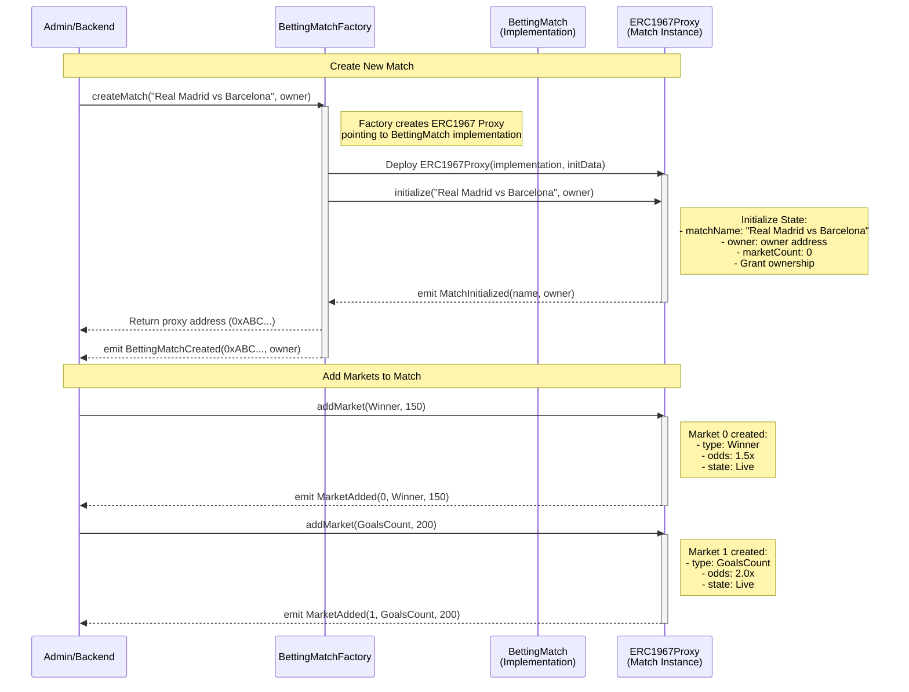

---

### Phase 2: Users Place Bets

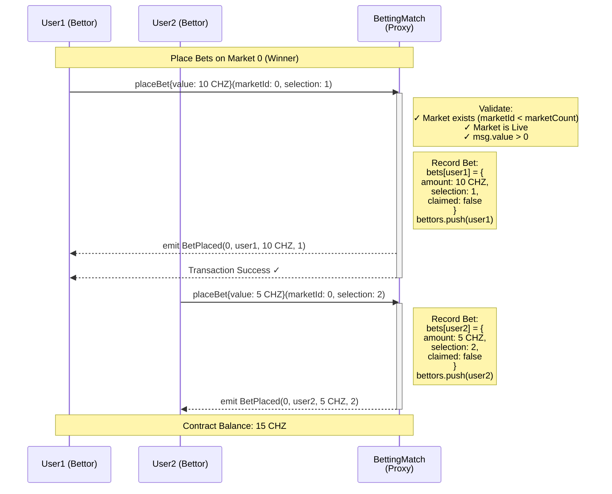

**Multiple Users Betting Example:**

```
Market 0 (Winner):
  User1: 10 CHZ → selection: 1 (Home)
  User2: 5 CHZ  → selection: 2 (Away)
  User3: 8 CHZ  → selection: 1 (Home)

Total in Contract: 23 CHZ
```

---

### Phase 3: Owner Funds Liquidity & Resolves Market

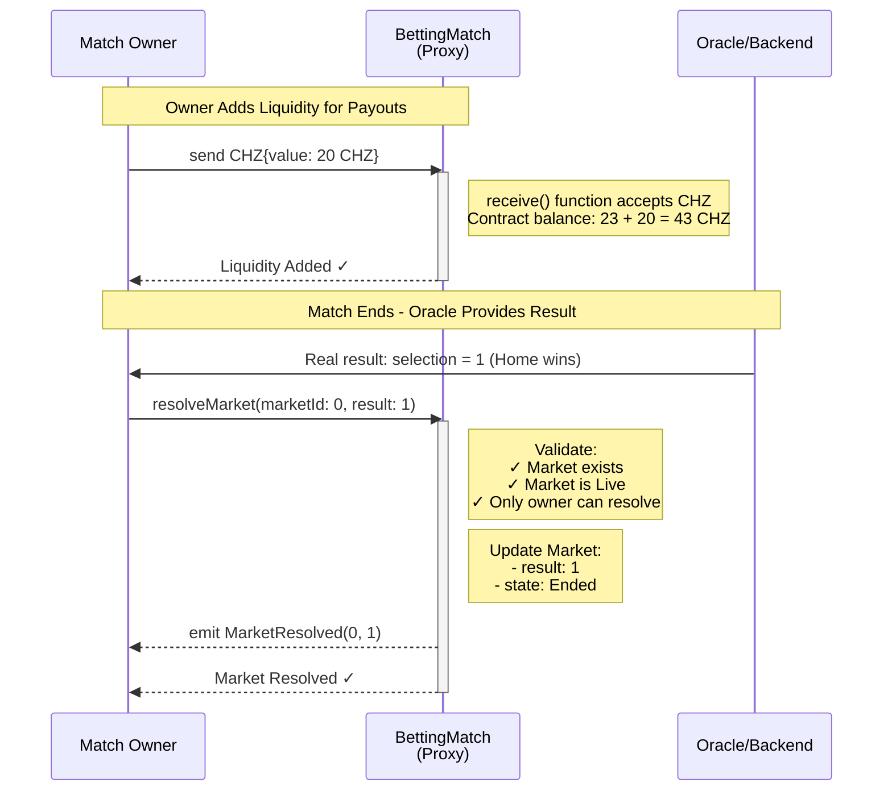

---

### Phase 4: Winners Claim Payouts

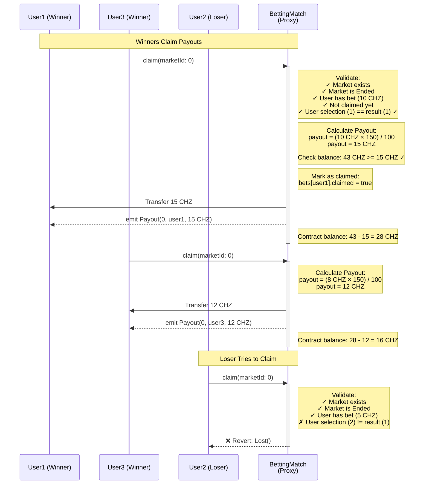

---

## System 2: Streaming System Flow (Beacon Pattern)

### Phase 1: System Deployment

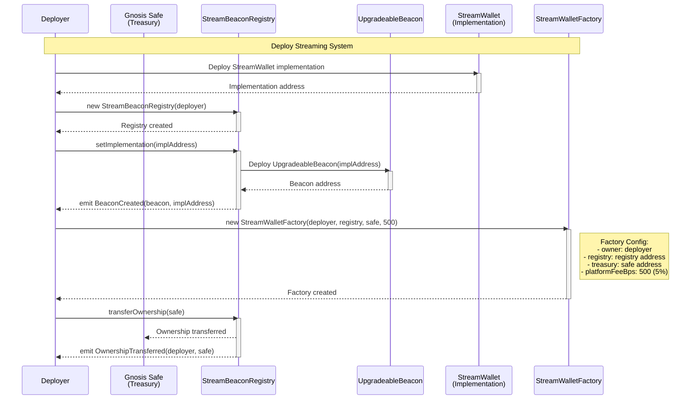

---

### Phase 2: Create Streamer Wallet

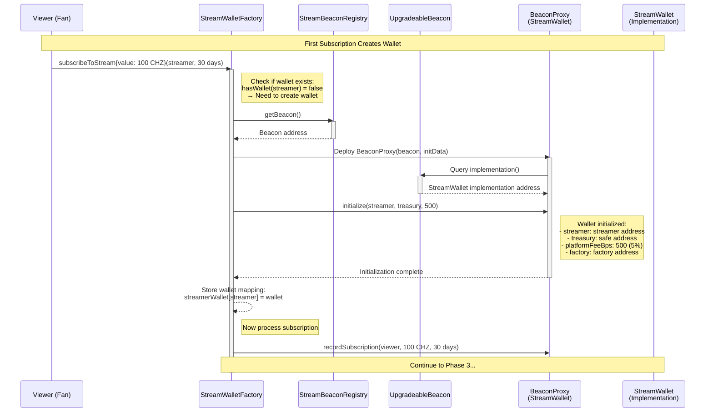

---

### Phase 3: Subscription with Fee Split

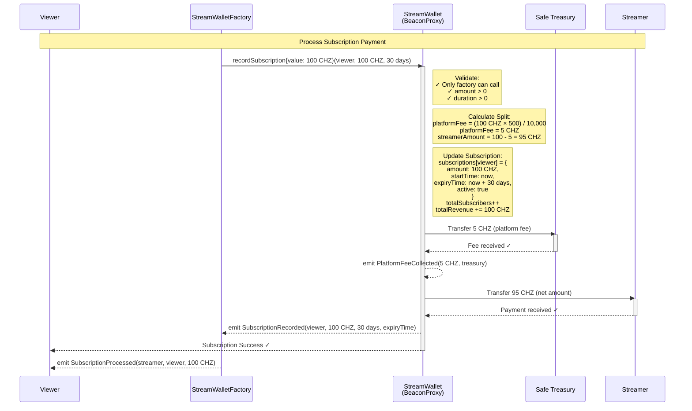

**Subscription Flow Summary:**

```
Viewer pays:        100 CHZ
Platform fee (5%):   -5 CHZ → Treasury
Streamer receives:   95 CHZ → Streamer wallet
```

---

### Phase 4: Donation Flow

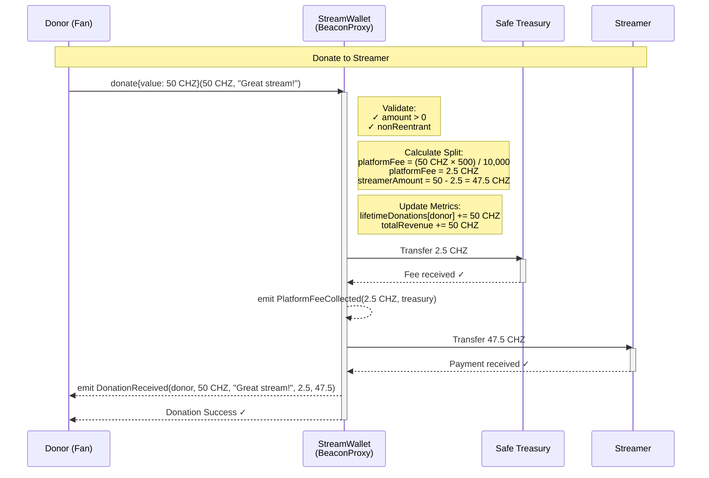

---

### Phase 5: Upgrade All Streamer Wallets (Atomic Upgrade)

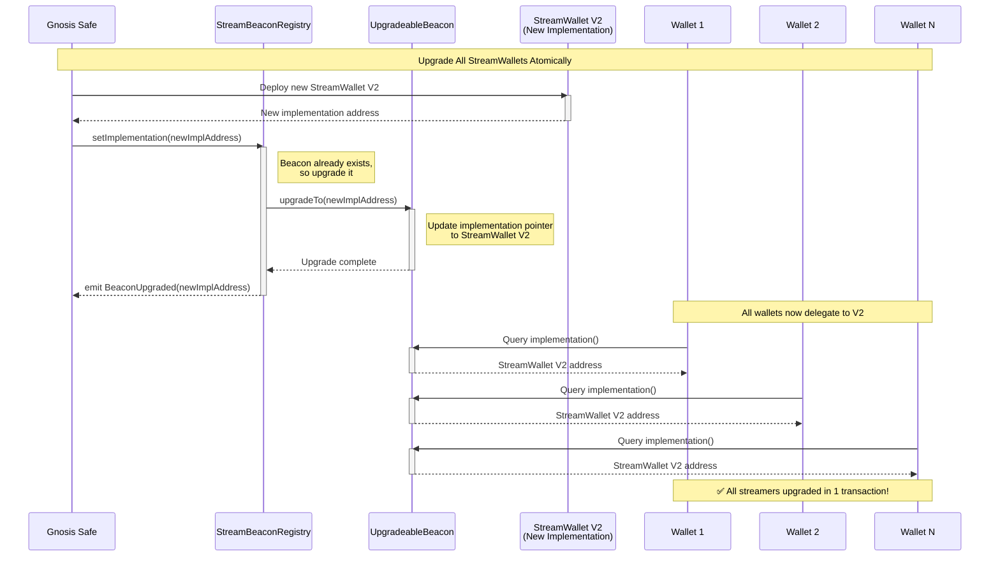

---

## Key Differences Between Systems

### Betting System (UUPS)
- ✅ **Individual Upgrades**: Each match upgradeable by its owner
- ✅ **Simple Pattern**: ERC1967 proxy → implementation
- ✅ **Owner Control**: Match owner has full control
- ✅ **Independent**: Matches don't affect each other
- ⚠️ **No Atomic Upgrades**: Must upgrade each match separately

### Streaming System (Beacon)
- ✅ **Atomic Upgrades**: All streamers upgrade together
- ✅ **Safe Control**: Multisig controls all upgrades
- ✅ **Platform Updates**: Fix bugs for everyone at once
- ✅ **Consistent**: All streamers on same version
- ⚠️ **Less Individual Control**: Streamers can't upgrade independently

---

## State Diagrams

### Betting Match Lifecycle

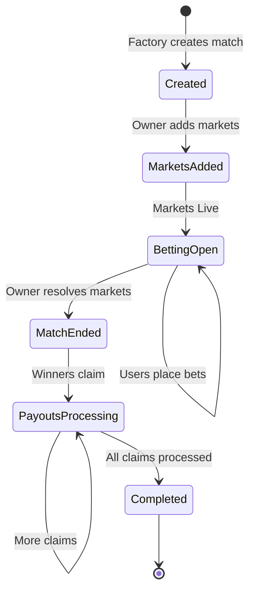

### Streamer Wallet Lifecycle

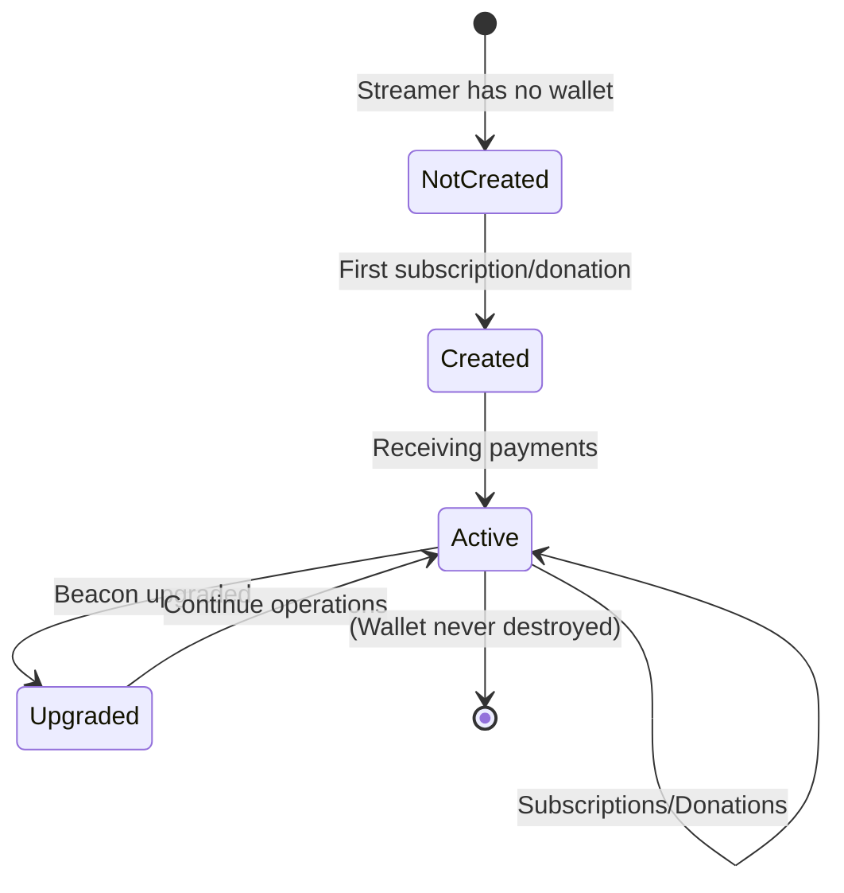

---

**Last Updated**: 2025-11-19
