# 🎯 Complete Betting System Flow - Sequence Diagram

## Overview

This document provides detailed sequence diagrams for both betting systems:
1. **Parimutuel System** (Current - MatchBettingBase)
2. **Fixed Odds System** (New - MatchBettingOdds)

All diagrams use **Mermaid** syntax for easy rendering in GitHub, GitLab, and documentation tools.

---

## System 1: Parimutuel Betting Flow (Current System)

### Phase 1: Match Creation & Initialization


---

### Phase 2: Users Place Bets

```mermaid
sequenceDiagram
    participant User1 as User1 (Bettor)
    participant Contract as FootballBetting
    participant Oracle as PriceOracle (Library)
    participant Chainlink as MockV3Aggregator<br/>(Chainlink Feed)

    User1->>Contract: betHome{value: 100 ether}
    activate Contract
    
    Note right of Contract: Check Modifiers:<br/>✓ whenNotPaused<br/>✓ onlyBeforeCutoff<br/>✓ nonReentrant<br/>✓ msg.value > 0
    
    Contract->>Oracle: chzToUsd(100 ether, priceFeed)
    activate Oracle
    
    Oracle->>Chainlink: latestRoundData()
    activate Chainlink
    Chainlink-->>Oracle: price = 10000000 ($0.10)
    deactivate Chainlink
    
    Note right of Oracle: Calculate USD value:<br/>usdValue = (100 ether × 10000000) / 1e18<br/>usdValue = 1000000000 ($10.00)
    
    Oracle-->>Contract: Return: $10.00 (in 8 decimals)
    deactivate Oracle
    
    Note right of Contract: Validate minimum bet:<br/>1000000000 >= 500000000 ✓<br/>($10 >= $5 minimum)
    
    Note right of Contract: Update State:<br/>pool[0] += 100 ether<br/>bets[user1][0] += 100 ether
    
    Contract-->>User1: emit BetPlaced(user1, 0, 100 ether, 1000000000)
    Contract-->>User1: Transaction Success ✓
    deactivate Contract
```



**Multiple Users Betting:**

```
User1: betHome{value: 500 ether}    → pool[0] = 500 ether (Home)
User2: betDraw{value: 300 ether}    → pool[1] = 300 ether (Draw)
User3: betAway{value: 200 ether}    → pool[2] = 200 ether (Away)
User4: betHome{value: 300 ether}    → pool[0] = 800 ether (Home)

Total Pool: 1,300 ether
```

---

### Phase 3: Match Resolves & Settlement


**Parimutuel Calculation Logic:**

```
Total Pool: 1,300 CHZ
├─ Home (winning): 800 CHZ staked
├─ Draw (losing): 300 CHZ staked
└─ Away (losing): 200 CHZ staked

Platform Fee: 1,300 × 2% = 26 CHZ
Distributable to Winners: 1,300 - 26 = 1,274 CHZ

Payout Formula:
payout = (userStake / winningPool) × distributable

User1 (500 CHZ on Home):
payout = (500 / 800) × 1,274 = 796.25 CHZ

User4 (300 CHZ on Home):
payout = (300 / 800) × 1,274 = 477.75 CHZ

Total Paid: 796.25 + 477.75 = 1,274 CHZ ✓
```

---

### Phase 4: Winners Claim Payouts

```mermaid
sequenceDiagram
    participant User1 as User1 (Winner)
    participant Contract as FootballBetting
    participant Treasury as Treasury

    User1->>Contract: claim()
    activate Contract
    
    Note right of Contract: Check Conditions:<br/>✓ settled<br/>✓ !claimed[user1]<br/>✓ bets[user1][0] > 0<br/>✓ pool[0] > 0
    
    Note right of Contract: Calculate Payout:<br/>userStake = 500 ether<br/>winPool = 800 ether<br/>total = 1,300 ether<br/>fee = 26 ether<br/>distributable = 1,274 ether<br/>payout = (500/800) × 1,274<br/>payout = 796.25 ether
    
    Note right of Contract: Update State (CEI):<br/>claimed[user1] = true<br/>feeBps = 0 (after first claim)
    
    Contract-->>User1: emit Claimed(user1, 796.25 ether)
    
    Contract->>Treasury: Transfer fee: 26 ether
    activate Treasury
    Treasury-->>Contract: Fee transfer success ✓
    deactivate Treasury
    
    Contract->>User1: Transfer payout: 796.25 ether
    User1-->>Contract: Receive success ✓
    
    Contract-->>User1: Claim Complete ✓
    deactivate Contract
```



**Full Claiming Process:**

```
User1 (500 CHZ on Home): claim() → 796.25 CHZ ✓
User4 (300 CHZ on Home): claim() → 477.75 CHZ ✓
User2 (300 CHZ on Draw): claim() → Reverts: NothingToClaim ✗
User3 (200 CHZ on Away): claim() → Reverts: NothingToClaim ✗

Treasury receives: 26 CHZ (fee)
Contract final balance: 0 CHZ (all distributed)
```

---

## System 2: Fixed Odds Betting Flow (New System)

### Phase 1: Match Creation with Odds


---

### Phase 2: Users Place Bets (Odds Locked)


**Odds Change Between Bets:**

```
User1: placeBet{value: 1000 ether}(0) @ 1.8x → Locked 1800 CHZ payout
                    ↓
Admin: setOdds(0, 16000)  → Update to 1.6x for new bets
                    ↓
User2: placeBet{value: 1000 ether}(0) @ 1.6x → Locked 1600 CHZ payout
                    ↓
Admin: setOdds(0, 15000)  → Update to 1.5x
                    ↓
User3: placeBet{value: 1000 ether}(0) @ 1.5x → Locked 1500 CHZ payout

Result:
- User1 gets 1.8x (early bet, better odds)
- User2 gets 1.6x (odds moved against them)
- User3 gets 1.5x (latest odds, worst price)
- Each bet PERMANENTLY LOCKED at time of placement
```

---

### Phase 3: Match Settlement (House P&L)


**House P&L Scenarios:**

**Scenario A: House Profits**
```
Total Staked: 10,000 CHZ
├─ Home (loses): 5,000 CHZ
├─ Draw (loses): 3,000 CHZ
└─ Away (wins @ 2.0x): 2,000 CHZ

Total Payouts: 2,000 × 2.0 = 4,000 CHZ
House P&L: 10,000 - 4,000 = +6,000 CHZ (PROFIT)

Action: Send 6,000 CHZ profit to treasury
Contract keeps: 4,000 CHZ for winner payouts
```

**Scenario B: House Loses**
```
Total Staked: 10,000 CHZ
├─ Home (wins @ 2.5x): 8,000 CHZ
├─ Draw (loses): 1,000 CHZ
└─ Away (loses): 1,000 CHZ

Total Payouts: 8,000 × 2.5 = 20,000 CHZ
House P&L: 10,000 - 20,000 = -10,000 CHZ (LOSS)

Action: Treasury must fund contract with 10,000 CHZ
Contract needs: 20,000 CHZ total for payouts
```

---

### Phase 4: Winners Claim with Locked Odds

```mermaid
sequenceDiagram
    participant User1 as User1 (Winner)
    participant Contract as MatchBettingOdds

    User1->>Contract: claim()
    activate Contract
    
    Note right of Contract: Check Conditions:<br/>✓ settled
    
    Note right of Contract: Iterate User Bets:<br/><br/>userBets[user1][0]:<br/>├─ outcome: 0 (matches winningOutcome ✓)<br/>├─ amountChz: 1000<br/>├─ odds: 18000 ← LOCKED ODDS USED<br/>└─ claimed: false ✓<br/><br/>Calculate:<br/>payout = (1000 × 18000) / 10000<br/>payout = 1,800 ether<br/>totalPayout += 1,800<br/><br/>Mark Claimed:<br/>userBets[user1][0].claimed = true
    
    Contract-->>User1: emit Claimed(user1, 1800 ether, 1)
    
    Contract->>User1: Transfer 1,800 CHZ
    User1-->>Contract: Receive success ✓
    
    Contract-->>User1: Claim Complete ✓
    deactivate Contract
```



**Multiple Claims with Different Locked Odds:**

```
User1 (1000 CHZ @ 1.8x): claim() → 1,800 CHZ ✓
User2 (1000 CHZ @ 1.6x): claim() → 1,600 CHZ ✓
User3 (1000 CHZ @ 1.5x): claim() → 1,500 CHZ ✓

Total Paid: 4,900 CHZ
Contract Balance After: 0 CHZ (if started with exactly 4,900)

User4 (Draw bettor): claim() → Reverts: NothingToClaim ✗
User5 (Away bettor): claim() → Reverts: NothingToClaim ✗
```

---

## Key Function Reference

### Parimutuel System Functions

| Function | Contract | Caller | Purpose | Gas Cost |
|----------|----------|--------|---------|----------|
| `createFootballMatch()` | MatchHubBeaconFactory | Admin | Deploy new match proxy | ~400k |
| `initialize()` | FootballBetting | Factory (auto) | Initialize match state | ~250k |
| `betHome()` | FootballBetting | Any user | Bet on home team | ~150k |
| `betDraw()` | FootballBetting | Any user | Bet on draw | ~150k |
| `betAway()` | FootballBetting | Any user | Bet on away team | ~150k |
| `settle(uint8)` | FootballBetting | Admin/Settler | Resolve match outcome | ~50k |
| `claim()` | FootballBetting | Winner | Claim payout | ~100k |
| `pendingPayout(address)` | FootballBetting | Anyone (view) | Check claimable amount | - |
| `totalPoolAmount()` | FootballBetting | Anyone (view) | Total staked | - |

### Fixed Odds System Functions

| Function | Contract | Caller | Purpose | Gas Cost |
|----------|----------|--------|---------|----------|
| `initialize(InitParams)` | MatchBettingOdds | Admin | Create match with odds | ~300k |
| `placeBet(uint8)` | MatchBettingOdds | Any user | Bet with locked odds | ~200k |
| `setOdds(uint8, uint64)` | MatchBettingOdds | Admin | Update odds for outcome | ~30k |
| `setMaxLiability(uint256)` | MatchBettingOdds | Admin | Adjust risk limits | ~30k |
| `settle(uint8)` | MatchBettingOdds | Admin/Settler | Resolve + calc P&L | ~80k |
| `fundContract()` | MatchBettingOdds | Treasury | Add liquidity for losses | ~30k |
| `claim()` | MatchBettingOdds | Winner | Claim with locked odds | ~150k |
| `pendingPayout(address)` | MatchBettingOdds | Anyone (view) | Check claimable amount | - |
| `getAllOdds()` | MatchBettingOdds | Anyone (view) | Get current odds array | - |
| `getUserBetCount(address)` | MatchBettingOdds | Anyone (view) | Count user's bets | - |
| `getUserBet(address, uint256)` | MatchBettingOdds | Anyone (view) | Get specific bet details | - |

---

## State Transitions

### Parimutuel Match State Machine


### Fixed Odds Match State Machine


---

## Error Handling & Edge Cases

### Common Reverts

| Error | Condition | Solution |
|-------|-----------|----------|
| `BettingClosed` | Bet after cutoffTs | Wait for next match |
| `BetBelowMinimum` | < $5 USD worth | Increase bet amount |
| `BetAboveMaximum` | > maxBetAmount | Reduce bet size |
| `InsufficientLiquidity` | Exceeds maxLiability | Wait for odds adjustment |
| `NotSettled` | Claim before settlement | Wait for admin to settle |
| `NothingToClaim` | Bet on losing outcome | Cannot claim (lost bet) |
| `AlreadySettled` | Settle twice | Match already resolved |
| `InsufficientContractBalance` | Payouts > balance | Treasury needs to fund |

---

## Gas Optimization Notes

**Parimutuel System:**
- Betting: ~150k gas (state updates + oracle call)
- Settlement: ~50k gas (minimal calculation)
- Claim: ~100k gas (proportional payout calculation + transfer)
- **Total per user**: ~250k gas

**Fixed Odds System:**
- Betting: ~200k gas (odds locking + liability tracking)
- Settlement: ~80k gas (P&L calculation)
- Claim: ~150k gas (iterate bets + locked odds payout)
- **Total per user**: ~350k gas (30% more than parimutuel)

**Trade-off:** Fixed odds provides better UX (known payout) at cost of higher gas usage.

---

## Summary Comparison

| Aspect | Parimutuel | Fixed Odds |
|--------|-----------|------------|
| **User knows payout when betting** | ❌ No | ✅ Yes (locked) |
| **Odds can change** | ✅ Always changes | ✅ But each bet locked |
| **House risk** | None (peer-to-peer) | High (liquidity required) |
| **Treasury involvement** | Fee collection only | Provides liquidity + takes P&L |
| **Claim payout calculation** | Proportional share | Locked odds × stake |
| **Gas per user** | ~250k | ~350k |
| **Complexity** | Simple | Complex |
| **Competitiveness** | Low | High (industry standard) |

---

**Status**: Complete Flow Documentation ✓
**Last Updated**: October 31, 2025
**Version**: 1.0
