# ChilizTV — Complete Sequence Diagrams

> All flows derived from contract source code. Covers **deployment**, **betting**, **streaming (donations & subscriptions)**, **payout/escrow**, and **failure routes**.

---

## Table of Contents

- [ChilizTV — Complete Sequence Diagrams](#chiliztv--complete-sequence-diagrams)
  - [Table of Contents](#table-of-contents)
  - [1. System Deployment](#1-system-deployment)
  - [2. Betting Happy Path](#2-betting-happy-path)
  - [3. Betting Failure Routes](#3-betting-failure-routes)
  - [4. Payout \& Escrow](#4-payout--escrow)
  - [5. Streaming Donations — Happy Path](#5-streaming-donations--happy-path)
  - [6. Streaming Subscriptions — Happy Path](#6-streaming-subscriptions--happy-path)
  - [7. Streaming Failure Routes](#7-streaming-failure-routes)
  - [8. ChilizSwapRouter — All Payment Paths Summary](#8-chilizswaprouter--all-payment-paths-summary)
  - [Contract Summary](#contract-summary)
    - [Error Quick Reference](#error-quick-reference)

---

## 1. System Deployment

Complete deployment of every contract in the correct order.

```mermaid
sequenceDiagram
    title ChilizTV — Full System Deployment

    actor Deployer as Deployer (Admin)

    participant USDC as USDC Token
    participant FImpl as FootballMatch (impl)
    participant BImpl as BasketballMatch (impl)
    participant Factory as BettingMatchFactory
    participant Escrow as PayoutEscrow
    participant SWImpl as StreamWallet (impl)
    participant SWFactory as StreamWalletFactory
    participant KayenMR as KayenMasterRouterV2
    participant KayenR as KayenRouter
    participant SwapRouter as ChilizSwapRouter
    participant Safe as Gnosis Safe (Treasury)

    rect rgb(200, 220, 255)
        Note over Deployer,Safe: PHASE 1: BETTING SYSTEM

        Deployer->>Factory: deploy BettingMatchFactory()
        activate Factory
        Note right of Factory: Constructor internally deploys:<br/>FootballMatch impl<br/>BasketballMatch impl<br/>Sets deployer as Ownable owner
        Factory->>FImpl: new FootballMatch()
        FImpl-->>Factory: FOOTBALL_IMPLEMENTATION set (immutable)
        Factory->>BImpl: new BasketballMatch()
        BImpl-->>Factory: BASKETBALL_IMPLEMENTATION set (immutable)
        Factory-->>Deployer: Factory deployed ✓
        deactivate Factory
    end

    rect rgb(230, 255, 230)
        Note over Deployer,Safe: PHASE 2: PAYOUT ESCROW

        Deployer->>Escrow: deploy PayoutEscrow(usdc, safeAddress)
        activate Escrow
        Note right of Escrow: Ownable(_owner = Safe)<br/>usdc = immutable USDC<br/>ReentrancyGuard + Pausable
        Escrow-->>Deployer: Escrow deployed ✓
        deactivate Escrow
    end

    rect rgb(255, 240, 220)
        Note over Deployer,Safe: PHASE 3: STREAMING SYSTEM

        Deployer->>SWFactory: deploy StreamWalletFactory(<br/>  initialOwner, treasury, feeBps,<br/>  kayenRouter, fanToken, usdc)
        activate SWFactory
        Note right of SWFactory: Constructor internally deploys StreamWallet impl.<br/>`streamWalletImplementation` is MUTABLE via `setImplementation()`<br/>(affects NEW wallets only). Existing wallets upgrade individually<br/>via `upgradeWallet(streamer, newImpl)`. No beacon — per-wallet UUPS.<br/>Stores treasury, feeBps, router, tokens.
        SWFactory->>SWImpl: new StreamWallet()
        SWImpl-->>SWFactory: STREAM_WALLET_IMPLEMENTATION set
        SWFactory-->>Deployer: StreamWalletFactory deployed ✓
        deactivate SWFactory
    end

    rect rgb(255, 230, 230)
        Note over Deployer,Safe: PHASE 4: UNIFIED SWAP ROUTER

        Deployer->>SwapRouter: deploy ChilizSwapRouter(<br/>  masterRouter, tokenRouter,<br/>  usdc, wchz, treasury, feeBps)
        activate SwapRouter
        Note right of SwapRouter: Immutables: masterRouter, tokenRouter, usdc, wchz<br/>Mutable: treasury, platformFeeBps<br/>Ownable(msg.sender) + ReentrancyGuard
        SwapRouter-->>Deployer: SwapRouter deployed ✓
        deactivate SwapRouter
    end

    rect rgb(240, 240, 255)
        Note over Deployer,Safe: PHASE 5: CROSS-SYSTEM WIRING

        Note right of Deployer: Order matters: SWFactory must know the router<br/>BEFORE the router registers the factory, otherwise<br/>ChilizSwapRouter reverts `RouterNotConfiguredOnFactory`.

        Deployer->>SWFactory: setSwapRouter(SwapRouter)
        SWFactory-->>Deployer: ✓

        Deployer->>SwapRouter: setStreamWalletFactory(SWFactory)
        SwapRouter-->>Deployer: ✓

        Note right of Deployer: Per new BettingMatch proxy:<br/>1. match.setUSDCToken(usdc)<br/>2. match.setPayoutEscrow(Escrow)<br/>3. Escrow.authorizeMatch(match, cap)  // Safe<br/>4. match.grantRole(RESOLVER_ROLE, oracle)<br/>5. match.grantRole(SWAP_ROUTER_ROLE, SwapRouter)

        Note over Deployer,Safe: Fund PayoutEscrow via Gnosis Safe
        Safe->>USDC: approve(Escrow, amount)
        Safe->>Escrow: fund(amount)
        Escrow-->>Safe: emit Funded ✓
    end

    rect rgb(240, 240, 240)
        Note over Deployer,Safe: DEPLOYMENT COMPLETE
        Note over Factory: BettingMatchFactory ready<br/>FootballMatch + BasketballMatch impls
        Note over Escrow: PayoutEscrow funded by Safe<br/>Awaiting match authorizations
        Note over SWFactory: StreamWalletFactory ready<br/>with SwapRouter wired
        Note over SwapRouter: ChilizSwapRouter ready<br/>Betting + Streaming + Kayen DEX
    end
```

---

## 2. Betting Happy Path

Full lifecycle: match creation → market setup → bets → odds change → resolution → claims.

```mermaid
sequenceDiagram
    title Betting System — Happy Path (End-to-End)

    actor Admin as Admin (ADMIN_ROLE)
    actor OddsSetter as OddsSetter (ODDS_SETTER_ROLE)
    actor Resolver as Resolver (RESOLVER_ROLE)
    actor Treasury as Treasury (TREASURY_ROLE)
    actor User1 as User1 (Winner)
    actor User2 as User2 (Loser)

    participant Factory as BettingMatchFactory
    participant Proxy as Match Proxy (ERC1967)
    participant FImpl as FootballMatch Logic
    participant USDC as USDC Token
    participant Escrow as PayoutEscrow

    rect rgb(200, 220, 255)
        Note over Admin,Escrow: STEP 1: CREATE MATCH

        Admin->>Factory: createFootballMatch("Real Madrid vs Barça", owner)
        activate Factory
        Factory->>Proxy: new ERC1967Proxy(FOOTBALL_IMPL, initData)
        activate Proxy
        Proxy->>FImpl: delegatecall initialize("Real Madrid vs Barça", owner)
        Note right of FImpl: __BettingMatchV2_init:<br/>Grant owner ALL roles:<br/>DEFAULT_ADMIN, ADMIN, RESOLVER,<br/>PAUSER, TREASURY, ODDS_SETTER<br/>matchName = "Real Madrid vs Barça"<br/>sportType = "FOOTBALL"
        FImpl-->>Proxy: Initialized ✓
        deactivate Proxy
        Factory-->>Admin: emit MatchCreated(proxy, FOOTBALL, owner)
        deactivate Factory
    end

    rect rgb(230, 255, 230)
        Note over Admin,Escrow: STEP 2: CONFIGURE MATCH

        Admin->>Proxy: setUSDCToken(usdcAddress)
        Note right of Proxy: onlyRole(ADMIN_ROLE)<br/>emit USDCTokenSet

        Admin->>Proxy: setPayoutEscrow(escrowAddress)
        Note right of Proxy: onlyRole(ADMIN_ROLE)<br/>emit PayoutEscrowSet

        Admin->>Proxy: grantRole(SWAP_ROUTER_ROLE, swapRouter)
        Note right of Proxy: onlyRole(DEFAULT_ADMIN_ROLE)<br/>Allows ChilizSwapRouter to call placeBetUSDCFor

        Admin->>Escrow: authorizeMatch(proxy) [via Safe]
        Note right of Escrow: onlyOwner<br/>authorizedMatches[proxy] = true<br/>emit MatchAuthorized
    end

    rect rgb(255, 245, 220)
        Note over Admin,Escrow: STEP 3: ADD MARKETS & OPEN

        Admin->>Proxy: addMarketWithLine(WINNER, 22000, 0)
        activate Proxy
        Note right of Proxy: onlyRole(ADMIN_ROLE)<br/>_validateOdds(22000) ✓ [10001..1000000]<br/>maxSelections = 2 (Home/Draw/Away)<br/>State = Inactive<br/>oddsRegistry[0] = [22000], currentIndex = 1
        Proxy-->>Admin: emit MarketCreated(0, "WINNER", 22000)
        deactivate Proxy

        Admin->>Proxy: addMarketWithLine(GOALS_TOTAL, 18500, 25)
        Note right of Proxy: marketId=1, line=25 (2.5 goals)<br/>maxSelections = 1 (Under/Over)

        Admin->>Proxy: openMarket(0)
        Note right of Proxy: State: Inactive → Open<br/>emit MarketStateChanged(0, Inactive, Open)

        Admin->>Proxy: openMarket(1)
        Note right of Proxy: State: Inactive → Open

        Treasury->>Proxy: fundUSDCTreasury(50000e6)
        Note right of Proxy: onlyRole(TREASURY_ROLE)<br/>safeTransferFrom(treasury, proxy, 50000 USDC)
    end

    rect rgb(255, 240, 220)
        Note over Admin,Escrow: STEP 4: USERS PLACE BETS

        User1->>USDC: approve(proxy, 500e6)
        User1->>Proxy: placeBetUSDC(marketId=0, selection=0, 500e6)
        activate Proxy
        Note right of Proxy: Checks: Open ✓, !Paused ✓, USDC set ✓<br/>_validateSelection(0, 0): 0 ≤ 2 ✓<br/>odds = 22000 (2.20x)<br/>potentialPayout = 500 × 22000 / 10000 = 1100 USDC<br/>Solvency: liabilities + 1100 ≤ balance + 500 ✓<br/>safeTransferFrom(user1, proxy, 500 USDC)
        Proxy-->>User1: emit BetPlaced(0, user1, idx=0, 500e6, sel=0, 22000, oddsIdx=1)
        deactivate Proxy

        OddsSetter->>Proxy: setMarketOdds(0, 18000)
        Note right of Proxy: onlyRole(ODDS_SETTER_ROLE)<br/>Market Open ✓<br/>oddsRegistry[0] = [22000, 18000]<br/>currentIndex = 2<br/>emit OddsUpdated(0, 22000, 18000, 2)

        User2->>USDC: approve(proxy, 300e6)
        User2->>Proxy: placeBetUSDC(marketId=0, selection=2, 300e6)
        activate Proxy
        Note right of Proxy: User2 gets NEW odds: 18000 (1.80x)<br/>potentialPayout = 300 × 18000 / 10000 = 540 USDC<br/>Bet stored with oddsIndex=2
        Proxy-->>User2: emit BetPlaced(0, user2, idx=0, 300e6, sel=2, 18000, oddsIdx=2)
        deactivate Proxy
    end

    rect rgb(220, 255, 220)
        Note over Admin,Escrow: STEP 5: MATCH LIFECYCLE

        Admin->>Proxy: suspendMarket(0)
        Note right of Proxy: Open → Suspended (match kicked off)<br/>No more bets accepted

        Admin->>Proxy: closeMarket(0)
        Note right of Proxy: Suspended → Closed (match ended)<br/>Awaiting result
    end

    rect rgb(255, 230, 230)
        Note over Admin,Escrow: STEP 6: RESOLVE MARKET

        Resolver->>Proxy: resolveMarket(0, result=0)
        activate Proxy
        Note right of Proxy: onlyRole(RESOLVER_ROLE)<br/>State must be Closed or Open<br/>core.result = 0 (Home wins)<br/>core.resolvedAt = block.timestamp<br/>State: Closed → Resolved
        Proxy-->>Resolver: emit MarketResolved(0, result=0, timestamp)
        deactivate Proxy
    end

    rect rgb(240, 240, 255)
        Note over Admin,Escrow: STEP 7: WINNERS CLAIM

        User1->>Proxy: claim(marketId=0, betIndex=0)
        activate Proxy
        Note right of Proxy: nonReentrant, Resolved ✓, !Paused ✓<br/>bet.selection(0) == core.result(0) ✓ WINNER<br/>betOdds = oddsRegistry[oddsIndex=1-1] = 22000<br/>payout = 500 × 22000 / 10000 = 1100 USDC<br/>bet.claimed = true (CEI)<br/>totalUSDCLiabilities -= 1100<br/>_disburse(user1, 1100): balance ≥ 1100 ✓
        Proxy->>USDC: safeTransfer(user1, 1100e6)
        USDC-->>User1: 1100 USDC received ✓
        Proxy-->>User1: emit Payout(0, user1, 0, 1100e6)
        deactivate Proxy

        Note over User2: User2 bet on selection=2 (Away)<br/>Result was 0 (Home)<br/>claim() would revert: BetLost
    end
```

---

## 3. Betting Failure Routes

Every revert path from the betting contracts.

```mermaid
sequenceDiagram
    title Betting System — All Failure Routes

    actor User as User
    actor BadActor as Unauthorized Caller
    actor Admin as Admin

    participant Proxy as Match Proxy
    participant USDC as USDC Token
    participant Escrow as PayoutEscrow

    rect rgb(255, 220, 220)
        Note over User,Escrow: ❌ BET PLACEMENT FAILURES

        User->>Proxy: placeBetUSDC(99, 0, 100e6)
        Proxy-->>User: REVERT InvalidMarketId(99)<br/>marketId >= marketCount

        User->>Proxy: placeBetUSDC(0, 0, 100e6) [market Inactive]
        Proxy-->>User: REVERT InvalidMarketState(0, Inactive, Open)<br/>Market not Open

        User->>Proxy: placeBetUSDC(0, 0, 100e6) [paused]
        Proxy-->>User: REVERT EnforcedPause<br/>Contract is paused

        User->>Proxy: placeBetUSDC(0, 0, 0)
        Proxy-->>User: REVERT ZeroBetAmount<br/>amount == 0

        User->>Proxy: placeBetUSDC(0, 0, 100e6) [no USDC set]
        Proxy-->>User: REVERT USDCNotConfigured<br/>usdcToken == address(0)

        User->>Proxy: placeBetUSDC(0, 0, 100e6) [no odds set]
        Proxy-->>User: REVERT OddsNotSet(0)<br/>currentIndex == 0

        User->>Proxy: placeBetUSDC(0, 5, 100e6) [football WINNER]
        Proxy-->>User: REVERT InvalidSelection(0, 5, 2)<br/>selection > maxSelections

        User->>Proxy: placeBetUSDC(0, 0, 1000000e6) [huge bet]
        Proxy-->>User: REVERT USDCSolvencyExceeded<br/>liabilities + potentialPayout > balance + deposit

        User->>Proxy: placeBetUSDC(0, 0, 100e6) [no USDC approval]
        Proxy-->>User: REVERT SafeERC20: low-level call failed<br/>ERC20 transferFrom fails
    end

    rect rgb(255, 235, 220)
        Note over User,Escrow: ❌ CLAIM / REFUND FAILURES

        User->>Proxy: claim(0, 0) [market not Resolved]
        Proxy-->>User: REVERT InvalidMarketState(0, Open, Resolved)

        User->>Proxy: claim(0, 99) [bad index]
        Proxy-->>User: REVERT BetNotFound(0, user, 99)

        User->>Proxy: claim(0, 0) [already claimed]
        Proxy-->>User: REVERT AlreadyClaimed(0, user, 0)

        User->>Proxy: claim(0, 0) [bet lost]
        Proxy-->>User: REVERT BetLost(0, user, 0)<br/>bet.selection != core.result

        User->>Proxy: claim(0, 0) [contract underfunded, no escrow]
        Proxy-->>User: REVERT InsufficientUSDCBalance(1100, 200)<br/>balance < payout and no escrow set

        User->>Proxy: claimRefund(0, 0) [not cancelled]
        Proxy-->>User: REVERT InvalidMarketState(0, Open, Cancelled)
    end

    rect rgb(255, 245, 220)
        Note over User,Escrow: ❌ ADMIN / ROLE FAILURES

        BadActor->>Proxy: addMarketWithLine(WINNER, 20000, 0)
        Proxy-->>BadActor: REVERT AccessControlUnauthorizedAccount<br/>Missing ADMIN_ROLE

        BadActor->>Proxy: setMarketOdds(0, 15000)
        Proxy-->>BadActor: REVERT AccessControlUnauthorizedAccount<br/>Missing ODDS_SETTER_ROLE

        BadActor->>Proxy: resolveMarket(0, 1)
        Proxy-->>BadActor: REVERT AccessControlUnauthorizedAccount<br/>Missing RESOLVER_ROLE

        BadActor->>Proxy: emergencyPause()
        Proxy-->>BadActor: REVERT AccessControlUnauthorizedAccount<br/>Missing PAUSER_ROLE

        BadActor->>Proxy: placeBetUSDCFor(user, 0, 0, 100e6)
        Proxy-->>BadActor: REVERT AccessControlUnauthorizedAccount<br/>Missing SWAP_ROUTER_ROLE

        Admin->>Proxy: setMarketOdds(0, 5000)
        Proxy-->>Admin: REVERT InvalidOddsValue(5000, 10001, 1000000)<br/>Odds below MIN_ODDS

        Admin->>Proxy: emergencyWithdrawUSDC(100e6) [not paused]
        Proxy-->>Admin: REVERT ContractNotPaused<br/>emergencyWithdraw requires pause
    end
```

---

## 4. Payout & Escrow

Happy path with escrow fallback + all escrow failure routes.

```mermaid
sequenceDiagram
    title PayoutEscrow — Happy Path + Failures

    actor Safe as Gnosis Safe (Owner)
    actor Winner as Winner

    participant Proxy as BettingMatch Proxy
    participant USDC as USDC Token
    participant Escrow as PayoutEscrow

    rect rgb(230, 255, 230)
        Note over Safe,Escrow: ✅ HAPPY: Direct Payout (no escrow needed)

        Winner->>Proxy: claim(marketId, betIndex)
        Proxy->>Proxy: _disburse(winner, 1100 USDC)
        Proxy->>Proxy: contractBalance(1500) >= 1100 ✓
        Proxy->>USDC: safeTransfer(winner, 1100)
        USDC-->>Winner: 1100 USDC ✓
    end

    rect rgb(220, 240, 255)
        Note over Safe,Escrow: ✅ HAPPY: Escrow Fallback Payout

        Winner->>Proxy: claim(marketId, betIndex)
        Proxy->>Proxy: _disburse(winner, 1100 USDC)
        Note right of Proxy: contractBalance = 400 < 1100<br/>deficit = 1100 - 400 = 700
        Proxy->>Escrow: disburseTo(proxy, 700)
        activate Escrow
        Note right of Escrow: onlyAuthorizedMatch ✓<br/>whenNotPaused ✓<br/>balance(5000) >= 700 ✓<br/>totalDisbursed += 700<br/>disbursedPerMatch[proxy] += 700
        Escrow->>USDC: safeTransfer(proxy, 700)
        deactivate Escrow
        Note right of Proxy: contractBalance now = 400 + 700 = 1100
        Proxy->>USDC: safeTransfer(winner, 1100)
        USDC-->>Winner: 1100 USDC ✓
    end

    rect rgb(255, 220, 220)
        Note over Safe,Escrow: ❌ FAILURE: Escrow Not Set

        Winner->>Proxy: claim(marketId, betIndex)
        Proxy->>Proxy: contractBalance(400) < 1100
        Note right of Proxy: payoutEscrow == address(0)
        Proxy-->>Winner: REVERT InsufficientUSDCBalance(1100, 400)
    end

    rect rgb(255, 230, 220)
        Note over Safe,Escrow: ❌ FAILURE: Escrow Underfunded

        Winner->>Proxy: claim(marketId, betIndex)
        Proxy->>Escrow: disburseTo(proxy, 700)
        Note right of Escrow: balance(200) < 700
        Escrow-->>Proxy: REVERT InsufficientEscrowBalance(700, 200)
        Proxy-->>Winner: REVERT (entire tx rolled back)
        Note over Winner: Retry after Safe tops up escrow
    end

    rect rgb(255, 240, 220)
        Note over Safe,Escrow: ❌ FAILURE: Match Not Authorized on Escrow

        Winner->>Proxy: claim(marketId, betIndex)
        Proxy->>Escrow: disburseTo(proxy, 700)
        Note right of Escrow: authorizedMatches[proxy] == false
        Escrow-->>Proxy: REVERT UnauthorizedMatch(proxy)
        Proxy-->>Winner: REVERT (entire tx rolled back)
    end

    rect rgb(255, 245, 230)
        Note over Safe,Escrow: ❌ FAILURE: Escrow Paused

        Winner->>Proxy: claim(marketId, betIndex)
        Proxy->>Escrow: disburseTo(proxy, 700)
        Note right of Escrow: Pausable: paused == true
        Escrow-->>Proxy: REVERT EnforcedPause
        Proxy-->>Winner: REVERT (entire tx rolled back)
    end

    rect rgb(240, 240, 240)
        Note over Safe,Escrow: ESCROW MANAGEMENT

        Safe->>Escrow: fund(5000e6)
        Note right of Escrow: safeTransferFrom(safe, escrow, 5000)<br/>emit Funded(safe, 5000)

        Safe->>Escrow: withdraw(2000e6)
        Note right of Escrow: onlyOwner, balance check<br/>safeTransfer(safe, 2000)<br/>emit Withdrawn(safe, 2000)

        Safe->>Escrow: authorizeMatch(newProxy)
        Note right of Escrow: authorizedMatches[newProxy] = true

        Safe->>Escrow: revokeMatch(oldProxy)
        Note right of Escrow: authorizedMatches[oldProxy] = false

        Safe->>Escrow: pause()
        Note right of Escrow: Halts all disburseTo() calls
    end
```

---

## 5. Streaming Donations — Happy Path

All three donation paths: CHZ, ERC20 token, and USDC direct.

```mermaid
sequenceDiagram
    title Streaming Donations — Happy Path (All Payment Paths)

    actor Donor as Donor / Fan
    
    participant SwapRouter as ChilizSwapRouter
    participant Kayen as Kayen DEX
    participant USDC as USDC Token
    participant SWFactory as StreamWalletFactory
    participant Wallet as StreamWallet Proxy
    participant Streamer as Streamer Address
    participant Treasury as Platform Treasury

    rect rgb(200, 220, 255)
        Note over Donor,Treasury: PATH A: donateWithCHZ (native CHZ)

        Donor->>SwapRouter: donateWithCHZ{value: 50 CHZ}(<br/>  streamer, "Go team!", minOut, deadline)
        activate SwapRouter
        Note right of SwapRouter: Checks: value > 0 ✓, streamer ≠ 0 ✓<br/>block.timestamp ≤ deadline ✓

        SwapRouter->>Kayen: swapExactETHForTokens{50 CHZ}(<br/>  minOut, [WCHZ, USDC], router, deadline)
        Kayen-->>SwapRouter: receive 120 USDC

        SwapRouter->>SwapRouter: _splitAndTransfer(streamer, 120)
        Note right of SwapRouter: fee = 120 × 500 / 10000 = 6 USDC<br/>streamerAmt = 120 - 6 = 114 USDC

        SwapRouter->>USDC: safeTransfer(treasury, 6)
        USDC-->>Treasury: 6 USDC fee

        SwapRouter->>USDC: safeTransfer(streamer, 114)
        USDC-->>Streamer: 114 USDC

        SwapRouter->>SWFactory: getOrCreateWallet(streamer)
        SWFactory-->>SwapRouter: wallet address

        SwapRouter->>Wallet: recordDonationByRouter(<br/>  donor, 120, 6, 114, "Go team!")
        activate Wallet
        Note right of Wallet: onlyAuthorized (swapRouter) ✓<br/>lifetimeDonations[donor] += 120<br/>totalRevenue += 120
        Wallet-->>SwapRouter: emit DonationReceived ✓
        deactivate Wallet

        SwapRouter-->>Donor: emit DonationWithCHZ ✓
        deactivate SwapRouter
    end

    rect rgb(230, 255, 230)
        Note over Donor,Treasury: PATH B: donateWithToken (any ERC20 / Fan Token)

        Donor->>SwapRouter: donateWithToken(<br/>  fanToken, 1000, streamer, "msg", minOut, deadline)
        activate SwapRouter
        Note right of SwapRouter: Checks: amount > 0, token ≠ 0, streamer ≠ 0<br/>token ≠ usdc ✓, deadline ✓

        SwapRouter->>USDC: safeTransferFrom(donor, router, 1000 tokens)
        SwapRouter->>Kayen: swapExactTokensForTokens(<br/>  1000, minOut, [token, USDC], router, deadline)
        Kayen-->>SwapRouter: receive 80 USDC

        SwapRouter->>SwapRouter: _splitAndTransfer(streamer, 80)
        SwapRouter->>USDC: safeTransfer(treasury, 4)
        SwapRouter->>USDC: safeTransfer(streamer, 76)
        SwapRouter->>Wallet: recordDonationByRouter(donor, 80, 4, 76, "msg")
        SwapRouter-->>Donor: emit DonationWithToken ✓
        deactivate SwapRouter
    end

    rect rgb(255, 240, 220)
        Note over Donor,Treasury: PATH C: donateWithUSDC (direct, no swap)

        Donor->>SwapRouter: donateWithUSDC(streamer, "thanks!", 50e6)
        activate SwapRouter
        Note right of SwapRouter: No Kayen swap needed

        SwapRouter->>USDC: safeTransferFrom(donor, router, 50)
        SwapRouter->>USDC: safeTransfer(treasury, 2.5)
        SwapRouter->>USDC: safeTransfer(streamer, 47.5)
        SwapRouter->>Wallet: recordDonationByRouter(donor, 50, 2.5, 47.5, "thanks!")
        SwapRouter-->>Donor: emit DonationWithUSDCEvent ✓
        deactivate SwapRouter
    end

    rect rgb(240, 240, 240)
        Note over Donor,Treasury: ALT PATH: donateToStream via Factory (fan token direct)

        Donor->>SWFactory: donateToStream(streamer, "hello!", 500)
        activate SWFactory
        SWFactory->>USDC: transferFrom(donor, factory, 500 fan tokens)
        
        alt No wallet exists
            SWFactory->>Wallet: _deployStreamWallet(streamer)
            Note right of SWFactory: new ERC1967Proxy(impl, initData)<br/>Sets swapRouter on wallet
        end

        SWFactory->>Wallet: donate(500, "hello!", 0)
        activate Wallet
        Note right of Wallet: Pull fan tokens from factory<br/>fee = 500 × 5% = 25 tokens<br/>Swap 25 tokens → USDC → treasury<br/>Swap 475 tokens → USDC → streamer
        Wallet-->>SWFactory: emit DonationReceived ✓
        deactivate Wallet
        SWFactory-->>Donor: emit DonationProcessed ✓
        deactivate SWFactory
    end
```

---

## 6. Streaming Subscriptions — Happy Path

All subscription paths: CHZ, ERC20, and USDC direct.

```mermaid
sequenceDiagram
    title Streaming Subscriptions — Happy Path

    actor Sub as Subscriber
    
    participant SwapRouter as ChilizSwapRouter
    participant Kayen as Kayen DEX
    participant USDC as USDC Token
    participant SWFactory as StreamWalletFactory
    participant Wallet as StreamWallet Proxy
    participant Streamer as Streamer
    participant Treasury as Treasury

    rect rgb(200, 220, 255)
        Note over Sub,Treasury: PATH A: subscribeWithCHZ

        Sub->>SwapRouter: subscribeWithCHZ{10 CHZ}(<br/>  streamer, 30 days, minOut, deadline)
        activate SwapRouter
        Note right of SwapRouter: Checks: value > 0, streamer ≠ 0,<br/>duration > 0, deadline ✓

        SwapRouter->>Kayen: swapExactETHForTokens{10 CHZ}(...)
        Kayen-->>SwapRouter: 25 USDC

        SwapRouter->>SwapRouter: _splitAndTransfer(streamer, 25)
        Note right of SwapRouter: fee = 1.25, streamer = 23.75

        SwapRouter->>USDC: safeTransfer(treasury, 1.25)
        SwapRouter->>USDC: safeTransfer(streamer, 23.75)

        SwapRouter->>SWFactory: getOrCreateWallet(streamer)
        SWFactory-->>SwapRouter: wallet

        SwapRouter->>Wallet: recordSubscriptionByRouter(<br/>  subscriber, 25, 30 days)
        activate Wallet
        Note right of Wallet: onlyAuthorized ✓<br/>sub.active? extend expiry : new sub<br/>sub.amount += 25<br/>sub.expiryTime = now + 30d (or extend)<br/>totalSubscribers++ (if new)<br/>totalRevenue += 25
        Wallet-->>SwapRouter: emit SubscriptionRecorded ✓
        deactivate Wallet

        SwapRouter-->>Sub: emit SubscriptionWithCHZ ✓
        deactivate SwapRouter
    end

    rect rgb(230, 255, 230)
        Note over Sub,Treasury: PATH B: subscribeWithToken (ERC20)

        Sub->>SwapRouter: subscribeWithToken(<br/>  token, 500, streamer, 30d, minOut, deadline)
        activate SwapRouter
        SwapRouter->>Kayen: swap 500 tokens → USDC
        Kayen-->>SwapRouter: 40 USDC
        SwapRouter->>USDC: fee → treasury, rest → streamer
        SwapRouter->>Wallet: recordSubscriptionByRouter(sub, 40, 30d)
        SwapRouter-->>Sub: emit SubscriptionWithToken ✓
        deactivate SwapRouter
    end

    rect rgb(255, 240, 220)
        Note over Sub,Treasury: PATH C: subscribeWithUSDC (direct)

        Sub->>SwapRouter: subscribeWithUSDC(streamer, 30d, 100e6)
        activate SwapRouter
        SwapRouter->>USDC: safeTransferFrom(sub, router, 100)
        SwapRouter->>USDC: safeTransfer(treasury, 5)
        SwapRouter->>USDC: safeTransfer(streamer, 95)
        SwapRouter->>Wallet: recordSubscriptionByRouter(sub, 100, 30d)
        SwapRouter-->>Sub: emit SubscriptionWithUSDCEvent ✓
        deactivate SwapRouter
    end

    rect rgb(240, 240, 255)
        Note over Sub,Treasury: SUBSCRIPTION EXTENSION (active subscriber renews)

        Sub->>SwapRouter: subscribeWithUSDC(streamer, 30d, 100e6)
        activate SwapRouter
        SwapRouter->>Wallet: recordSubscriptionByRouter(sub, 100, 30d)
        Note right of Wallet: sub.active = true, expiryTime > now<br/>NEW expiryTime = currentExpiry + 30d<br/>(remaining time preserved!)
        SwapRouter-->>Sub: Subscription extended ✓
        deactivate SwapRouter
    end

    rect rgb(240, 240, 240)
        Note over Sub,Treasury: STREAMER WITHDRAWAL

        Streamer->>Wallet: withdrawRevenue()
        activate Wallet
        Note right of Wallet: onlyStreamer ✓<br/>available = USDC.balanceOf(wallet)<br/>(no amount parameter — drains full balance)<br/>totalWithdrawn += available<br/>safeTransfer(streamer, available)
        Wallet-->>Streamer: emit RevenueWithdrawn(streamer, amount) ✓
        deactivate Wallet
    end
```

---

## 7. Streaming Failure Routes

All revert conditions across SwapRouter, StreamWallet, and StreamWalletFactory.

```mermaid
sequenceDiagram
    title Streaming System — All Failure Routes

    actor User as User
    actor BadActor as Unauthorized

    participant SwapRouter as ChilizSwapRouter
    participant Kayen as Kayen DEX
    participant SWFactory as StreamWalletFactory
    participant Wallet as StreamWallet Proxy

    rect rgb(255, 220, 220)
        Note over User,Wallet: ❌ SWAP ROUTER — DONATION FAILURES

        User->>SwapRouter: donateWithCHZ{0 CHZ}(streamer, msg, min, dl)
        SwapRouter-->>User: REVERT ZeroValue

        User->>SwapRouter: donateWithCHZ{1 CHZ}(address(0), msg, min, dl)
        SwapRouter-->>User: REVERT ZeroAddress

        User->>SwapRouter: donateWithCHZ{1 CHZ}(str, msg, min, yesterday)
        SwapRouter-->>User: REVERT DeadlinePassed

        User->>SwapRouter: donateWithToken(usdcAddr, 100, str, msg, min, dl)
        SwapRouter-->>User: REVERT TokenIsUSDC<br/>Use donateWithUSDC instead

        User->>SwapRouter: donateWithUSDC(streamer, msg, 0)
        SwapRouter-->>User: REVERT ZeroValue

        User->>SwapRouter: donateWithCHZ{1 CHZ}(str, msg, 999999e6, dl)
        SwapRouter->>Kayen: swap → only 2 USDC received
        Kayen-->>SwapRouter: REVERT amountOutMin not met<br/>(Kayen slippage protection)
        SwapRouter-->>User: REVERT (swap failed)
    end

    rect rgb(255, 230, 220)
        Note over User,Wallet: ❌ SWAP ROUTER — SUBSCRIPTION FAILURES

        User->>SwapRouter: subscribeWithCHZ{1 CHZ}(str, 0, min, dl)
        SwapRouter-->>User: REVERT ZeroValue<br/>duration == 0

        User->>SwapRouter: subscribeWithToken(token, 0, str, 30d, min, dl)
        SwapRouter-->>User: REVERT ZeroValue<br/>amount == 0
    end

    rect rgb(255, 235, 220)
        Note over User,Wallet: ❌ SWAP ROUTER — BETTING FAILURES

        User->>SwapRouter: placeBetWithCHZ{0}(match, 0, 0, min, dl)
        SwapRouter-->>User: REVERT ZeroValue

        User->>SwapRouter: placeBetWithUSDC(address(0), 0, 0, 100)
        SwapRouter-->>User: REVERT ZeroAddress

        User->>SwapRouter: placeBetWithToken(usdc, 100, match, 0, 0, min, dl)
        SwapRouter-->>User: REVERT TokenIsUSDC
    end

    rect rgb(255, 240, 220)
        Note over User,Wallet: ❌ FACTORY FAILURES

        User->>SWFactory: subscribeToStream(address(0), 30d, 100)
        SWFactory-->>User: REVERT InvalidAddress

        User->>SWFactory: subscribeToStream(streamer, 0, 100)
        SWFactory-->>User: REVERT InvalidDuration

        User->>SWFactory: subscribeToStream(streamer, 30d, 0)
        SWFactory-->>User: REVERT InvalidAmount

        User->>SWFactory: donateToStream(streamer, "msg", 0)
        SWFactory-->>User: REVERT InvalidAmount

        BadActor->>SWFactory: deployWalletFor(streamer) [wallet exists]
        SWFactory-->>BadActor: REVERT WalletAlreadyExists

        BadActor->>SWFactory: setTreasury(addr) [not owner]
        SWFactory-->>BadActor: REVERT OwnableUnauthorizedAccount
    end

    rect rgb(255, 245, 220)
        Note over User,Wallet: ❌ STREAM WALLET FAILURES

        BadActor->>Wallet: recordSubscription(sub, 100, 30d, 0)
        Wallet-->>BadActor: REVERT OnlyFactory<br/>msg.sender != factory

        BadActor->>Wallet: recordSubscriptionByRouter(sub, 100, 30d)
        Wallet-->>BadActor: REVERT OnlyAuthorized<br/>msg.sender != factory && != swapRouter

        BadActor->>Wallet: withdrawRevenue(100e6)
        Wallet-->>BadActor: REVERT OnlyStreamer<br/>msg.sender != streamer

        User->>Wallet: withdrawRevenue(999999e6) [as streamer]
        Wallet-->>User: REVERT InsufficientBalance<br/>amount > USDC.balanceOf(wallet)

        User->>Wallet: donate(0, "msg", 0) [via factory]
        Wallet-->>User: REVERT InvalidAmount

        User->>Wallet: recordSubscription(sub, 100, 0, 0) [via factory]
        Wallet-->>User: REVERT InvalidDuration
    end
```

---

## 8. ChilizSwapRouter — All Payment Paths Summary

Visual overview of every entry point and where tokens flow.

```mermaid
sequenceDiagram
    title ChilizSwapRouter — Complete Payment Flow Map

    actor User as User

    participant SwapRouter as ChilizSwapRouter
    participant Kayen as Kayen DEX (MasterRouter + TokenRouter)
    participant Match as BettingMatch Proxy
    participant Wallet as StreamWallet Proxy
    participant Treasury as Treasury
    participant Streamer as Streamer

    rect rgb(200, 220, 255)
        Note over User,Streamer: 🏆 BETTING PATHS

        Note over User: placeBetWithCHZ{CHZ}(match, mkt, sel, min, dl)
        User->>SwapRouter: CHZ (native)
        SwapRouter->>Kayen: CHZ → USDC (masterRouter.swapExactETHForTokens)
        SwapRouter->>Match: safeTransfer(USDC) + placeBetUSDCFor(user)

        Note over User: placeBetWithToken(token, amt, match, mkt, sel, min, dl)
        User->>SwapRouter: ERC20 token
        SwapRouter->>Kayen: ERC20 → USDC (tokenRouter.swapExactTokensForTokens)
        SwapRouter->>Match: safeTransfer(USDC) + placeBetUSDCFor(user)

        Note over User: placeBetWithUSDC(match, mkt, sel, amt)
        User->>SwapRouter: USDC direct
        SwapRouter->>Match: safeTransfer(USDC) + placeBetUSDCFor(user)
        Note right of Match: NO swap needed
    end

    rect rgb(230, 255, 230)
        Note over User,Streamer: 🎁 DONATION PATHS

        Note over User: donateWithCHZ{CHZ}(streamer, msg, min, dl)
        User->>SwapRouter: CHZ
        SwapRouter->>Kayen: CHZ → USDC
        SwapRouter->>Treasury: fee (platformFeeBps%)
        SwapRouter->>Streamer: remainder
        SwapRouter->>Wallet: recordDonationByRouter()

        Note over User: donateWithToken(token, amt, streamer, msg, min, dl)
        User->>SwapRouter: ERC20
        SwapRouter->>Kayen: ERC20 → USDC
        SwapRouter->>Treasury: fee
        SwapRouter->>Streamer: remainder
        SwapRouter->>Wallet: recordDonationByRouter()

        Note over User: donateWithUSDC(streamer, msg, amt)
        User->>SwapRouter: USDC
        SwapRouter->>Treasury: fee
        SwapRouter->>Streamer: remainder
        SwapRouter->>Wallet: recordDonationByRouter()
    end

    rect rgb(255, 240, 220)
        Note over User,Streamer: 📺 SUBSCRIPTION PATHS

        Note over User: subscribeWithCHZ{CHZ}(streamer, duration, min, dl)
        User->>SwapRouter: CHZ
        SwapRouter->>Kayen: CHZ → USDC
        SwapRouter->>Treasury: fee
        SwapRouter->>Streamer: remainder
        SwapRouter->>Wallet: recordSubscriptionByRouter()

        Note over User: subscribeWithToken(token, amt, streamer, dur, min, dl)
        User->>SwapRouter: ERC20
        SwapRouter->>Kayen: ERC20 → USDC
        SwapRouter->>Treasury: fee
        SwapRouter->>Streamer: remainder
        SwapRouter->>Wallet: recordSubscriptionByRouter()

        Note over User: subscribeWithUSDC(streamer, duration, amt)
        User->>SwapRouter: USDC
        SwapRouter->>Treasury: fee
        SwapRouter->>Streamer: remainder
        SwapRouter->>Wallet: recordSubscriptionByRouter()
    end
```

---

## Contract Summary

| Contract | Pattern | Key Roles / Access |
|---|---|---|
| **BettingMatchFactory** | Ownable | Owner deploys, anyone creates matches |
| **FootballMatch / BasketballMatch** | UUPS Proxy + AccessControl | ADMIN, RESOLVER, ODDS_SETTER, PAUSER, TREASURY, SWAP_ROUTER |
| **PayoutEscrow** | Ownable + Pausable + ReentrancyGuard | Owner (Safe) manages whitelist & funds |
| **StreamWalletFactory** | Ownable + ReentrancyGuard | Owner configures; deploys UUPS proxies |
| **StreamWallet** | UUPS Proxy + Ownable | Streamer withdraws; Factory/SwapRouter record |
| **ChilizSwapRouter** | Ownable + ReentrancyGuard | Owner sets treasury/fees; immutable DEX config |

### Error Quick Reference

| Error | Contract | Trigger |
|---|---|---|
| `InvalidMarketId` | BettingMatch | marketId >= marketCount |
| `InvalidMarketState` | BettingMatch | Wrong lifecycle state |
| `ZeroBetAmount` | BettingMatch | amount == 0 |
| `USDCNotConfigured` | BettingMatch | usdcToken not set |
| `OddsNotSet` | BettingMatch | No odds registered |
| `InvalidSelection` | Football/Basketball | selection > maxSelections |
| `USDCSolvencyExceeded` | BettingMatch | Liabilities exceed balance |
| `InvalidOddsValue` | BettingMatch | odds < 10001 or > 1000000 |
| `AlreadyClaimed` | BettingMatch | Double claim attempt |
| `BetLost` | BettingMatch | Wrong selection |
| `BetNotFound` | BettingMatch | Invalid bet index |
| `ContractNotPaused` | BettingMatch | emergencyWithdraw when active |
| `InsufficientEscrowBalance` | PayoutEscrow | Escrow can't cover deficit |
| `UnauthorizedMatch` | PayoutEscrow | Match not whitelisted |
| `ZeroValue` | ChilizSwapRouter | 0 amount / 0 CHZ sent |
| `ZeroAddress` | ChilizSwapRouter | address(0) parameter |
| `DeadlinePassed` | ChilizSwapRouter | block.timestamp > deadline |
| `TokenIsUSDC` | ChilizSwapRouter | Use direct USDC function |
| `InvalidFeeBps` | ChilizSwapRouter | Fee > 10000 bps |
| `OnlyFactory` | StreamWallet | Caller not factory |
| `OnlyStreamer` | StreamWallet | Caller not streamer |
| `OnlyAuthorized` | StreamWallet | Caller not factory/router |
| `InvalidAmount` | StreamWallet | amount == 0 |
| `InvalidDuration` | StreamWallet | duration == 0 |
| `InsufficientBalance` | StreamWallet | Withdrawal > balance |
| `WalletAlreadyExists` | StreamWalletFactory | Duplicate wallet deploy |
