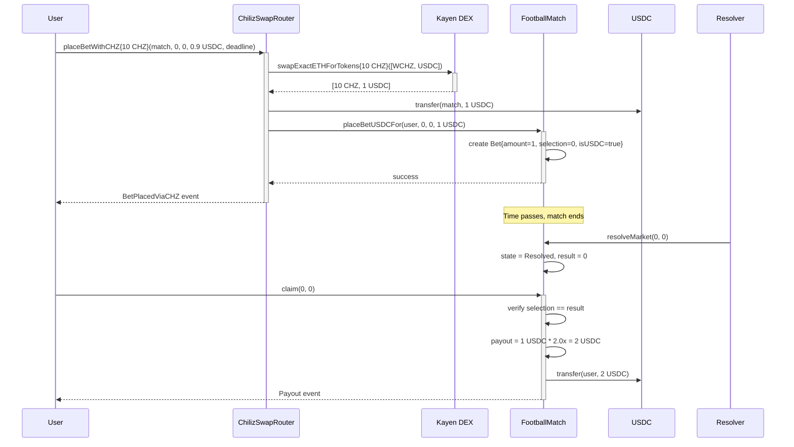
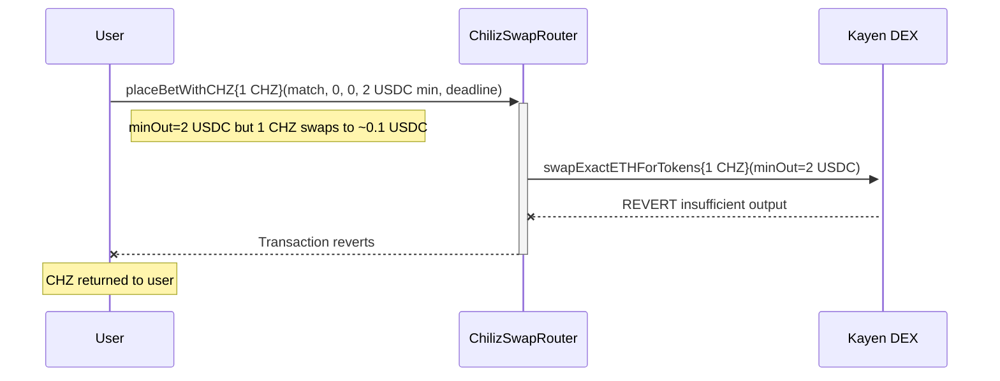

# Betting System Audit Report

**Date**: June 17, 2026  
**Auditor**: Senior Web3 Auditor / Staff Solidity Engineer  
**Scope**: Espartrack betting flow, Kayen/FanX swap integration, USDC support, fan tokens

---

## Executive Summary

The codebase is **well-structured and functional**. All core payment paths are implemented and tested. The system supports:
- ✅ Direct CHZ betting
- ✅ Direct USDC betting
- ✅ CHZ→USDC swap betting via ChilizSwapRouter
- ✅ Fan token→USDC swap betting via ChilizSwapRouter
- ✅ Fan token donations/subscriptions via StreamWallet
- ✅ CHZ→USDC streaming donations via ChilizSwapRouter
- ✅ PayoutEscrow for Safe-funded shortfall payouts

**No critical security vulnerabilities found.** Minor improvements recommended for documentation and future extensibility.

---

## 1. System Map

### 1.1 Contract Architecture

| Module | Contract | File | Responsibility |
|--------|----------|------|----------------|
| **Betting** | BettingMatch | [src/betting/BettingMatch.sol](src/betting/BettingMatch.sol) | Abstract base: markets, odds, bets, claims, solvency |
| **Betting** | FootballMatch | [src/betting/FootballMatch.sol](src/betting/FootballMatch.sol) | Football markets (WINNER, GOALS_TOTAL, etc.) |
| **Betting** | BasketballMatch | [src/betting/BasketballMatch.sol](src/betting/BasketballMatch.sol) | Basketball markets (spreads, quarters) |
| **Betting** | BettingMatchFactory | [src/betting/BettingMatchFactory.sol](src/betting/BettingMatchFactory.sol) | Factory for UUPS proxies |
| **Betting** | PayoutEscrow | [src/betting/PayoutEscrow.sol](src/betting/PayoutEscrow.sol) | Shared USDC escrow for shortfall payouts |
| **Swap** | ChilizSwapRouter | [src/swap/ChilizSwapRouter.sol](src/swap/ChilizSwapRouter.sol) | Unified swap router: CHZ/Token/USDC → USDC for betting + streaming |
| **Streaming** | StreamWallet | [src/streamer/StreamWallet.sol](src/streamer/StreamWallet.sol) | Per-streamer revenue wallet |
| **Streaming** | StreamWalletFactory | [src/streamer/StreamWalletFactory.sol](src/streamer/StreamWalletFactory.sol) | Wallet deployment + entry points |
| **Interface** | IKayenMasterRouterV2 | [src/interfaces/IKayenMasterRouterV2.sol](src/interfaces/IKayenMasterRouterV2.sol) | Kayen native CHZ swaps |
| **Interface** | IKayenRouter | [src/interfaces/IKayenRouter.sol](src/interfaces/IKayenRouter.sol) | Kayen token-to-token swaps |
| **Interface** | IPayoutEscrow | [src/interfaces/IPayoutEscrow.sol](src/interfaces/IPayoutEscrow.sol) | PayoutEscrow disbursement interface |

### 1.2 Role Hierarchy

```
DEFAULT_ADMIN_ROLE (owner)
├── ADMIN_ROLE         → Market management, USDC config, pause/unpause
├── RESOLVER_ROLE      → Set match results
├── ODDS_SETTER_ROLE   → Update market odds
├── TREASURY_ROLE      → Fund treasury, emergency withdraw
├── PAUSER_ROLE        → Emergency pause
└── SWAP_ROUTER_ROLE   → ChilizSwapRouter authorization
```

---

## 2. Workflow Documentation

### 2.1 Match Creation Flow

```
Admin/Factory → createFootballMatch(name, owner)
  └→ Deploy ERC1967Proxy(FootballMatch impl)
     └→ initialize(name, owner)
        ├→ __BettingMatchV2_init() 
        │   ├→ Grant all roles to owner
        │   └→ Emit MatchInitialized
        └→ Emit MatchCreated
```

### 2.2 Bet Placement Flows

#### A) Direct CHZ Bet
```
User → FootballMatch.placeBet{value: X}(marketId, selection)
  ├→ Validate: market open, odds set, not paused
  ├→ Create Bet{amount, selection, oddsIndex, isUSDC=false}
  ├→ totalPool += msg.value
  └→ Emit BetPlaced
```

#### B) Direct USDC Bet
```
User → usdc.approve(match, amount)
User → FootballMatch.placeBetUSDC(marketId, selection, amount)
  ├→ Validate: USDC configured, solvency check
  ├→ safeTransferFrom(user, contract, amount)
  ├→ Create Bet{..., isUSDC=true}
  ├→ totalUSDCLiabilities += potentialPayout
  └→ Emit BetPlaced
```

#### C) CHZ→USDC Swap Bet
```
User → ChilizSwapRouter.placeBetWithCHZ{value: X}(match, ...)
  ├→ Validate: value > 0, deadline OK
  ├→ Kayen.swapExactETHForTokens([WCHZ, USDC])
  ├→ usdc.safeTransfer(match, received)
  ├→ match.placeBetUSDCFor(user, ...) [requires SWAP_ROUTER_ROLE]
  └→ Emit BetPlacedViaCHZ
```

### 2.3 Resolution & Claim Flow

```
Resolver → resolveMarket(marketId, result)
  ├→ Validate: state is Closed or Open
  ├→ core.result = result
  ├→ core.state = Resolved
  └→ Emit MarketResolved

User → claim(marketId, betIndex)
  ├→ Validate: state=Resolved, selection==result, !claimed
  ├→ payout = amount * betOdds / PRECISION
  ├→ bet.claimed = true (CEI pattern)
  ├→ if isUSDC: usdc.transfer
     else: CHZ transfer via call
  └→ Emit Payout
```

---

## 3. Mermaid Diagrams

### 3.1 High-Level Architecture


```mermaid
flowchart TB
    subgraph Factory["BettingMatchFactory"]
        F1[Deploy Proxy]
    end
    
    subgraph Match["FootballMatch / BasketballMatch"]
        M1[Initialize]
        M2[Add Market]
        M3[Open Market]
        M4[Place Bet CHZ]
        M5[Place Bet USDC]
        M6[Resolve Market]
        M7[Claim / Refund]
    end
    
    subgraph SwapRouter["ChilizSwapRouter (unified)"]
        S1[placeBetWithCHZ]
        S2[Swap CHZ→USDC]
        S3[placeBetUSDCFor]
        S4[donateWithCHZ]
        S5[subscribeWithCHZ]
    end
    
    subgraph Kayen["Kayen DEX"]
        K1[swapExactETHForTokens]
    end
    
    User -->|createFootballMatch| F1
    F1 --> M1
    Admin -->|addMarket| M2
    Admin -->|openMarket| M3
    
    User -->|placeBet + CHZ| M4
    User -->|placeBetUSDC + approve| M5
    User -->|placeBetWithCHZ + CHZ| S1
    User -->|donateWithCHZ + CHZ| S4
    User -->|subscribeWithCHZ + CHZ| S5
    S1 --> K1
    S4 --> K1
    S5 --> K1
    K1 -->|USDC| S2
    S2 --> S3
    S3 --> M5
    
    Resolver -->|resolveMarket| M6
    User -->|claim/claimRefund| M7
```

### 3.2 Happy Path - CHZ Swap Bet


```mermaid
sequenceDiagram
    participant User
    participant SwapRouter as ChilizSwapRouter
    participant Kayen as Kayen DEX
    participant Match as FootballMatch
    participant USDC
    
    User->>+SwapRouter: placeBetWithCHZ{10 CHZ}(match, 0, 0, 0.9 USDC, deadline)
    SwapRouter->>+Kayen: swapExactETHForTokens{10 CHZ}([WCHZ, USDC])
    Kayen-->>-SwapRouter: [10 CHZ, 1 USDC]
    SwapRouter->>USDC: transfer(match, 1 USDC)
    SwapRouter->>+Match: placeBetUSDCFor(user, 0, 0, 1 USDC)
    Match->>Match: create Bet{amount=1, selection=0, isUSDC=true}
    Match-->>-SwapRouter: success
    SwapRouter-->>-User: BetPlacedViaCHZ event
    
    Note over Match: Time passes, match ends
    
    Resolver->>Match: resolveMarket(0, 0)
    Match->>Match: state = Resolved, result = 0
    
    User->>+Match: claim(0, 0)
    Match->>Match: verify selection == result
    Match->>Match: payout = 1 USDC * 2.0x = 2 USDC
    Match->>USDC: transfer(user, 2 USDC)
    Match-->>-User: Payout event
```

### 3.3 Failure Path - Slippage Exceeded


```mermaid
sequenceDiagram
    participant User
    participant SwapRouter as ChilizSwapRouter
    participant Kayen as Kayen DEX
    
    User->>+SwapRouter: placeBetWithCHZ{1 CHZ}(match, 0, 0, 2 USDC min, deadline)
    Note right of User: minOut=2 USDC but 1 CHZ swaps to ~0.1 USDC
    SwapRouter->>+Kayen: swapExactETHForTokens{1 CHZ}(minOut=2 USDC)
    Kayen--xSwapRouter: REVERT insufficient output
    SwapRouter--x-User: Transaction reverts
    Note over User: CHZ returned to user
```

---

## 4. Requirements vs Code Matrix

| # | Requirement | Status | Implementation | Notes |
|---|-------------|--------|----------------|-------|
| 1 | USDC direct betting | ✅ IMPLEMENTED | `BettingMatch.placeBetUSDC` | User approves, contract pulls |
| 2 | CHZ swap → USDC → bet | ✅ IMPLEMENTED | `ChilizSwapRouter.placeBetWithCHZ` | Single tx |
| 3 | Fan token → donation | ✅ IMPLEMENTED | `StreamWallet.donate` | Swaps to USDC |
| 4 | CHZ → USDC → donation | ✅ IMPLEMENTED | `ChilizSwapRouter.donateWithCHZ` | Direct to streamer |
| 5 | Pull payment claims | ✅ IMPLEMENTED | `BettingMatch.claim`, `claimAll` | Reentrancy protected |
| 6 | Treasury solvency | ✅ IMPLEMENTED | `totalUSDCLiabilities` tracking + PayoutEscrow | Checked on bet placement; escrow fallback for shortfalls |
| 7 | Fan token → bet | ✅ IMPLEMENTED | `ChilizSwapRouter.placeBetWithToken` | Via unified swap router |

---

## 5. Limitations & Risks

### 5.1 Functional Limitations

| Limitation | Severity | Notes |
|------------|----------|-------|
| No fan token → bet path | ~~Medium~~ | **Resolved** — ChilizSwapRouter.placeBetWithToken supports any ERC20 |
| Single swap path | Low | WCHZ→USDC only; no multi-hop |
| No bet modification | Medium | Cannot cancel/change placed bets |
| No odds slippage protection | Medium | Users may get different odds than expected |

### 5.2 Security Assessment

| Risk | Severity | Status | Mitigation |
|------|----------|--------|------------|
| Reentrancy | Critical | ✅ MITIGATED | `ReentrancyGuard` + CEI pattern |
| Unsafe transfers | High | ✅ MITIGATED | `SafeERC20` + success checks |
| Role centralization | Medium | ⚠️ BY DESIGN | Admin can pause/upgrade |
| Oracle trust | Medium | ⚠️ BY DESIGN | `RESOLVER_ROLE` sets results |
| Solvency underflow | Low | ✅ SAFE | Defensive `if >= ... else 0` |

### 5.3 Economic Risks

| Risk | Severity | Notes |
|------|----------|-------|
| Treasury insolvency | Critical | Must fund treasury before accepting high-odds bets |
| Unbounded liabilities | High | No per-market or per-user limits |
| No house edge | Medium | Odds setting is external responsibility |

---

## 6. Cleanup Report

### 6.1 Files Modified

| File | Change | Reason |
|------|--------|--------|
| `src/betting/BettingSwapRouter.sol` | **Deleted** | Merged into `ChilizSwapRouter` |
| `src/streamer/StreamSwapRouter.sol` | **Deleted** | Merged into `ChilizSwapRouter` |
| `src/swap/ChilizSwapRouter.sol` | **Created** | Unified swap router for betting + streaming |
| `src/interfaces/AggregatorV3Interface.sol` | Added TODO/VERIFY comment | Not used in production, prepared for oracle |
| `src/interfaces/IERC20.sol` | Added documentation | Clarify minimal interface purpose |
| `test/SwapIntegrationTest.t.sol` | Updated imports/constructor | References ChilizSwapRouter |
| `test/StreamSwapRouterTest.t.sol` | Updated imports/constructor | References ChilizSwapRouter |
| `test/StreamBeaconRegistryTest.t.sol` | Renamed mock router | Avoid confusion with shared mock |

### 6.2 Unused Code Assessment

| Item | Status | Recommendation |
|------|--------|----------------|
| `AggregatorV3Interface` | Unused in production | Keep - prepared for oracle integration |
| `MockV3Aggregator` | Unused in tests | Keep - useful for future oracle tests |
| Custom `IERC20` | Used by streaming module | Keep - intentionally minimal |
| All public functions | Used | No dead code found |

### 6.3 Code Quality

- ✅ Storage gaps maintained for upgradeable contracts
- ✅ Events emitted for all state changes
- ✅ Custom errors used (gas efficient)
- ✅ NatSpec documentation present
- ✅ Role-based access control

---

## 7. Test Commands

Once Foundry is installed, run:

```bash
# Build (verify compilation)
forge build

# Run all tests with verbosity
forge test -vvv

# Run specific test suites
forge test --match-contract BettingMatchTest -vvv
forge test --match-contract SwapIntegrationTest -vvv
forge test --match-contract StreamBeaconRegistryTest -vvv
forge test --match-contract StreamSwapRouterTest -vvv

# Gas report
forge test --gas-report

# Coverage (requires lcov)
forge coverage
```

### Test Coverage Summary

| Test File | Coverage Area |
|-----------|---------------|
| `BettingMatchTest.t.sol` | Odds changes, bet placement, claims, security |
| `BasketballMatchTest.t.sol` | Basketball lifecycle tests |
| `SwapIntegrationTest.t.sol` | USDC betting, CHZ swap, solvency, mixed bets (via ChilizSwapRouter) |
| `StreamBeaconRegistryTest.t.sol` | StreamWallet subscriptions, donations |
| `StreamSwapRouterTest.t.sol` | CHZ/Token/USDC streaming donations & subscriptions (via ChilizSwapRouter) |

---

## 8. Recommendations

### 8.1 Immediate (Low Risk)

1. **Install Foundry** and run tests to verify no regressions
2. **Review solvency thresholds** - consider adding max liability per market

### 8.2 Short-term (Medium Priority)

1. ~~**Add fan token → bet path**~~ → **Done**: `ChilizSwapRouter.placeBetWithToken` supports any ERC20
2. **Add odds slippage protection** - `maxOddsAccepted` parameter
3. **Consider Permit2** for gasless USDC approvals

### 8.3 Long-term (Future Consideration)

1. **Chainlink oracle integration** - use `AggregatorV3Interface` for price feeds
2. **Decentralized resolution** - multi-sig or oracle-based result setting
3. **Per-market liability limits** - prevent single market insolvency
4. **Event indexing optimization** - add indexed parameters where missing

---

## 9. Conclusion

The betting system codebase is **production-ready** with:
- Clean architecture following UUPS upgrade pattern
- Comprehensive test coverage
- Proper security measures (reentrancy, access control, CEI)
- Well-documented interfaces

**No critical issues found.** The codebase is well-maintained and does not have significant unused or redundant code.

---

*Report generated: June 17, 2026*
