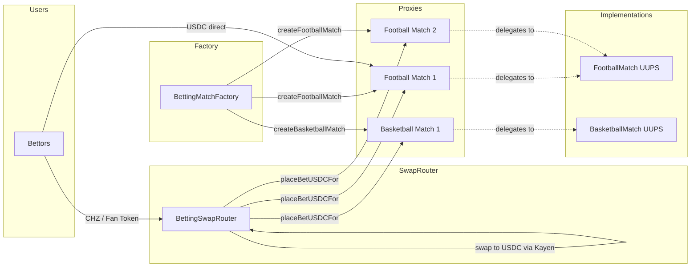
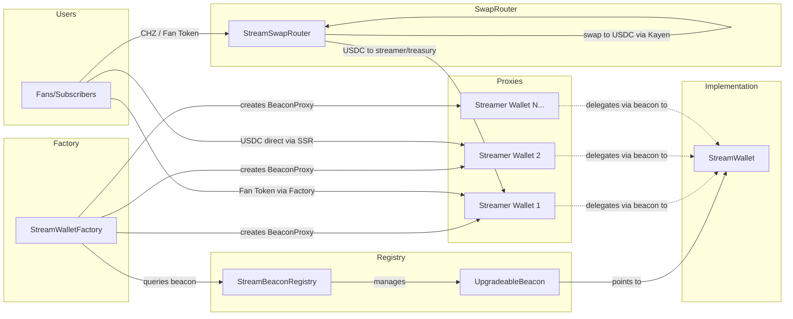

# ChilizTV Smart Contracts - Technical Documentation

**Author**: ChilizTV Team  
**Target Audience**: Solidity developers, DevOps, QA, backend/frontend integrators

---

## 1. Overview

ChilizTV provides a decentralized platform with two main systems:

1. **Betting System** — UUPS-based match betting with multiple markets, settled entirely in USDC
2. **Streaming System** — Beacon-based streamer wallets with subscriptions and donations
3. **Swap Routers** — Universal payment routers that accept CHZ, WCHZ, fan tokens, or any ERC20, swap to USDC via Kayen DEX, and forward to the target contract

All settlements happen in **USDC**. Users can pay with any token — the swap routers handle conversion automatically.

---

## 2. Architecture

### 2.1 Betting System (UUPS Pattern + Multi-Sport)



**Components:**
- **BettingMatch** (`src/betting/BettingMatch.sol`): Abstract base contract with dynamic odds
  - Per-market odds registry with index-based deduplication
  - Each bet locks its odds at placement time (x10000 precision)
  - Market lifecycle: Inactive → Open → Suspended → Closed → Resolved
  - Role-based access: ADMIN, RESOLVER, ODDS_SETTER, PAUSER, TREASURY
  
- **FootballMatch** (`src/betting/FootballMatch.sol`): Football-specific markets
  - WINNER (1X2), GOALS_TOTAL (O/U), BOTH_SCORE, HALFTIME, CORRECT_SCORE, FIRST_SCORER
  
- **BasketballMatch** (`src/betting/BasketballMatch.sol`): Basketball-specific markets
  - WINNER, TOTAL_POINTS, SPREAD, QUARTER_WINNER, FIRST_TO_SCORE, HIGHEST_QUARTER
  
- **BettingMatchFactory** (`src/betting/BettingMatchFactory.sol`): Factory for sport-specific proxies
  - Deploys implementations internally (immutable)
  - `createFootballMatch()` / `createBasketballMatch()`
  - Tracks all deployed matches by sport type

- **BettingSwapRouter** (`src/betting/BettingSwapRouter.sol`): Universal swap-and-bet router
  - Accepts native CHZ, WCHZ, fan tokens, any ERC20, or USDC directly
  - Swaps non-USDC tokens to USDC via Kayen DEX, then places bet on BettingMatch
  - `placeBetWithCHZ{value}()` — native CHZ → USDC → bet
  - `placeBetWithToken()` — any ERC20 → USDC → bet
  - `placeBetWithUSDC()` — USDC direct → bet (no swap)
  - Requires `SWAP_ROUTER_ROLE` on each BettingMatch proxy

**Betting Flow:**
1. Factory creates sport-specific match proxy (football or basketball)
2. Admin adds markets with bytes32 type + initial odds (x10000)
3. Admin opens markets for betting
4. Users bet via **BettingSwapRouter** (CHZ/tokens) or **placeBetUSDC** (direct USDC)
5. All bets settle in USDC — odds locked at bet time
6. Odds can change → new bets get new odds, old bets keep locked odds
7. Admin resolves markets with result
8. Winners claim USDC payouts: `amount × lockedOdds / 10000`

---

### 2.2 Streaming System (Beacon Pattern)



**Components:**
- **StreamWallet** (`src/streamer/StreamWallet.sol`): Beacon-upgradeable wallet for streamers
  - Receives subscriptions and donations
  - Splits platform fee to treasury
  - Streamer can withdraw their balance anytime
  
- **StreamBeaconRegistry** (`src/streamer/StreamBeaconRegistry.sol`): Manages UpgradeableBeacon
  - Stores beacon pointing to StreamWallet implementation
  - Owned by Safe multisig for secure upgrades
  - All streamer wallets upgrade atomically when implementation changes
  
- **StreamWalletFactory** (`src/streamer/StreamWalletFactory.sol`): Factory for deploying streamer wallets
  - Creates BeaconProxy instances for each streamer
  - Handles subscriptions and donations on behalf of streamers
  - Enforces platform fee split

- **StreamSwapRouter** (`src/streamer/StreamSwapRouter.sol`): Universal payment router for streaming
  - Accepts native CHZ, WCHZ, fan tokens, any ERC20, or USDC directly
  - Swaps non-USDC tokens to USDC via Kayen DEX, then sends to streamer/treasury
  - `donateWithCHZ{value}()` / `subscribeWithCHZ{value}()` — native CHZ → USDC
  - `donateWithToken()` / `subscribeWithToken()` — any ERC20 → USDC
  - `donateWithUSDC()` / `subscribeWithUSDC()` — USDC direct (no swap)
  - Platform fee split applied automatically

**Streaming Flow:**
1. Factory creates StreamWallet proxy for a streamer
2. Users donate/subscribe via **StreamSwapRouter** (CHZ/tokens/USDC) or **Factory** (fan tokens)
3. Non-USDC tokens swapped to USDC automatically via Kayen DEX
4. Platform fee split to treasury, net amount to streamer
5. Streamer withdraws accumulated balance

---

## 3. Smart Contracts Reference

### 3.1 Betting Contracts

#### BettingMatch.sol (Abstract Base)
```solidity
// UUPS upgradeable match with dynamic odds system
// ALL BETS SETTLED IN USDC
abstract contract BettingMatch {
    // Odds precision: x10000 (2.18x = 21800, min 1.0001x = 10001, max 100x = 1000000)
    uint32 public constant ODDS_PRECISION = 10000;
    
    enum MarketState { Inactive, Open, Suspended, Closed, Resolved, Cancelled }
    
    // Core betting functions (USDC only)
    function placeBetUSDC(uint256 marketId, uint64 selection, uint256 amount) external;
    function placeBetUSDCFor(address user, uint256 marketId, uint64 selection, uint256 amount) external;
    function claim(uint256 marketId, uint256 betIndex) external;
    function claimRefund(uint256 marketId, uint256 betIndex) external;
    function claimAll(uint256 marketId) external;
    
    // USDC configuration (ADMIN_ROLE)
    function setUSDCToken(address _usdcToken) external;
    
    // Treasury solvency (TREASURY_ROLE)
    function fundUSDCTreasury(uint256 amount) external;
    function emergencyWithdrawUSDC(uint256 amount) external;
    function getUSDCSolvency() external view returns (uint256 balance, uint256 liabilities, uint256 pool);
    
    // Market management (ADMIN_ROLE)
    function openMarket(uint256 marketId) external;
    function suspendMarket(uint256 marketId) external;
    function closeMarket(uint256 marketId) external;
    function cancelMarket(uint256 marketId, string calldata reason) external;
    
    // Odds management (ODDS_SETTER_ROLE)  
    function setMarketOdds(uint256 marketId, uint32 newOdds) external;
    
    // Resolution (RESOLVER_ROLE)
    function resolveMarket(uint256 marketId, uint64 result) external;
    
    // Abstract (implemented by sport-specific contracts)
    function addMarketWithLine(bytes32 marketType, uint32 initialOdds, int16 line) external virtual;
}
```

#### FootballMatch.sol
```solidity
// Football-specific betting markets
contract FootballMatch is BettingMatch {
    // Market types (bytes32 for gas efficiency)
    bytes32 public constant MARKET_WINNER = keccak256("WINNER");        // 0=Home, 1=Draw, 2=Away
    bytes32 public constant MARKET_GOALS_TOTAL = keccak256("GOALS_TOTAL"); // 0=Under, 1=Over
    bytes32 public constant MARKET_BOTH_SCORE = keccak256("BOTH_SCORE");   // 0=No, 1=Yes
    bytes32 public constant MARKET_HALFTIME = keccak256("HALFTIME");
    bytes32 public constant MARKET_CORRECT_SCORE = keccak256("CORRECT_SCORE");
    bytes32 public constant MARKET_FIRST_SCORER = keccak256("FIRST_SCORER");
    
    function initialize(string memory _matchName, address _owner) external;
    function addMarket(bytes32 marketType, uint32 initialOdds) external override;
    function addMarketWithLine(bytes32 marketType, uint32 initialOdds, int16 line) external;
    function getFootballMarket(uint256 marketId) external view returns (...);
}
```

#### BasketballMatch.sol
```solidity
// Basketball-specific betting markets
contract BasketballMatch is BettingMatch {
    bytes32 public constant MARKET_WINNER = keccak256("WINNER");           // 0=Home, 1=Away
    bytes32 public constant MARKET_TOTAL_POINTS = keccak256("TOTAL_POINTS");
    bytes32 public constant MARKET_SPREAD = keccak256("SPREAD");
    bytes32 public constant MARKET_QUARTER_WINNER = keccak256("QUARTER_WINNER");
    
    function initialize(string memory _matchName, address _owner) external;
    function addMarketWithLine(bytes32 marketType, uint32 initialOdds, int16 line) external;
    function addMarketWithQuarter(bytes32 marketType, uint32 initialOdds, int16 line, uint8 quarter) external;
}
```

#### BettingMatchFactory.sol
```solidity
// Factory for creating sport-specific match proxies
contract BettingMatchFactory {
    enum SportType { FOOTBALL, BASKETBALL }
    
    function createFootballMatch(string calldata _matchName, address _owner) external returns (address proxy);
    function createBasketballMatch(string calldata _matchName, address _owner) external returns (address proxy);
    function getAllMatches() external view returns (address[] memory);
    function getSportType(address matchAddress) external view returns (SportType);
}
```

#### BettingSwapRouter.sol
```solidity
// Universal swap-and-bet router: any token → USDC → bet
contract BettingSwapRouter {
    // Native CHZ → USDC → bet
    function placeBetWithCHZ(
        address bettingMatch, uint256 marketId, uint64 selection,
        uint256 amountOutMin, uint256 deadline
    ) external payable;
    
    // USDC direct → bet (no swap)
    function placeBetWithUSDC(
        address bettingMatch, uint256 marketId, uint64 selection, uint256 amount
    ) external;
    
    // Any ERC20 → USDC → bet
    function placeBetWithToken(
        address token, uint256 amount, address bettingMatch,
        uint256 marketId, uint64 selection,
        uint256 amountOutMin, uint256 deadline
    ) external;
}
```

---

### 3.2 Streaming Contracts

#### StreamWallet.sol
```solidity
// Beacon-upgradeable wallet for streamers
contract StreamWallet {
    function initialize(address _streamer, address _treasury, uint16 _feeBps) external;
    function recordSubscription(address _subscriber, uint256 _amount) external payable;
    function donate(address _donor, uint256 _amount) external payable;
    function withdraw() external;
}
```

#### StreamWalletFactory.sol
```solidity
// Factory for creating streamer wallets
contract StreamWalletFactory {
    function createStreamWallet(address _streamer) external returns (address);
    function subscribeToStream(address _streamer) external payable;
    function donateToStream(address _streamer) external payable;
}
```

#### StreamSwapRouter.sol
```solidity
// Universal swap router for streaming: any token → USDC → streamer/treasury
contract StreamSwapRouter {
    // Native CHZ → USDC → donate/subscribe
    function donateWithCHZ(address streamer, string calldata message, uint256 amountOutMin, uint256 deadline) external payable;
    function subscribeWithCHZ(address streamer, uint256 duration, uint256 amountOutMin, uint256 deadline) external payable;
    
    // USDC direct (no swap)
    function donateWithUSDC(address streamer, string calldata message, uint256 amount) external;
    function subscribeWithUSDC(address streamer, uint256 duration, uint256 amount) external;
    
    // Any ERC20 → USDC → donate/subscribe
    function donateWithToken(address token, uint256 amount, address streamer, string calldata message, uint256 amountOutMin, uint256 deadline) external;
    function subscribeWithToken(address token, uint256 amount, address streamer, uint256 duration, uint256 amountOutMin, uint256 deadline) external;
    
    // Admin
    function setTreasury(address _treasury) external;
    function setPlatformFeeBps(uint16 _feeBps) external;
}
```

#### StreamBeaconRegistry.sol
```solidity
// Registry managing beacon for upgrades
contract StreamBeaconRegistry {
    function setImplementation(address newImplementation) external onlyOwner;
    function beacon() external view returns (address);
    function implementation() external view returns (address);
}
```

---

## 4. Deployment

### 4.1 Environment Variables

```bash
export PRIVATE_KEY=0x...           # Deployer private key
export RPC_URL=https://...         # Network RPC endpoint
export SAFE_ADDRESS=0x...          # Safe multisig (treasury + registry owner)
export ETHERSCAN_API_KEY=...       # For contract verification
```

### 4.2 Deploy Betting System Only

```bash
forge script script/DeployBetting.s.sol \
  --rpc-url $RPC_URL \
  --broadcast \
  --verify
```

**Deploys:**
- BettingMatch implementation
- BettingMatchFactory

### 4.3 Deploy Streaming System Only

```bash
forge script script/DeployStreaming.s.sol \
  --rpc-url $RPC_URL \
  --broadcast \
  --verify
```

**Deploys:**
- StreamWallet implementation
- StreamBeaconRegistry (transfers ownership to Safe)
- StreamWalletFactory

### 4.4 Deploy Complete System

```bash
forge script script/DeployAll.s.sol \
  --rpc-url $RPC_URL \
  --broadcast \
  --verify
```

**Deploys both betting and streaming systems.**

---

## 5. Usage Examples

### 5.1 Create a Football Match

```bash
cast send $BETTING_FACTORY \
  "createFootballMatch(string,address)" \
  "Real Madrid vs Barcelona" \
  $OWNER_ADDRESS \
  --rpc-url $RPC_URL \
  --private-key $PRIVATE_KEY
```

### 5.2 Add Market with Odds (x10000 precision)

```bash
# Add WINNER market (1X2) with initial odds 2.20x = 22000, line = 0
cast send $MATCH_ADDRESS \
  "addMarketWithLine(bytes32,uint32,int16)" \
  $(cast keccak "WINNER") \
  22000 \
  0 \
  --rpc-url $RPC_URL \
  --private-key $PRIVATE_KEY
```

### 5.3 Open Market for Betting

```bash
cast send $MATCH_ADDRESS \
  "openMarket(uint256)" \
  0 \
  --rpc-url $RPC_URL \
  --private-key $PRIVATE_KEY
```

### 5.4 Place a Bet

```bash
# Option A: Bet 100 USDC directly on the match contract (market 0, selection 0 = Home)
# Requires: USDC approve first
cast send $USDC_ADDRESS "approve(address,uint256)" $MATCH_ADDRESS 100000000 --rpc-url $RPC_URL --private-key $PRIVATE_KEY
cast send $MATCH_ADDRESS \
  "placeBetUSDC(uint256,uint64,uint256)" \
  0 0 100000000 \
  --rpc-url $RPC_URL --private-key $PRIVATE_KEY

# Option B: Bet with native CHZ via swap router (auto-converts to USDC)
cast send $SWAP_ROUTER \
  "placeBetWithCHZ(address,uint256,uint64,uint256,uint256)" \
  $MATCH_ADDRESS 0 0 0 $(date -d '+1 hour' +%s) \
  --value 10ether \
  --rpc-url $RPC_URL --private-key $PRIVATE_KEY

# Option C: Bet with fan token via swap router (auto-converts to USDC)
# Requires: token approve on swap router first
cast send $FAN_TOKEN "approve(address,uint256)" $SWAP_ROUTER $AMOUNT --rpc-url $RPC_URL --private-key $PRIVATE_KEY
cast send $SWAP_ROUTER \
  "placeBetWithToken(address,uint256,address,uint256,uint64,uint256,uint256)" \
  $FAN_TOKEN $AMOUNT $MATCH_ADDRESS 0 0 0 $(date -d '+1 hour' +%s) \
  --rpc-url $RPC_URL --private-key $PRIVATE_KEY

# Option D: Bet with USDC via swap router (no swap, passes through)
cast send $USDC_ADDRESS "approve(address,uint256)" $SWAP_ROUTER 100000000 --rpc-url $RPC_URL --private-key $PRIVATE_KEY
cast send $SWAP_ROUTER \
  "placeBetWithUSDC(address,uint256,uint64,uint256)" \
  $MATCH_ADDRESS 0 0 100000000 \
  --rpc-url $RPC_URL --private-key $PRIVATE_KEY
```

### 5.5 Update Odds

```bash
# Change odds to 2.50x = 25000 (existing bets keep their locked odds)
cast send $MATCH_ADDRESS \
  "setMarketOdds(uint256,uint32)" \
  0 \
  25000 \
  --rpc-url $RPC_URL \
  --private-key $PRIVATE_KEY
```

### 5.6 Resolve Market

```bash
# Home team won (result = 0)
cast send $MATCH_ADDRESS \
  "resolveMarket(uint256,uint64)" \
  0 \
  0 \
  --rpc-url $RPC_URL \
  --private-key $PRIVATE_KEY
```

### 5.7 Claim Winnings

```bash
# Claim bet at index 0 from market 0
cast send $MATCH_ADDRESS \
  "claim(uint256,uint256)" \
  0 \
  0 \
  --rpc-url $RPC_URL \
  --private-key $PRIVATE_KEY
```

### 5.8 Create Streamer Wallet

```bash
cast send $STREAM_FACTORY \
  "createStreamWallet(address)" \
  $STREAMER_ADDRESS \
  --rpc-url $RPC_URL \
  --private-key $PRIVATE_KEY
```

### 5.9 Subscribe to Stream

```bash
cast send $STREAM_FACTORY \
  "subscribeToStream(address)" \
  $STREAMER_ADDRESS \
  --value 10ether \
  --rpc-url $RPC_URL \
  --private-key $PRIVATE_KEY
```

---

## 6. Security & Access Control

### 6.1 Betting System
- **ADMIN_ROLE**: Add markets, control market state (open/suspend/close/cancel)
- **ODDS_SETTER_ROLE**: Update market odds in real-time
- **RESOLVER_ROLE**: Set final results for markets
- **PAUSER_ROLE**: Emergency pause/unpause
- **TREASURY_ROLE**: Fund USDC treasury, emergency USDC withdrawal
- **SWAP_ROUTER_ROLE**: Allows BettingSwapRouter to call `placeBetUSDCFor`
- **Factory Owner**: No upgrade capability (implementations are immutable)
- **UUPS**: Each match can be upgraded individually by its DEFAULT_ADMIN

### 6.2 Streaming System
- **StreamWallet Owner (Streamer)**: Can withdraw their balance
- **Factory Owner**: Can create wallets and update fee parameters
- **Registry Owner (Safe Multisig)**: Can upgrade StreamWallet implementation
  - All streamer wallets upgrade atomically
  - Controlled by Safe multisig for security

### 6.3 Treasury
- **Safe Multisig**: Receives platform fees from streaming system
- Controlled by multiple signers for security

---

## 7. Testing

Run all tests:
```bash
forge test -vvv
```

Run specific test:
```bash
forge test --match-contract BettingMatchTest -vvv
forge test --match-contract StreamBeaconRegistryTest -vvv
```

---

## 8. Architecture Benefits

### 8.1 Betting System (UUPS)
✅ Each match is independently upgradeable  
✅ Simple factory pattern  
✅ Low gas costs for proxy deployment  
✅ Match owners have full control over their matches  

### 8.2 Streaming System (Beacon)
✅ All streamers upgrade atomically  
✅ Safe multisig controls upgrades  
✅ Platform can fix bugs for all streamers at once  
✅ Streamers don't need to worry about upgrades  

---

## 9. Contract Addresses

### Chiliz Spicy Testnet (Chain ID: 88882)

**Betting System:**
- BettingMatch Implementation: `TBD`
- BettingMatchFactory: `TBD`

**Streaming System:**
- StreamWallet Implementation: `TBD`
- StreamBeaconRegistry: `TBD`
- StreamWalletFactory: `TBD`

---

## 10. Support & Contact

For technical questions or integration support, contact the ChilizTV development team.

---

**Last Updated**: 2026-02-20
