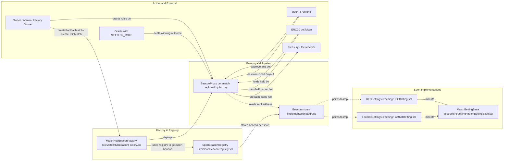

# Documentation Technique – MatchHub & MatchHubFactory

**Rôle** : Product Owner / Product Manager
**Public cible** : Équipes de développement Solidity, DevOps, QA, intégrateurs back‑end/front‑end

---

## 1. Contexte & Vision Produit

Nous offrons une plateforme décentralisée où chaque **MatchHub** représente un match sportif unique : son nom, ses marchés de paris (victoire/défaite/égalité, nombre de buts, premier buteur), ses mises en ETH, la résolution des marchés et la distribution automatique des gains.
La factory **MatchHubFactory** permet à toute adresse whitelisted de déployer facilement de nouveaux hubs, en garantissant uniformité, sécurité et upgradeabilité via le pattern UUPS+ERC‑1967.

---



## 2. Composants Principaux

### 2.1 MatchHubFactory

* **Responsabilité** : déployer des proxies UUPS pointant vers la logique `MatchHub`.
* **State**

  * `implementation` : adresse du contrat logique `MatchHub`.
  * `allHubs[]` : liste de tous les proxies déployés.
* **API Clés**

  * `constructor(address impl)`
  * `setImplementation(address newImpl)`
  * `createHub()`
  * `getAllHubs()`
* **Événements**

  * `ImplementationUpdated(newImplementation)`
  * `MatchHubCreated(proxy, owner)`
* **Sécurité**

  * `onlyOwner` sur setters
  * Rejet des adresses nulles

### 2.2 MatchHub

* **Responsabilité** : gérer un unique match et ses multiples marchés de paris.
* **State**

  * `matchName` : nom/description du match
  * `marketCount` : compteur de marchés créés
  * `markets[id]` : mapping `marketId → Market`
* **Struct Market**

  * `mtype` : `Winner | GoalsCount | FirstScorer`
  * `odds` : cote ×100 (p.ex. 150 = 1.5×)
  * `state` : `Live | Ended`
  * `result` : résultat encodé
  * `bets[user]` : struct Bet { `amount`, `selection`, `claimed` }
  * `bettors[]` : adresses ayant parié
* **API Clés**

  * `initialize(string name, address owner)`
  * `addMarket(MarketType mtype, uint256 odds)`
  * `placeBet(uint256 marketId, uint256 selection)` payable
  * `resolveMarket(uint256 marketId, uint256 result)`
  * `claim(uint256 marketId)` nonReentrant
* **Événements**

  * `MatchInitialized(name, owner)`
  * `MarketAdded(marketId, mtype, odds)`
  * `BetPlaced(marketId, user, amount, selection)`
  * `MarketResolved(marketId, result)`
  * `Payout(marketId, user, amount)`
* **Erreurs Personnalisées**

  * `InvalidMarket(marketId)`
  * `WrongState(required)`
  * `ZeroBet`, `NoBet`, `AlreadyClaimed`, `Lost`, `TransferFailed`
* **Sécurité**

  * UUPS via `_authorizeUpgrade` + `onlyOwner`
  * `ReentrancyGuard` sur `claim`
  * Checks d’état avant chaque action

---

## 3. Flux Utilisateur

```bash
# 1. Déployer la factory
forge create MatchHubFactory.sol:MatchHubFactory \
  --constructor-args <MATCHHUB_IMPL_ADDR> \
  --rpc-url <RPC> \
  --private-key $PK \
  --broadcast

# 2. Créer un nouveau match (hub)
cast send <FACTORY_ADDR> "createHub()" \
  --rpc-url <RPC> \
  --private-key $PK

# 3. Ajouter un marché
cast send <HUB_PROXY_ADDR> "addMarket(uint8,uint256)" 0 150 \
  --rpc-url <RPC> \
  --private-key $PK

# 4. Parier
cast send <HUB_PROXY_ADDR> "placeBet(uint256,uint256)" <marketId> <selection> \
  --value 1000000000000000000 \
  --rpc-url <RPC> \
  --private-key $PK

# 5. Résoudre (owner)
cast send <HUB_PROXY_ADDR> "resolveMarket(uint256,uint256)" <marketId> <result> \
  --rpc-url <RPC> \
  --private-key $PK

# 6. Réclamer (bettor)
cast send <HUB_PROXY_ADDR> "claim(uint256)" <marketId> \
  --rpc-url <RPC> \
  --private-key $PK
```

---

## 4. Stratégie d’Upgrade

1. **Déployer nouvelle implémentation**

   ```bash
   forge create MatchHub.sol:MatchHubImplV2 \
     --rpc-url <RPC> --private-key $PK --broadcast
   ```
2. **Upgrader proxy existant**

   ```solidity
   // via Foundry script ou Hardhat/Ethers
   MatchHub proxy = MatchHub(<PROXY_ADDR>);
   proxy.upgradeTo(<NEW_IMPL_ADDR>);
   ```
3. **Mettre à jour la factory**

   ```bash
   cast send <FACTORY_ADDR> "setImplementation(address)" <NEW_IMPL_ADDR> \
     --rpc-url <RPC> --private-key $PK
   ```

---

## 5. Tests & Audit

* **Tests Unitaires** : couverture 100 % sur tous les scénarios (Foundry).
* **Fuzzing** : `forge test --fuzz`.
* **Analyse Statique** : Slither, MythX.
* **Revue Manuelle** : validation des erreurs custom, events, flows critiques.

---

## Betting contracts & extension guide

Important: all new sport-specific betting contracts must inherit from `MatchBettingBase`.

Why: `MatchBettingBase` centralizes pari-mutuel staking, settlement, claims, role-based access, and critical storage layout. To ensure compatibility with the BeaconProxy/initializer pattern and preserve upgradability you must:

- import the base: `import "./MatchBettingBase.sol";`
- declare the contract as `contract MySportBetting is MatchBettingBase { ... }`
- call the internal initializer `_initSport(...)` from your `initialize(...) external initializer` function supplying the owner, token, matchId, cutoff, feeBps, treasury and the number of outcomes for that sport.

Example (pattern used by existing implementations):

```solidity
import "./MatchBettingBase.sol";

contract FootballBetting is MatchBettingBase {
  function initialize(address owner_, address token_, bytes32 matchId_, uint64 cutoffTs_, uint16 feeBps_, address treasury_) external initializer {
    // Football: 3 outcomes (Home/Draw/Away)
    _initSport(owner_, token_, matchId_, cutoffTs_, feeBps_, treasury_, 3);
  }
}
```

Current sport-specific betting contracts included in this repo:

- `src/betting/FootballBetting.sol` — 1x2 (Home/Draw/Away) wrapper around `MatchBettingBase`.
- `src/betting/UFCBetting.sol` — 2/3-outcome wrapper (Red/Blue[/Draw]) using `allowDraw` flag.

Notes:

- Keep `MatchBettingBase` storage append-only when adding fields in future versions to avoid storage collisions in upgradeable deployments.
- Add sport-specific convenience wrappers (e.g., `betHome`, `betAway`) that call `placeBet(outcome, amount)`.
- If you add new external config interfaces, put them under `src/interfaces/` and keep them small and decoupled from the base logic.

## 6. Roadmap

* Oracle externe pour automatiser la résolution (`resolveMarket`).
* Front‑end React/Next.js avec `ethers.js`/`wagmi`.
* DAO pour la gouvernance des propriétaires de hubs.
* Support multi‑token (WCHZ, stablecoins).

> **Note produit** : chaque hub est isolé, upgradeable et auditable individuellement, garantissant modularité et sécurité.
