# Technical Documentation – MatchHub & MatchHubFactory

**Role**: Product Owner / Product Manager  
**Target Audience**: Solidity development teams, DevOps, QA, backend/frontend integrators

---

## 1. Context & Product Vision

We offer a decentralized platform where each **MatchHub** represents a unique sports match: its name, betting markets (win/lose/draw, number of goals, first goalscorer), stakes in ETH, market resolution, and automatic payout distribution.
The **MatchHubFactory** factory allows any whitelisted address to easily deploy new hubs, ensuring uniformity, security, and upgradeability via the UUPS+ERC-1967 pattern.

---


---

## 2. Streaming & Smart Wallet Architecture

### 2.1 Sequence Diagram: Complete Interaction Flow

```mermaid
sequenceDiagram
    participant Viewer as 👤 Viewer/Fan
    participant Frontend as 🖥️ Frontend
    participant WalletFactory as 🏭 StreamWalletFactory
    participant StreamWallet as 💰 StreamWallet (Proxy)
    participant Token as 🪙 ERC20 Token
    participant Streamer as 🎥 Streamer
    participant Treasury as 🏦 Platform Treasury
    participant BettingProxy as 🎲 Betting Proxy
    participant Oracle as 🔮 Oracle

    %% === STREAMING: First Subscription ===
    Note over Viewer,StreamWallet: STREAMING FLOW - First Subscription
    Viewer->>Frontend: Subscribe to stream
    Frontend->>Token: Check allowance
    Token-->>Frontend: allowance = 0
    Frontend->>Viewer: Request approval
    Viewer->>Token: approve(WalletFactory, amount)
    Token-->>Viewer: Approval confirmed
    
    Frontend->>WalletFactory: subscribeToStream(streamerId, amount)
    WalletFactory->>WalletFactory: Check if wallet exists
    alt Wallet doesn't exist
        WalletFactory->>StreamWallet: Deploy new Smart-wallet
        StreamWallet-->>WalletFactory: wallet address
        WalletFactory->>StreamWallet: initialize(streamer, platformFee)
        StreamWallet-->>WalletFactory: initialized
        Note right of StreamWallet: Wallet created with:<br/>- Streamer as owner<br/>- Platform fee %<br/>- Revenue split rules
    end
    
    WalletFactory->>Token: transferFrom(viewer, StreamWallet, amount)
    Token-->>StreamWallet: Tokens received
    WalletFactory->>StreamWallet: recordSubscription(viewer, amount, duration)
    StreamWallet->>StreamWallet: Calculate split:<br/>platformFee = amount * feeBps / 10000<br/>streamerAmount = amount - platformFee
    StreamWallet->>Token: transfer(Treasury, platformFee)
    Token-->>Treasury: Platform fee received
    StreamWallet->>Token: transfer(Streamer, streamerAmount)
    Token-->>Streamer: Streamer payment received
    StreamWallet-->>WalletFactory: Subscription recorded
    WalletFactory-->>Frontend: SubscriptionCreated event
    Frontend-->>Viewer: ✅ Subscribed!

    %% === STREAMING: Donation ===
    Note over Viewer,StreamWallet: STREAMING FLOW - Donation
    Viewer->>Frontend: Send donation
    Frontend->>Token: approve(StreamWallet, donationAmount)
    Token-->>Frontend: Approved
    Frontend->>StreamWallet: donate(amount, message)
    StreamWallet->>Token: transferFrom(viewer, this, amount)
    Token-->>StreamWallet: Tokens received
    StreamWallet->>StreamWallet: Calculate split
    StreamWallet->>Token: transfer(Treasury, platformFee)
    StreamWallet->>Token: transfer(Streamer, donationAmount - platformFee)
    StreamWallet-->>Frontend: DonationReceived event
    Frontend-->>Viewer: 💝 Donation sent!
    Frontend-->>Streamer: 🎁 New donation notification

    %% === STREAMING: Revenue Withdrawal ===
    Note over Streamer,StreamWallet: STREAMING FLOW - Streamer Withdrawal
    Streamer->>Frontend: Request withdrawal
    Frontend->>StreamWallet: withdrawRevenue(amount)
    StreamWallet->>StreamWallet: Check balance & ownership
    StreamWallet->>Token: transfer(Streamer, amount)
    Token-->>Streamer: Withdrawal complete
    StreamWallet-->>Frontend: RevenueWithdrawn event
    Frontend-->>Streamer: ✅ Funds transferred

    %% === BETTING: Match Creation ===
    Note over Viewer,BettingProxy: BETTING FLOW - Match Creation
    Streamer->>Frontend: Create betting match
    Frontend->>WalletFactory: MatchHubBeaconFactory.createFootballMatch(matchId, cutoff, feeBps)
    WalletFactory->>BettingProxy: Deploy new BeaconProxy
    BettingProxy-->>WalletFactory: proxy address
    WalletFactory->>BettingProxy: initialize(owner, token, matchId, cutoff, feeBps, treasury)
    BettingProxy->>BettingProxy: Grant roles:<br/>ADMIN_ROLE → ADMIN<br/>SETTLER_ROLE → Oracle <br/>PAUSER_ROLE → ADMIN (Safe or back-end)
    BettingProxy-->>Frontend: MatchHubCreated event
    Frontend-->>Streamer: 🎲 Match created!

    %% === BETTING: Place Bet ===
    Note over Viewer,BettingProxy: BETTING FLOW - Place Bet
    Viewer->>Frontend: Place bet on HOME (amount)
    Frontend->>Token: approve(BettingProxy, amount)
    Token-->>Frontend: Approved
    Frontend->>BettingProxy: betHome(amount)
    BettingProxy->>BettingProxy: Check onlyBeforeCutoff
    BettingProxy->>BettingProxy: Update pool[HOME] += amount
    BettingProxy->>BettingProxy: Update bets[viewer][HOME] += amount
    BettingProxy->>Token: transferFrom(viewer, this, amount)
    Token-->>BettingProxy: Tokens received
    BettingProxy-->>Frontend: BetPlaced event
    Frontend-->>Viewer: ✅ Bet placed!

    %% === BETTING: Settlement ===
    Note over Oracle,BettingProxy: BETTING FLOW - Match Settlement
    Oracle->>Oracle: Match ends, determine winner
    Oracle->>Frontend: Submit settlement (winningOutcome)
    Frontend->>BettingProxy: settle(HOME)
    BettingProxy->>BettingProxy: Check SETTLER_ROLE
    BettingProxy->>BettingProxy: Set settled = true<br/>winningOutcome = HOME
    BettingProxy->>BettingProxy: Calculate totalPool & feeAmount
    BettingProxy-->>Frontend: Settled event
    Frontend-->>Viewer: 🏆 Match settled!

    %% === BETTING: Claim Payout ===
    Note over Viewer,BettingProxy: BETTING FLOW - Claim Payout
    Viewer->>Frontend: Claim winnings
    Frontend->>BettingProxy: claim()
    BettingProxy->>BettingProxy: Check settled = true
    BettingProxy->>BettingProxy: Check claimed[viewer] = false
    BettingProxy->>BettingProxy: Calculate payout:<br/>userShare = userStake / winPool<br/>payout = userShare * distributable
    BettingProxy->>Token: transfer(Treasury, fee)
    Token-->>Treasury: Platform fee received
    BettingProxy->>Token: transfer(Viewer, payout)
    Token-->>Viewer: Winnings received
    BettingProxy->>BettingProxy: Set feeBps = 0 (MVP)<br/>Set claimed[viewer] = true
    BettingProxy-->>Frontend: Claimed event
    Frontend-->>Viewer: 💰 Winnings claimed!

    %% === INTEGRATION [AS AN IDEA NOT TO IMPLEMENT] ===
    Note over Viewer,Oracle: CROSS-FEATURE INTEGRATION
    Viewer->>Frontend: Subscribe + Bet in one transaction
    Frontend->>WalletFactory: multicall([subscribe, createBet])
    WalletFactory-->>Frontend: Both actions completed
    Frontend-->>Viewer: ✅ Subscribed & Bet placed!
```



### 2.2 StreamWallet Contract (`src/streamer/StreamWallet.sol`)

The **StreamWallet** is a proxy contract automatically deployed during the first subscription or donation to a stream.

#### 2.2.1 Responsibilities
- **Revenue Collection**: Collects subscriptions and donations
- **Automatic Split**: Automatic distribution between streamer and platform (via `platformFeeBps`)
- **Streamer Control**: The streamer is the owner and can withdraw their funds
- **Transparency**: All transactions are traced on-chain with events
- **Integration**: Can interact with betting contracts

#### 2.2.2 Main Functions
- `initialize()`: Initializes the wallet with streamer, token, treasury, and fee
- `recordSubscription()`: Records a subscription and distributes funds (called by factory)
- `donate()`: Accepts a donation with optional message
- `withdrawRevenue()`: Allows the streamer to withdraw accumulated revenue
- `isSubscribed()`: Checks if a user has an active subscription
- `availableBalance()`: Returns the balance available for withdrawal

#### 2.2.3 Key State
- User subscription mapping (`subscriptions`)
- Lifetime donation mapping per donor (`lifetimeDonations`)
- Metrics: `totalRevenue`, `totalWithdrawn`, `totalSubscribers`
- Configuration: `streamer`, `treasury`, `platformFeeBps`, `token`

### 2.3 StreamWalletFactory Contract (`src/streamer/StreamWalletFactory.sol`)

The **factory** manages deployment and interaction with StreamWallets via the BeaconProxy pattern.

#### 2.3.1 Responsibilities
- Automatic wallet deployment for streamers (lazy deployment)
- Centralized subscription and donation management
- Wallet uniformity via Beacon pattern (upgradeability)
- Global configuration (treasury, platform fee)

#### 2.3.2 Main Functions
- `subscribeToStream()`: Subscribes to a stream (creates wallet if necessary)
- `donateToStream()`: Sends a donation (creates wallet if necessary)
- `deployWalletFor()`: Manual wallet deployment (admin only)
- `setBeacon()`, `setTreasury()`, `setPlatformFee()`: Configuration (owner only)
- `getWallet()`, `hasWallet()`: View functions

#### 2.3.3 Architecture
- Uses `StreamBeaconRegistry` (immutable) to manage upgradeable implementation
- `streamerWallets` mapping to track deployed wallets
- BeaconProxy pattern for upgradeability without redeploying each wallet

### 2.4 Upgradeable Architecture with Beacon Pattern

#### 2.4.1 Overview

The streaming system uses the **Beacon Pattern** to enable upgrading all StreamWallets simultaneously via a single transaction.

```mermaid
sequenceDiagram
    participant Admin as 👨‍💼 Admin
    participant Safe as 🔐 Gnosis Safe
    participant SBR as 📋 StreamBeaconRegistry
    participant BEACON as 🔔 UpgradeableBeacon
    participant IMPL as 📦 StreamWallet Impl
    participant SWF as 🏭 StreamWalletFactory
    participant PROXY1 as 💰 Proxy Streamer 1
    participant PROXY2 as 💰 Proxy Streamer 2
    participant PROXY3 as 💰 Proxy Streamer N
    participant User as 👤 User

    Note over Admin,Safe: SETUP: Ownership & Registry
    Admin->>SBR: Deploy StreamBeaconRegistry(safeAddress)
    SBR-->>Admin: Registry deployed
    Safe->>SBR: Owns registry
    
    Note over Admin,IMPL: SETUP: Implementation
    Admin->>IMPL: Deploy StreamWallet implementation
    IMPL-->>Admin: Implementation deployed
    
    Note over Safe,BEACON: SETUP: Create Beacon
    Safe->>SBR: setImplementation(implAddress)
    SBR->>BEACON: Create UpgradeableBeacon(impl)
    BEACON->>IMPL: points to implementation
    BEACON-->>SBR: Beacon created
    SBR-->>Safe: ✅ BeaconCreated event
    
    Note over Admin,SWF: SETUP: Deploy Factory
    Admin->>SWF: Deploy StreamWalletFactory(admin, registry, token, treasury, fee)
    SWF->>SBR: registry = immutable reference
    SWF-->>Admin: Factory deployed
    
    Note over User,PROXY1: RUNTIME: First Subscription
    User->>SWF: subscribeToStream(streamer1, amount)
    SWF->>SBR: getBeacon()
    SBR-->>SWF: beacon address
    SWF->>PROXY1: Deploy BeaconProxy(beacon, initData)
    PROXY1->>BEACON: Store beacon reference
    PROXY1->>BEACON: getImplementation()
    BEACON-->>PROXY1: returns IMPL address
    PROXY1->>IMPL: delegatecall initialize()
    IMPL-->>PROXY1: initialized
    PROXY1-->>SWF: proxy deployed
    SWF-->>User: ✅ Subscribed!
    
    Note over User,PROXY2: RUNTIME: More Subscriptions
    User->>SWF: subscribeToStream(streamer2, amount)
    SWF->>SBR: getBeacon()
    SBR-->>SWF: beacon address
    SWF->>PROXY2: Deploy BeaconProxy(beacon, initData)
    PROXY2->>BEACON: Store beacon reference
    PROXY2->>IMPL: delegatecall to IMPL
    SWF-->>User: ✅ Subscribed!
    
    User->>SWF: subscribeToStream(streamerN, amount)
    SWF->>PROXY3: Deploy BeaconProxy(beacon, initData)
    PROXY3->>BEACON: Store beacon reference
    PROXY3->>IMPL: delegatecall to IMPL
    
    Note over User,PROXY1: RUNTIME: User Interactions
    User->>PROXY1: donate(amount, message)
    PROXY1->>BEACON: getImplementation()
    BEACON-->>PROXY1: IMPL address
    PROXY1->>IMPL: delegatecall donate()
    IMPL-->>PROXY1: donation recorded
    PROXY1-->>User: ✅ Donation sent!
    
    Note over Safe,IMPL: All proxies use same implementation via beacon
    
    rect rgb(200, 220, 255)
    Note over Safe,PROXY3: Key Architecture Points:<br/>- SBR owned by Gnosis Safe (security)<br/>- SWF has immutable registry reference<br/>- All proxies delegate to IMPL via BEACON<br/>- Upgrading BEACON upgrades ALL proxies atomically
    end
```



**Architecture Summary:**
- **StreamBeaconRegistry**: Owned by Gnosis Safe, manages the unique beacon
- **UpgradeableBeacon**: Points to the current implementation
- **StreamWalletFactory**: Immutable reference to registry, deploys proxies
- **BeaconProxy (per streamer)**: Delegates all calls to implementation via beacon
- **StreamWallet Implementation**: Business logic shared by all proxies

#### 2.4.2 Components

**1. StreamBeaconRegistry** (`src/streamer/StreamBeaconRegistry.sol`)
- **Role**: Manages the unique UpgradeableBeacon for all StreamWallets
- **Owner**: Gnosis Safe (multisig recommended)
- **Key functions**:
  - `setImplementation(address)`: Creates or upgrades the implementation
  - `getBeacon()`: Returns the beacon address
  - `getImplementation()`: Returns the current implementation
  - `isInitialized()`: Checks if the beacon exists

**2. StreamWalletFactory** (`src/streamer/StreamWalletFactory.sol`)
- **Role**: Deploys BeaconProxy for each streamer
- **Registry**: Immutable reference to StreamBeaconRegistry
- **Security**: Cannot change beacon (immutable), only registry owner can upgrade

**3. StreamWallet Implementation** (`src/streamer/StreamWallet.sol`)
- **Role**: Business logic for streamer wallets
- **Pattern**: Upgradeable via Initializable & ReentrancyGuardUpgradeable
- **State**: Stored individually in each proxy

#### 2.4.3 Initial Deployment Flow

```mermaid
sequenceDiagram
    participant Admin as 👨‍💼 Admin/DevOps
    participant Safe as 🔐 Gnosis Safe
    participant Registry as 📋 StreamBeaconRegistry
    participant Factory as 🏭 StreamWalletFactory
    participant Beacon as 🔔 UpgradeableBeacon

    Note over Admin,Beacon: PHASE 1: Initial Deployment
    
    Admin->>Registry: 1. Deploy StreamBeaconRegistry(safeAddress)
    Registry-->>Admin: registry deployed
    
    Admin->>Admin: 2. Deploy StreamWallet implementation v1
    Admin-->>Admin: implV1 address
    
    Admin->>Safe: 3. Transfer ownership request
    Safe->>Registry: transferOwnership(safe)
    Registry-->>Safe: Ownership transferred
    
    Note over Safe,Beacon: PHASE 2: Beacon Configuration
    
    Safe->>Registry: 4. setImplementation(implV1)
    Registry->>Beacon: Create UpgradeableBeacon(implV1)
    Beacon-->>Registry: beacon created
    Registry-->>Safe: ✅ BeaconCreated event
    
    Note over Admin,Factory: PHASE 3: Factory Deployment
    
    Admin->>Factory: 5. Deploy StreamWalletFactory(<br/>adminAddress,<br/>registryAddress,<br/>tokenAddress,<br/>treasuryAddress,<br/>platformFeeBps)
    Factory->>Registry: Check registry.getBeacon()
    Registry-->>Factory: beacon address
    Factory-->>Admin: ✅ factory deployed
    
    Note over Admin,Factory: PHASE 4: First Usage
    
    Admin->>Factory: 6. User calls subscribeToStream()
    Factory->>Registry: getBeacon()
    Registry-->>Factory: beacon address
    Factory->>Factory: Deploy BeaconProxy(beacon, initData)
    Factory-->>Admin: ✅ StreamWallet proxy created
```



#### 2.4.4 Flux d'Upgrade

```mermaid
sequenceDiagram
    participant Safe as 🔐 Gnosis Safe (Owner)
    participant Registry as 📋 StreamBeaconRegistry
    participant Beacon as 🔔 UpgradeableBeacon
    participant OldImpl as 📦 StreamWallet v1
    participant NewImpl as 🆕 StreamWallet v2
    participant Proxy1 as 💰 Proxy Streamer 1
    participant Proxy2 as 💰 Proxy Streamer 2
    participant ProxyN as 💰 Proxy Streamer N

    Note over Safe,ProxyN: UPGRADE PROCESS - All wallets upgrade together!
    
    Safe->>NewImpl: 1. Deploy StreamWallet v2 (new implementation)
    NewImpl-->>Safe: newImpl address
    
    Safe->>Safe: 2. Verify new implementation<br/>(tests, audit, simulation)
    
    Note over Safe,Beacon: 3. Execute Upgrade Transaction
    
    Safe->>Registry: setImplementation(newImplAddress)
    Registry->>Beacon: Check if beacon exists
    Beacon-->>Registry: beacon exists
    Registry->>Beacon: upgradeTo(newImplAddress)
    Beacon->>Beacon: Update implementation pointer
    Beacon-->>Registry: ✅ upgraded
    Registry-->>Safe: ✅ BeaconUpgraded event
    
    Note over Proxy1,ProxyN: All proxies now use v2 automatically!
    
    Proxy1->>Beacon: Next call: getImplementation()
    Beacon-->>Proxy1: returns newImpl (v2)
    Proxy1->>NewImpl: delegatecall to v2
    
    Proxy2->>Beacon: Next call: getImplementation()
    Beacon-->>Proxy2: returns newImpl (v2)
    Proxy2->>NewImpl: delegatecall to v2
    
    ProxyN->>Beacon: Next call: getImplementation()
    Beacon-->>ProxyN: returns newImpl (v2)
    ProxyN->>NewImpl: delegatecall to v2
    
    Note over Safe,ProxyN: ✅ All wallets upgraded in 1 transaction!
```



#### 2.4.5 Deployment Commands

**Step 1: Deploy StreamWallet Implementation**
```bash
forge create src/streamer/StreamWallet.sol:StreamWallet \
  --rpc-url $RPC_URL \
  --private-key $DEPLOYER_PK \
  --verify
```

**Step 2: Deploy StreamBeaconRegistry**
```bash
forge create src/streamer/StreamBeaconRegistry.sol:StreamBeaconRegistry \
  --constructor-args $GNOSIS_SAFE_ADDRESS \
  --rpc-url $RPC_URL \
  --private-key $DEPLOYER_PK \
  --verify
```

**Step 3: Configure Beacon (via Gnosis Safe)**
```bash
# Prepare transaction via Safe UI or cast
cast send $REGISTRY_ADDRESS \
  "setImplementation(address)" $STREAM_WALLET_IMPL \
  --rpc-url $RPC_URL \
  --private-key $SAFE_SIGNER_PK
```

**Step 4: Deploy StreamWalletFactory**
```bash
forge create src/streamer/StreamWalletFactory.sol:StreamWalletFactory \
  --constructor-args \
    $ADMIN_ADDRESS \
    $REGISTRY_ADDRESS \
    $TOKEN_ADDRESS \
    $TREASURY_ADDRESS \
    500 \
  --rpc-url $RPC_URL \
  --private-key $DEPLOYER_PK \
  --verify
```

**Upgrade (via Gnosis Safe only)**
```bash
# 1. Deploy new implementation
forge create src/streamer/StreamWallet.sol:StreamWallet \
  --rpc-url $RPC_URL \
  --private-key $DEPLOYER_PK \
  --verify

# 2. Upgrade via Safe
cast send $REGISTRY_ADDRESS \
  "setImplementation(address)" $NEW_IMPL_ADDRESS \
  --rpc-url $RPC_URL \
  --private-key $SAFE_SIGNER_PK
```

#### 2.4.6 Security Checks

**Before upgrade:**
- ✅ Complete tests on testnet with mainnet fork
- ✅ Audit of the new implementation
- ✅ Verification of storage layout compatibility
- ✅ Upgrade simulation with Tenderly/Hardhat
- ✅ Multisig approval (Gnosis Safe)

**After upgrade:**
- ✅ Verify `registry.getImplementation()` returns the new address
- ✅ Test critical functions on an existing proxy
- ✅ Monitor user transactions
- ✅ Rollback plan if necessary

#### 2.4.7 Architecture Advantages

| Advantage | Description |
|----------|-------------|
| **Atomic Upgrade** | All wallets upgrade simultaneously in 1 transaction |
| **Gas Efficient** | Single beacon shared by all proxies |
| **Security** | Factory cannot upgrade (immutable registry) |
| **Governance** | Only Gnosis Safe can upgrade |
| **Rollback** | Possible to revert to old implementation if needed |
| **Transparency** | `BeaconCreated` and `BeaconUpgraded` events on-chain |
| **Consistency** | Same pattern as SportBeaconRegistry (betting) |

### 2.5 EIP-2612 Permit: UX Improvement

#### 2.5.1 Problem Solved

**Before EIP-2612:**
- Users had to make **2 transactions** to subscribe or donate:
  1. `approve(factory, amount)` - Approve tokens
  2. `subscribeToStream(...)` or `donateToStream(...)` - Perform action

**After EIP-2612:**
- Users make **1 single transaction** with an off-chain signature:
  1. Sign a permit message (free, no gas)
  2. `subscribeToStreamWithPermit(...)` or `donateToStreamWithPermit(...)` - Approve + action in one transaction

#### 2.5.2 Permit Functions

**StreamWalletFactory** now provides two new functions:

```solidity
function subscribeToStreamWithPermit(
    address streamer,
    uint256 amount,
    uint256 duration,
    uint256 deadline,    // Signature expiration timestamp
    uint8 v,             // ECDSA signature
    bytes32 r,           // ECDSA signature
    bytes32 s            // ECDSA signature
) external nonReentrant returns (address wallet)

function donateToStreamWithPermit(
    address streamer,
    uint256 amount,
    string calldata message,
    uint256 deadline,    // Signature expiration timestamp
    uint8 v,             // ECDSA signature
    bytes32 r,           // ECDSA signature
    bytes32 s            // ECDSA signature
) external nonReentrant returns (address wallet)
```

#### 2.5.3 User Flow with Permit

```mermaid
sequenceDiagram
    participant User as 👤 User
    participant Frontend as 🖥️ Frontend
    participant Wallet as 🦊 MetaMask
    participant Factory as 🏭 StreamWalletFactory
    participant Token as 🪙 ERC20Permit Token
    participant StreamWallet as 💰 StreamWallet

    Note over User,StreamWallet: Single Transaction Flow with EIP-2612

    User->>Frontend: Click "Subscribe"
    Frontend->>Wallet: Request signature (EIP-2612)
    Note right of Wallet: Sign permit message<br/>(Off-chain, NO GAS)
    Wallet-->>Frontend: Return signature (v, r, s)
    
    Frontend->>Factory: subscribeToStreamWithPermit(streamer, amount, duration, deadline, v, r, s)
    
    Factory->>Token: permit(user, factory, amount, deadline, v, r, s)
    Note right of Token: Gasless approval<br/>via signature verification
    Token-->>Factory: Approved ✅
    
    Factory->>Token: transferFrom(user, streamWallet, amount)
    Token-->>Factory: Transferred ✅
    
    Factory->>StreamWallet: recordSubscription(user, amount, duration)
    StreamWallet-->>Factory: Recorded ✅
    
    Factory-->>Frontend: Success + wallet address
    Frontend-->>User: "Subscription active! 🎉"
    
    Note over User,StreamWallet: ✨ Single transaction = Better UX!
```



#### 2.5.4 Advantages

| Advantage | Description |
|----------|-------------|
| **Improved UX** | 1 transaction instead of 2 → smoother experience |
| **Gas Saved** | ~45,000 gas saved (no separate `approve()` call) |
| **Security** | Deadline + nonce prevent signature replay |
| **Standard** | EIP-2612 supported by all major tokens (USDC, DAI, etc.) |
| **Flexibility** | Both patterns supported (classic approve + permit) |
| **Mobile-Friendly** | Fewer interactions = better for mobile wallets |

#### 2.5.5 Frontend Integration (Example with ethers.js)

```javascript
// 1. Prepare parameters
const domain = {
  name: await token.name(),
  version: '1',
  chainId: await provider.getNetwork().then(n => n.chainId),
  verifyingContract: token.address
};

const types = {
  Permit: [
    { name: 'owner', type: 'address' },
    { name: 'spender', type: 'address' },
    { name: 'value', type: 'uint256' },
    { name: 'nonce', type: 'uint256' },
    { name: 'deadline', type: 'uint256' }
  ]
};

const value = {
  owner: userAddress,
  spender: factoryAddress,
  value: amount,
  nonce: await token.nonces(userAddress),
  deadline: Math.floor(Date.now() / 1000) + 3600 // 1 hour
};

// 2. Request signature (off-chain, free)
const signature = await signer._signTypedData(domain, types, value);
const { v, r, s } = ethers.utils.splitSignature(signature);

// 3. Call function with permit (single transaction)
const tx = await factory.subscribeToStreamWithPermit(
  streamerAddress,
  amount,
  duration,
  value.deadline,
  v, r, s
);

await tx.wait();
console.log('Subscription successful! 🎉');
```

#### 2.5.6 Tests

EIP-2612 tests cover:
- ✅ Subscription with permit (single transaction)
- ✅ Donation with permit (single transaction)
- ✅ Multiple operations with permit (nonce increment)
- ✅ Revert if deadline expired
- ✅ Invalid signature revert

**Test command:**
```bash
forge test --match-test testSubscribeWithPermit
forge test --match-test testDonateWithPermit
forge test --match-test testPermit
```


---

## 3. User Flow

```bash
# 1. Deploy the factory
forge create MatchHubFactory.sol:MatchHubFactory \
  --constructor-args <MATCHHUB_IMPL_ADDR> \
  --rpc-url <RPC> \
  --private-key $PK \
  --broadcast

# 2. Create a new match (hub)
cast send <FACTORY_ADDR> "createHub()" \
  --rpc-url <RPC> \
  --private-key $PK

# 3. Add a market
cast send <HUB_PROXY_ADDR> "addMarket(uint8,uint256)" 0 150 \
  --rpc-url <RPC> \
  --private-key $PK

# 4. Place bet
cast send <HUB_PROXY_ADDR> "placeBet(uint256,uint256)" <marketId> <selection> \
  --value 1000000000000000000 \
  --rpc-url <RPC> \
  --private-key $PK

# 5. Resolve (owner)
cast send <HUB_PROXY_ADDR> "resolveMarket(uint256,uint256)" <marketId> <result> \
  --rpc-url <RPC> \
  --private-key $PK

# 6. Claim (bettor)
cast send <HUB_PROXY_ADDR> "claim(uint256)" <marketId> \
  --rpc-url <RPC> \
  --private-key $PK
```

---

## 4. Upgrade Strategy

1. **Deploy new implementation**

   ```bash
   forge create MatchHub.sol:MatchHubImplV2 \
     --rpc-url <RPC> --private-key $PK --broadcast
   ```
2. **Upgrade existing proxy**

   ```solidity
   // via Foundry script or Hardhat/Ethers
   MatchHub proxy = MatchHub(<PROXY_ADDR>);
   proxy.upgradeTo(<NEW_IMPL_ADDR>);
   ```
3. **Update the factory**

   ```bash
   cast send <FACTORY_ADDR> "setImplementation(address)" <NEW_IMPL_ADDR> \
     --rpc-url <RPC> --private-key $PK
   ```

---

## 5. Tests & Audit

* **Unit Tests**: 100% coverage on all scenarios (Foundry).
* **Fuzzing**: `forge test --fuzz`.
* **Static Analysis**: Slither, MythX.
* **Manual Review**: Validation of custom errors, events, critical flows.

---

## 6. Roadmap

* External oracle to automate resolution (`resolveMarket`).
* React/Next.js frontend with `ethers.js`/`wagmi`.
* DAO for hub owner governance.
* Multi-token support (WCHZ, stablecoins).

> **Product note**: Each hub is isolated, upgradeable and individually auditable, ensuring modularity and security.

## 5. Tests & Audit

* **Unit Tests**: 100% coverage on all scenarios (Foundry).
* **Fuzzing**: `forge test --fuzz`.
* **Static Analysis**: Slither, MythX.
* **Manual Review**: Validation of custom errors, events, critical flows.

---

## 6. Roadmap

* External oracle to automate resolution (`resolveMarket`).
* React/Next.js frontend with `ethers.js`/`wagmi`.
* DAO for hub owner governance.
* Multi-token support (WCHZ, stablecoins).

> **Product note**: Each hub is isolated, upgradeable and individually auditable, ensuring modularity and security.
