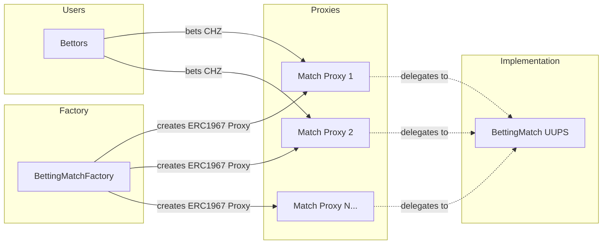
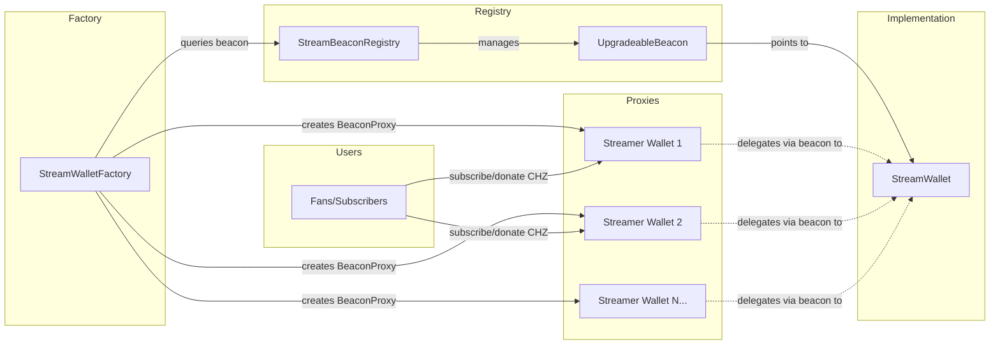

# ChilizTV Smart Contracts - Technical Documentation

**Author**: ChilizTV Team  
**Target Audience**: Solidity developers, DevOps, QA, backend/frontend integrators

---

## 1. Overview

ChilizTV provides a decentralized platform with two main systems:

1. **Betting System** - UUPS-based match betting with multiple markets
2. **Streaming System** - Beacon-based streamer wallets with subscriptions and donations

Both systems use native CHZ token for all transactions.

---

## 2. Architecture

### 2.1 Betting System (UUPS Pattern)



**Components:**
- **BettingMatch** (`src/betting/BettingMatch.sol`): UUPS upgradeable match contract
  - Supports multiple markets (Winner, GoalsCount, FirstScorer, etc.)
  - Each market has odds, state (Live/Ended), and result
  - Users bet CHZ on market selections
  - Owner resolves markets and users claim payouts
  
- **BettingMatchFactory** (`src/betting/BettingMatchFactory.sol`): Factory for deploying match proxies
  - Creates ERC1967 proxies pointing to BettingMatch implementation
  - Tracks all deployed matches
  - Can upgrade implementation for future matches

**Betting Flow:**
1. Factory creates new match proxy with name and owner
2. Owner adds markets to the match (market type + odds)
3. Users place bets with CHZ on specific market selections
4. Owner resolves markets with actual results
5. Winners claim payouts based on locked odds

---

### 2.2 Streaming System (Beacon Pattern)



**Components:**
- **StreamWallet** (`src/streamer/StreamWallet.sol`): Beacon-upgradeable wallet for streamers
  - Receives subscriptions and donations in CHZ
  - Splits platform fee to treasury
  - Streamer can withdraw their balance anytime
  
- **StreamBeaconRegistry** (`src/streamer/StreamBeaconRegistry.sol`): Manages UpgradeableBeacon
  - Stores beacon pointing to StreamWallet implementation
  - Owned by Safe multisig for secure upgrades
  - All streamer wallets upgrade atomically when implementation changes
  
- **StreamWalletFactory** (`src/streamer/StreamWalletFactory.sol`): Factory for deploying streamer wallets
  - Creates BeaconProxy instances for each streamer
  - Handles subscriptions and donations on behalf of streamers
  - Enforces platform fee split

**Streaming Flow:**
1. Factory creates StreamWallet proxy for a streamer
2. Users subscribe/donate with CHZ via factory
3. Platform fee automatically sent to treasury
4. Net amount recorded in streamer's wallet
5. Streamer withdraws accumulated balance

---

## 3. Smart Contracts Reference

### 3.1 Betting Contracts

#### BettingMatch.sol
```solidity
// UUPS upgradeable match with multiple betting markets
contract BettingMatch {
    enum MarketType { Winner, GoalsCount, FirstScorer }
    enum State { Live, Ended }
    
    function initialize(string calldata _matchName, address _owner) external;
    function addMarket(MarketType mtype, uint256 odds) external onlyOwner;
    function placeBet(uint256 marketId, uint256 selection) external payable;
    function resolveMarket(uint256 marketId, uint256 result) external onlyOwner;
    function claim(uint256 marketId) external nonReentrant;
}
```

#### BettingMatchFactory.sol
```solidity
// Factory for creating match proxies
contract BettingMatchFactory {
    function createMatch(string calldata _matchName, address _owner) external returns (address proxy);
    function setImplementation(address _newImpl) external onlyOwner;
    function getAllMatches() external view returns (address[] memory);
}
```

---

### 3.2 Streaming Contracts

#### StreamWallet.sol
```solidity
// Beacon-upgradeable wallet for streamers
contract StreamWallet {
    function initialize(address _streamer, address _treasury, uint16 _feeBps) external;
    function recordSubscription(address _subscriber, uint256 _amount) external payable;
    function donate(address _donor, uint256 _amount) external payable;
    function withdraw() external;
}
```

#### StreamWalletFactory.sol
```solidity
// Factory for creating streamer wallets
contract StreamWalletFactory {
    function createStreamWallet(address _streamer) external returns (address);
    function subscribeToStream(address _streamer) external payable;
    function donateToStream(address _streamer) external payable;
}
```

#### StreamBeaconRegistry.sol
```solidity
// Registry managing beacon for upgrades
contract StreamBeaconRegistry {
    function setImplementation(address newImplementation) external onlyOwner;
    function beacon() external view returns (address);
    function implementation() external view returns (address);
}
```

---

## 4. Deployment

### 4.1 Environment Variables

```bash
export PRIVATE_KEY=0x...           # Deployer private key
export RPC_URL=https://...         # Network RPC endpoint
export SAFE_ADDRESS=0x...          # Safe multisig (treasury + registry owner)
export ETHERSCAN_API_KEY=...       # For contract verification
```

### 4.2 Deploy Betting System Only

```bash
forge script script/DeployBetting.s.sol \
  --rpc-url $RPC_URL \
  --broadcast \
  --verify
```

**Deploys:**
- BettingMatch implementation
- BettingMatchFactory

### 4.3 Deploy Streaming System Only

```bash
forge script script/DeployStreaming.s.sol \
  --rpc-url $RPC_URL \
  --broadcast \
  --verify
```

**Deploys:**
- StreamWallet implementation
- StreamBeaconRegistry (transfers ownership to Safe)
- StreamWalletFactory

### 4.4 Deploy Complete System

```bash
forge script script/DeployAll.s.sol \
  --rpc-url $RPC_URL \
  --broadcast \
  --verify
```

**Deploys both betting and streaming systems.**

---

## 5. Usage Examples

### 5.1 Create a Betting Match

```bash
cast send $BETTING_FACTORY \
  "createMatch(string,address)" \
  "Real Madrid vs Barcelona" \
  $OWNER_ADDRESS \
  --rpc-url $RPC_URL
```

### 5.2 Add Market to Match

```bash
cast send $MATCH_ADDRESS \
  "addMarket(uint8,uint256)" \
  0 \      # MarketType.Winner
  150 \    # Odds: 1.5x
  --rpc-url $RPC_URL
```

### 5.3 Place a Bet

```bash
cast send $MATCH_ADDRESS \
  "placeBet(uint256,uint256)" \
  0 \      # Market ID
  1 \      # Selection
  --value 1ether \
  --rpc-url $RPC_URL
```

### 5.4 Create Streamer Wallet

```bash
cast send $STREAM_FACTORY \
  "createStreamWallet(address)" \
  $STREAMER_ADDRESS \
  --rpc-url $RPC_URL
```

### 5.5 Subscribe to Stream

```bash
cast send $STREAM_FACTORY \
  "subscribeToStream(address)" \
  $STREAMER_ADDRESS \
  --value 10ether \
  --rpc-url $RPC_URL
```

---

## 6. Security & Access Control

### 6.1 Betting System
- **BettingMatch Owner**: Can add markets and resolve results
- **Factory Owner**: Can update implementation for future matches
- **UUPS**: Each match can be upgraded individually by its owner

### 6.2 Streaming System
- **StreamWallet Owner (Streamer)**: Can withdraw their balance
- **Factory Owner**: Can create wallets and update fee parameters
- **Registry Owner (Safe Multisig)**: Can upgrade StreamWallet implementation
  - All streamer wallets upgrade atomically
  - Controlled by Safe multisig for security

### 6.3 Treasury
- **Safe Multisig**: Receives platform fees from streaming system
- Controlled by multiple signers for security

---

## 7. Testing

Run all tests:
```bash
forge test -vvv
```

Run specific test:
```bash
forge test --match-contract BettingMatchTest -vvv
forge test --match-contract StreamBeaconRegistryTest -vvv
```

---

## 8. Architecture Benefits

### 8.1 Betting System (UUPS)
✅ Each match is independently upgradeable  
✅ Simple factory pattern  
✅ Low gas costs for proxy deployment  
✅ Match owners have full control over their matches  

### 8.2 Streaming System (Beacon)
✅ All streamers upgrade atomically  
✅ Safe multisig controls upgrades  
✅ Platform can fix bugs for all streamers at once  
✅ Streamers don't need to worry about upgrades  

---

## 9. Contract Addresses

### Chiliz Spicy Testnet (Chain ID: 88882)

**Betting System:**
- BettingMatch Implementation: `TBD`
- BettingMatchFactory: `TBD`

**Streaming System:**
- StreamWallet Implementation: `TBD`
- StreamBeaconRegistry: `TBD`
- StreamWalletFactory: `TBD`

---

## 10. Support & Contact

For technical questions or integration support, contact the ChilizTV development team.

---

**Last Updated**: 2025-11-19
