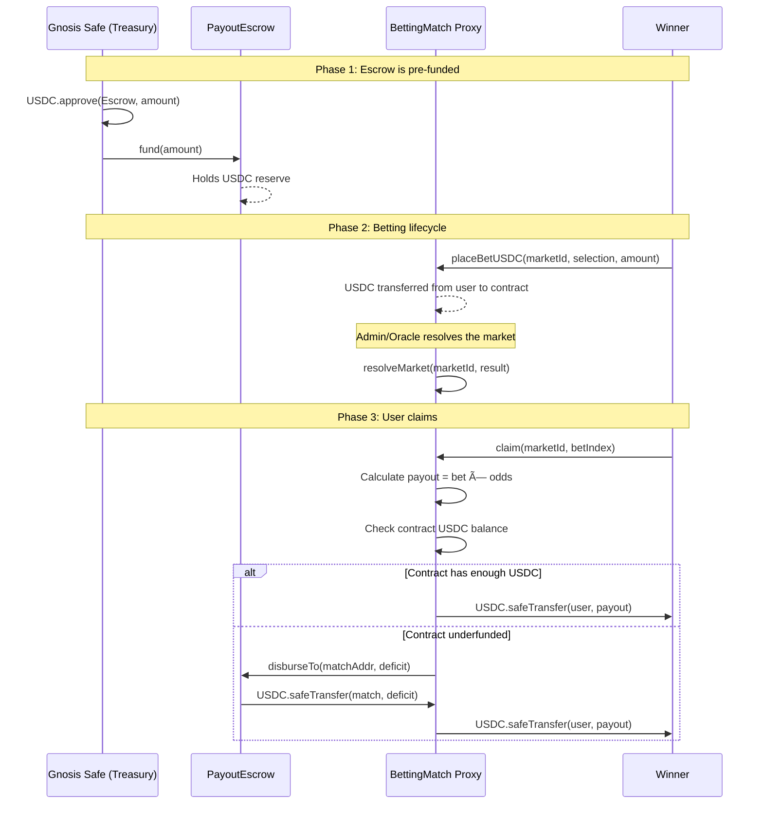
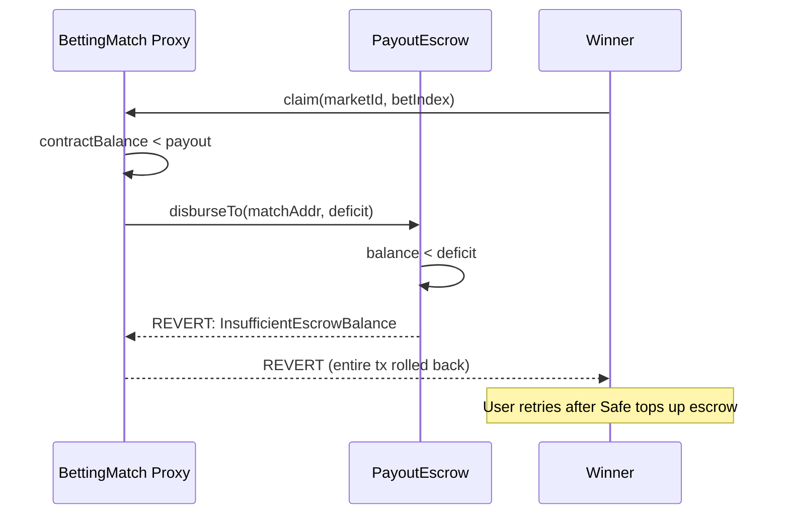
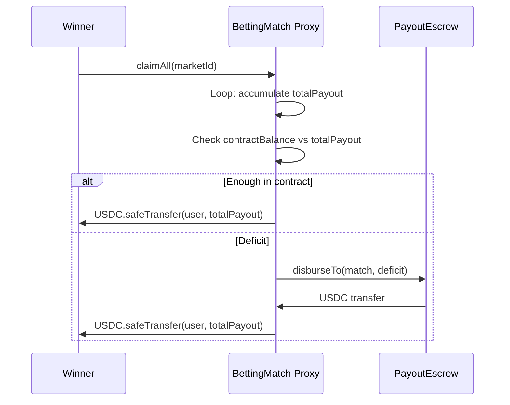

# Payout Architecture

## Overview

The ChilizTV betting system uses a **Pull-Claims with Pre-funded PayoutEscrow** architecture. Users claim their winnings on-chain from the BettingMatch contract. When that contract does not hold enough USDC to cover the payout, it automatically pulls the deficit from a shared `PayoutEscrow` contract funded by the Gnosis Safe treasury.

## Contracts

| Contract | Role | Deployed |
|----------|------|----------|
| `BettingMatch` (abstract) | Core betting logic, payout disbursement | Per-match UUPS proxy |
| `FootballMatch` / `BasketballMatch` | Sport-specific markets | Concrete implementations |
| `PayoutEscrow` | Shared USDC reserve funded by Safe | Once per network |
| `BettingMatchFactory` | Deploys match proxies | Once per network |

## Roles

| Role | Holder | Responsibility |
|------|--------|----------------|
| `ADMIN_ROLE` | Match owner | Create markets, set escrow, manage state |
| `RESOLVER_ROLE` | Oracle / admin | Resolve markets with results |
| `TREASURY_ROLE` | Safe / admin | Fund match contract directly |
| Escrow `owner` | Gnosis Safe | Fund escrow, authorize/revoke matches, pause |

## Payout Flow

### Happy Path

### Escrow Underfunded

### Batch Claim (claimAll)

## Invariants

1. **Double-claim prevention**: Each bet has a `claimed` boolean. Once set to `true`, any further claim attempt reverts with `AlreadyClaimed`.

2. **Solvency at bet time**: When a new bet is placed, the contract verifies `totalUSDCLiabilities + potentialPayout <= usdcToken.balanceOf(contract)`. This uses only the contract's own balance (escrow is not counted), keeping the check conservative.

3. **Liability accounting**: `totalUSDCLiabilities` is decremented on every successful claim/refund by the exact payout amount. This tracks the contract's outstanding obligations.

4. **Escrow whitelist**: Only BettingMatch contracts authorized by the Safe owner can call `PayoutEscrow.disburseTo()`. Unauthorized callers revert with `UnauthorizedMatch`.

5. **Escrow pausability**: The Safe can pause the escrow in emergencies, blocking all disbursements across all matches on the network.

## Monitoring

| Query | How |
|-------|-----|
| Match funding deficit | `match.getFundingDeficit()` → USDC needed beyond contract balance |
| Escrow available balance | `escrow.availableBalance()` → USDC ready for payouts |
| Total liabilities per match | `match.totalUSDCLiabilities()` |
| Total disbursed from escrow | `escrow.totalDisbursed()` |
| Per-match escrow usage | `escrow.disbursedPerMatch(matchAddr)` |

**Operational rule**: `escrow.availableBalance() >= Σ match.getFundingDeficit()` across all active matches.

## Security Properties

- **Checks-Effects-Interactions**: All claim functions set `bet.claimed = true` and update liabilities before any external call.
- **ReentrancyGuard**: Present on `claim()`, `claimRefund()`, `claimAll()` (BettingMatch) and `disburseTo()`, `fund()`, `withdraw()` (PayoutEscrow).
- **SafeERC20**: All token transfers use OpenZeppelin's `SafeERC20` wrappers.
- **Pausable**: Both BettingMatch and PayoutEscrow are independently pausable.

## What Requires Safe Execution

| Action | Who | How |
|--------|-----|-----|
| Fund escrow | Safe signers | `USDC.approve(escrow, amount)` → `escrow.fund(amount)` |
| Authorize match | Safe (escrow owner) | `escrow.authorizeMatch(matchProxy)` |
| Revoke match | Safe (escrow owner) | `escrow.revokeMatch(matchProxy)` |
| Withdraw from escrow | Safe (escrow owner) | `escrow.withdraw(amount)` |
| Pause/unpause escrow | Safe (escrow owner) | `escrow.pause()` / `escrow.unpause()` |

Everything else (betting, claiming, resolving) is automated on-chain.
