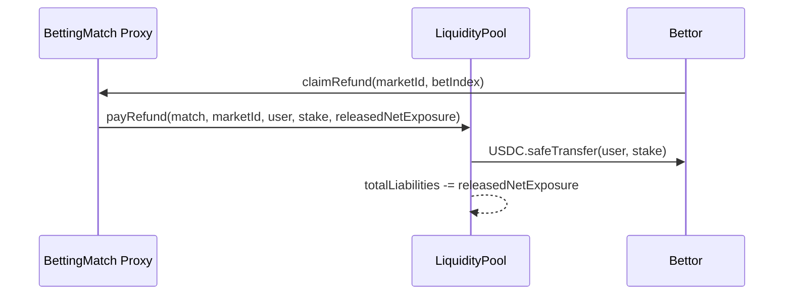
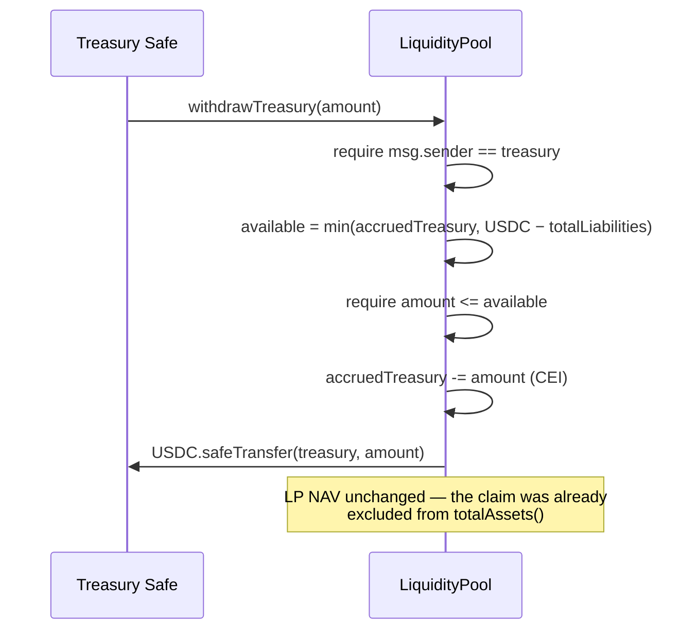
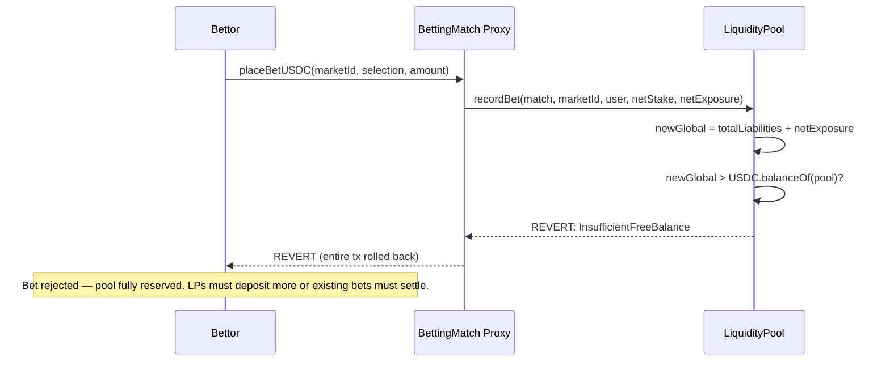

# Payout Architecture

## Overview

The ChilizTV betting system uses a **LiquidityPool-backed payout** architecture. A single ERC-4626 vault (`LiquidityPool`) is the sole holder of USDC on the betting side. LPs deposit USDC and receive transferable `ctvLP` shares that auto-compound the house edge priced into fixed odds. **BettingMatch proxies hold no USDC** — all stakes enter the pool; all payouts leave the pool.

## Contracts

| Contract | Role | Deployed |
|----------|------|----------|
| `BettingMatch` (abstract) | Core betting logic, delegates all USDC I/O to pool | Per-match UUPS proxy |
| `FootballMatch` / `BasketballMatch` | Sport-specific markets | Concrete implementations |
| `LiquidityPool` | ERC-4626 vault: single source of bet liquidity | Once per network (UUPS proxy) |
| `BettingMatchFactory` | Deploys match proxies | Once per network |

## Roles

| Role | Holder | Responsibility |
|------|--------|----------------|
| `DEFAULT_ADMIN_ROLE` (pool) | **Admin key (EOA or multisig) — NOT the treasury Safe** | Authorize/revoke matches, set fees & caps & cooldown & `maxBetAmount`, upgrade pool |
| `PAUSER_ROLE` (pool) | Admin key / security team | Emergency pause |
| `MATCH_ROLE` (pool) | Each BettingMatch proxy | Call `recordBet`, `settleMarket`, `payWinner`, `payRefund` |
| `ROUTER_ROLE` (pool) | ChilizSwapRouter | Call `recordBet` on behalf of users |
| `treasury` (pool state) | **Treasury Safe (multisig)** | `proposeTreasury` / `cancelTreasuryProposal` / `acceptTreasury` / `withdrawTreasury` |
| `ADMIN_ROLE` (match) | Match owner | Create markets, manage state, `setMaxAllowedOdds` |
| `RESOLVER_ROLE` (match) | Oracle / admin | Resolve markets with results |

**Role separation is enforced on-chain.** Admin cannot touch `accruedTreasury` or rotate `treasury`. Treasury cannot authorize matches, change fees, or upgrade the pool. Deploy with distinct addresses for `admin_` and `treasury_` in `initialize(...)`. See [treasury.md](treasury.md).

## NAV Model

```
totalAssets()   = USDC.balanceOf(pool) - totalLiabilities - accruedTreasury
freeBalance()   = totalAssets()              (LP-withdrawable USDC)
utilization()   = totalLiabilities × 10_000 / totalAssets()   (bps)
totalLiabilities = Σ netExposure across ALL open positions on every selection
                   (sum-based reservation, not max-side — see note below)
accruedTreasury = Σ 50% of losingNetStake accumulated at settlement (pull-claim)
```

> **Reservation model — sum-based, not max-side.**
> `recordBet` adds `netExposure` to `totalLiabilities` for every bet, regardless
> of which side it's on. The pool reserves enough capital to pay every open
> position on every selection if it won, even though only one side can actually
> win. A future optimisation could switch to max-side reservation (only reserve
> the worst-case losing side), which is more capital-efficient but harder to
> reason about across markets — the current design intentionally trades capital
> efficiency for simpler solvency invariants.

Claims against the pool's USDC balance, in precedence:
1. **Winners** — `totalLiabilities` (senior, reserved).
2. **Treasury** — `accruedTreasury` (pullable by Safe, never absorbs winning-bet losses).
3. **LPs** — residual, priced into ctvLP shares.

State deltas:

| Event | USDC balance | totalLiabilities | accruedTreasury | totalAssets (LP NAV) |
|---|---|---|---|---|
| Bet placed (netStake in, exposure reserved) | +netStake | +netExposure | — | −netExposure +netStake |
| Winner claims | −payout | −netExposure | — | −netStake (pool's realised loss) |
| Loser's market settles | — | −losingNetExposure | +losingNetStake × 50% | +losingNetStake × 50% |
| Refund (cancelled market) | −stake | −netExposure | — | −(netExposure − stake) ≈ 0 |
| `withdrawTreasury(x)` | −x | — | −x | unchanged |

## Payout Flow

### Happy Path

```mermaid
sequenceDiagram
    participant LP as Liquidity Provider
    participant Pool as LiquidityPool (ERC-4626)
    participant Match as BettingMatch Proxy
    participant User as Winner

    Note over LP,User: Phase 1: LPs seed the pool
    LP->>Pool: deposit(usdc, receiver)
    Pool-->>LP: ctvLP shares minted (auto-compound house edge)

    Note over LP,User: Phase 2: Betting lifecycle
    User->>Match: placeBetUSDC(marketId, selection, amount)
    Match->>Pool: recordBet(match, marketId, user, netStake, netExposure)
    Pool-->>Pool: totalLiabilities += netExposure; cap checks pass
    Match-->>User: Bet recorded ✓

    Note over LP,User: Phase 3: Market resolution (50/50 loss split)
    Match->>Match: resolveMarket(marketId, result)
    Match->>Pool: settleMarket(match, marketId, losingNetExposure, losingNetStake)
    Pool-->>Pool: totalLiabilities -= losingNetExposure
    Pool-->>Pool: accruedTreasury += losingNetStake × 5000 / 10_000 (50% to treasury)
    Pool-->>Pool: remaining 50% stays in USDC balance → compounds into LP NAV

    Note over LP,User: Phase 4: Winner claims
    User->>Match: claim(marketId, betIndex)
    Match->>Pool: payWinner(match, marketId, user, payout, releasedNetExposure)
    Pool->>User: USDC.safeTransfer(user, payout)
    Pool-->>Pool: totalLiabilities -= releasedNetExposure
```

### Refund (Cancelled Market)



### Treasury Withdrawal (pull-based)



### Treasury Rotation (2-step)

```mermaid
sequenceDiagram
    participant A as Safe A (current)
    participant Pool as LiquidityPool
    participant B as Safe B (target)

    A->>Pool: proposeTreasury(B)
    Pool-->>Pool: pendingTreasury = B
    Note over A,B: Safe A retains full rights until Safe B accepts
    B->>Pool: acceptTreasury()
    Pool->>Pool: require msg.sender == pendingTreasury
    Pool-->>Pool: treasury = B; pendingTreasury = 0
    Note over A: Safe A loses withdrawal rights
```

### Solvency Failure (Bet Rejected)



## Invariants

1. **Double-claim prevention**: Each bet has a `claimed` boolean. Once `true`, any further claim reverts `AlreadyClaimed`.

2. **Solvency at bet time**: `recordBet` checks `totalLiabilities + netExposure <= USDC.balanceOf(pool)`. No bet is accepted that the pool cannot cover.

3. **Per-market cap**: `marketLiability[match][marketId] + netExposure <= maxLiabilityPerMarketBps × totalAssets() / 10_000`. Caps scale automatically with LP deposits.

4. **Per-match cap**: `matchLiability[match] + netExposure <= maxLiabilityPerMatchBps × totalAssets() / 10_000`.

5. **MATCH_ROLE whitelist**: Only match proxies granted `MATCH_ROLE` by the admin key can call `recordBet`, `payWinner`, `payRefund`, `settleMarket`. Unauthorized callers revert `MatchNotAuthorized`.

6. **Cooldown**: LPs must wait `depositCooldownSeconds` after their last share receipt before withdrawing, preventing flash-NAV manipulation.

7. **freeBalance gate**: LP withdrawals are bounded by `freeBalance()` — LPs cannot withdraw USDC reserved for open winning positions or for the treasury's accrued claim.

8. **Treasury isolation**: `accruedTreasury` is never touched by winning-bet payouts. It can only change via `settleMarket` (accrues 50% of losing net stake) and `withdrawTreasury` (decreases on Safe pull). Admin cannot read or move this balance.

9. **Treasury solvency bound**: `withdrawTreasury` requires `amount <= min(accruedTreasury, USDC.balance - totalLiabilities)`. Outstanding winners always have precedence over treasury pulls.

10. **Inflation-attack mitigation**: `_decimalsOffset() = 6` — ctvLP has 12 decimals (USDC 6 + offset 6). First depositor cannot inflate share price cheaply.

## Monitoring

| Query | How | Healthy When |
|-------|-----|--------------|
| Pool free balance | `pool.freeBalance()` | > sum of expected winner payouts |
| Total liabilities | `pool.totalLiabilities()` | Decreasing after market settlement |
| Utilization | `pool.utilization()` | < 7000 bps (70%) — alert at 8000 |
| Per-match liability | `pool.matchLiability(matchAddr)` | Within `maxLiabilityPerMatchBps` of NAV |
| Per-market liability | `pool.marketLiability(matchAddr, marketId)` | Within `maxLiabilityPerMarketBps` of NAV |
| Treasury accrued | `pool.accruedTreasury()` | Monotonically ↑ until Safe withdraws |
| Treasury withdrawable now | `pool.treasuryWithdrawable()` | ≤ accrued; gap = pool capital tied up |
| LP NAV per share | `pool.convertToAssets(1e12)` | Growing (house edge compounding) |

**Operational rules**:
- `pool.freeBalance() > 0` at all times. If it reaches zero, new bets are blocked.
- `USDC.balanceOf(pool) >= totalLiabilities + accruedTreasury` is the core solvency invariant. Any deviation indicates a bug.

## Security Properties

- **Checks-Effects-Interactions**: `payWinner` / `payRefund` / `withdrawTreasury` update liability/accrual counters before calling `safeTransfer`.
- **ReentrancyGuard**: Present on all state-changing pool functions (`recordBet`, `settleMarket`, `payWinner`, `payRefund`, `withdrawTreasury`, `deposit`, `withdraw`, `redeem`).
- **SafeERC20**: All token transfers use OpenZeppelin's `SafeERC20` wrappers.
- **Pausable**: Pool can be paused by `PAUSER_ROLE` (admin key) — blocks all deposits, withdrawals, treasury pulls, and match operations simultaneously.
- **UUPS upgradeable**: Pool logic can be upgraded by the admin key. Storage layout is append-only; upgrade path preserves all live data.
- **Role separation**: admin key (`DEFAULT_ADMIN_ROLE`) and treasury Safe (`treasury` state var) are disjoint. See [treasury.md](treasury.md).

## Who Can Do What

Admin key (`DEFAULT_ADMIN_ROLE` / `PAUSER_ROLE`):

| Action | How |
|--------|-----|
| Authorize / revoke a match | `pool.authorizeMatch(matchProxy)` / `pool.revokeMatch(matchProxy)` |
| Set protocol fee | `pool.setProtocolFeeBps(newBps)` (≤ 1000) |
| Set liability caps | `pool.setMaxLiabilityPerMarketBps(bps)` / `pool.setMaxLiabilityPerMatchBps(bps)` |
| Set per-bet cap | `pool.setMaxBetAmount(newAmount)` (0 disables) |
| Set deposit cooldown | `pool.setDepositCooldownSeconds(seconds)` |
| Pause / unpause pool | `pool.pause()` / `pool.unpause()` |
| Upgrade pool logic | `pool.upgradeToAndCall(newImpl, "")` |

Treasury Safe (`treasury` state variable):

| Action | How |
|--------|-----|
| Start rotation to a new Safe | `pool.proposeTreasury(newSafe)` |
| Cancel a pending proposal | `pool.cancelTreasuryProposal()` |
| Accept incoming rotation (new Safe) | `pool.acceptTreasury()` |
| Withdraw accrued USDC | `pool.withdrawTreasury(amount)` — always sends to `treasury` |

Each BettingMatch (per-match admin):

| Action | How |
|--------|-----|
| Set per-match soft odds cap | `match.setMaxAllowedOdds(maxOdds)` (0 disables; uses MAX_ODDS = 100x) |
| Grant RESOLVER | `match.grantRole(RESOLVER_ROLE, oracle)` |

Everything else (betting, claiming, resolving) is automated on-chain.
