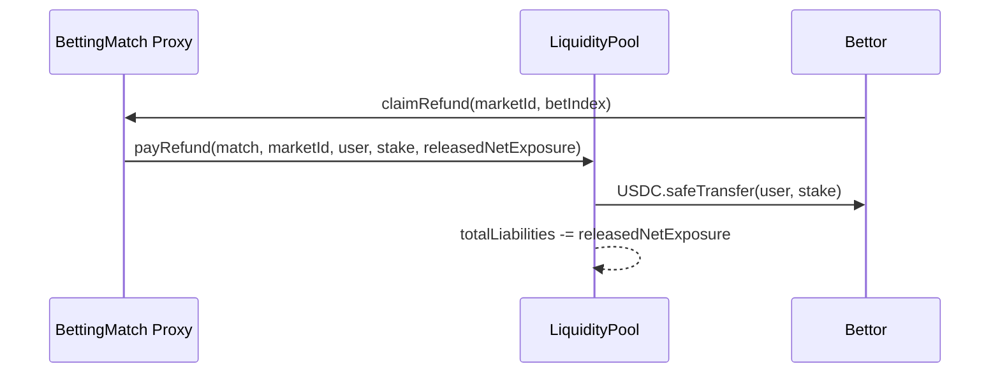
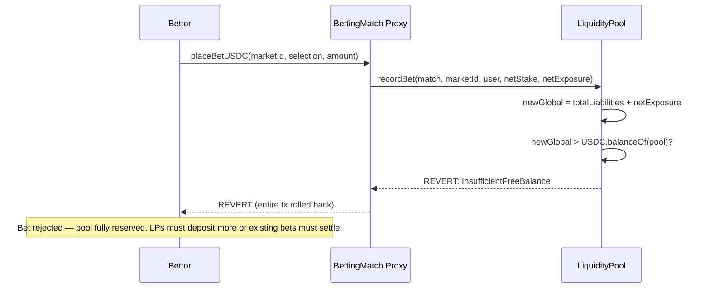

# Payout Architecture

## Overview

The ChilizTV betting system uses a **LiquidityPool-backed payout** architecture. A single ERC-4626 vault (`LiquidityPool`) is the sole holder of USDC on the betting side. LPs deposit USDC and receive transferable `ctvLP` shares that auto-compound the house edge priced into fixed odds. **BettingMatch proxies hold no USDC** — all stakes enter the pool; all payouts leave the pool.

## Contracts

| Contract | Role | Deployed |
|----------|------|----------|
| `BettingMatch` (abstract) | Core betting logic, delegates all USDC I/O to pool | Per-match UUPS proxy |
| `FootballMatch` / `BasketballMatch` | Sport-specific markets | Concrete implementations |
| `LiquidityPool` | ERC-4626 vault: single source of bet liquidity | Once per network (UUPS proxy) |
| `BettingMatchFactory` | Deploys match proxies | Once per network |

## Roles

| Role | Holder | Responsibility |
|------|--------|----------------|
| `DEFAULT_ADMIN_ROLE` (pool) | Gnosis Safe | Authorize/revoke matches, set treasury & fees, upgrade pool |
| `MATCH_ROLE` (pool) | Each BettingMatch proxy | Call `recordBet`, `settleMarket`, `payWinner`, `payRefund` |
| `ROUTER_ROLE` (pool) | ChilizSwapRouter | Call `recordBet` on behalf of users |
| `PAUSER_ROLE` (pool) | Safe / security team | Emergency pause |
| `ADMIN_ROLE` (match) | Match owner | Create markets, manage state |
| `RESOLVER_ROLE` (match) | Oracle / admin | Resolve markets with results |

## NAV Model

```
totalAssets()   = USDC.balanceOf(pool) - totalLiabilities
freeBalance()   = totalAssets()   (unreserved USDC, available for LP withdrawal)
totalLiabilities = Σ netExposure across all open winning-side positions
```

When a bet is placed: `USDC in ↑`, `totalLiabilities ↑` → `totalAssets()` unchanged.
When a winner claims: `USDC out ↓`, `totalLiabilities ↓` → `totalAssets()` drops by `stake` (pool's realised loss).
When a loser's market settles: `totalLiabilities ↓` → `totalAssets()` rises (pool keeps the stake).

## Payout Flow

### Happy Path

```mermaid
sequenceDiagram
    participant LP as Liquidity Provider
    participant Pool as LiquidityPool (ERC-4626)
    participant Match as BettingMatch Proxy
    participant User as Winner

    Note over LP,User: Phase 1: LPs seed the pool
    LP->>Pool: deposit(usdc, receiver)
    Pool-->>LP: ctvLP shares minted (auto-compound house edge)

    Note over LP,User: Phase 2: Betting lifecycle
    User->>Match: placeBetUSDC(marketId, selection, amount)
    Match->>Pool: recordBet(match, marketId, user, netStake, netExposure)
    Pool-->>Pool: totalLiabilities += netExposure; cap checks pass
    Match-->>User: Bet recorded ✓

    Note over LP,User: Phase 3: Market resolution
    Match->>Match: resolveMarket(marketId, result)
    Match->>Pool: settleMarket(match, marketId, losingLiabilityToRelease)
    Pool-->>Pool: totalLiabilities -= losingLiability (losers' stakes kept by pool)

    Note over LP,User: Phase 4: Winner claims
    User->>Match: claim(marketId, betIndex)
    Match->>Pool: payWinner(match, marketId, user, payout, releasedNetExposure)
    Pool->>User: USDC.safeTransfer(user, payout)
    Pool-->>Pool: totalLiabilities -= releasedNetExposure
```

### Refund (Cancelled Market)



### Solvency Failure (Bet Rejected)



## Invariants

1. **Double-claim prevention**: Each bet has a `claimed` boolean. Once `true`, any further claim reverts `AlreadyClaimed`.

2. **Solvency at bet time**: `recordBet` checks `totalLiabilities + netExposure <= USDC.balanceOf(pool)`. No bet is accepted that the pool cannot cover.

3. **Per-market cap**: `marketLiability[match][marketId] + netExposure <= maxLiabilityPerMarketBps × totalAssets() / 10_000`. Caps scale automatically with LP deposits.

4. **Per-match cap**: `matchLiability[match] + netExposure <= maxLiabilityPerMatchBps × totalAssets() / 10_000`.

5. **MATCH_ROLE whitelist**: Only match proxies granted `MATCH_ROLE` by the Safe can call `recordBet`, `payWinner`, `payRefund`, `settleMarket`. Unauthorized callers revert `MatchNotAuthorized`.

6. **Cooldown**: LPs must wait `depositCooldownSeconds` after their last share receipt before withdrawing, preventing flash-NAV manipulation.

7. **freeBalance gate**: LP withdrawals are bounded by `freeBalance()` — LPs cannot withdraw USDC reserved for open winning positions.

## Monitoring

| Query | How | Healthy When |
|-------|-----|--------------|
| Pool free balance | `pool.freeBalance()` | > sum of expected winner payouts |
| Total liabilities | `pool.totalLiabilities()` | Decreasing after market settlement |
| Per-match liability | `pool.matchLiability(matchAddr)` | Within `maxLiabilityPerMatchBps` of NAV |
| Per-market liability | `pool.marketLiability(matchAddr, marketId)` | Within `maxLiabilityPerMarketBps` of NAV |
| LP NAV per share | `pool.convertToAssets(1e18)` | Growing (house edge compounding) |
| Protocol fees accrued | events `WinnerPaid`, `BetRecorded` | Consistent with volume |

**Operational rule**: `pool.freeBalance() > 0` at all times. If it reaches zero, new bets are blocked until LPs deposit or open positions settle.

## Security Properties

- **Checks-Effects-Interactions**: `payWinner` / `payRefund` update liability counters before calling `safeTransfer`.
- **ReentrancyGuard**: Present on all state-changing pool functions (`recordBet`, `settleMarket`, `payWinner`, `payRefund`, `deposit`, `withdraw`, `redeem`).
- **SafeERC20**: All token transfers use OpenZeppelin's `SafeERC20` wrappers.
- **Pausable**: Pool can be paused by `PAUSER_ROLE` — blocks all deposits, withdrawals, and match operations simultaneously.
- **UUPS upgradeable**: Pool logic can be upgraded by Safe (`DEFAULT_ADMIN_ROLE`) without migrating USDC.

## What Requires Safe Execution

| Action | Who | How |
|--------|-----|-----|
| Authorize match proxy | Safe (`DEFAULT_ADMIN_ROLE`) | `pool.authorizeMatch(matchProxy)` |
| Revoke match proxy | Safe (`DEFAULT_ADMIN_ROLE`) | `pool.revokeMatch(matchProxy)` |
| Set protocol fee | Safe (`DEFAULT_ADMIN_ROLE`) | `pool.setProtocolFeeBps(newBps)` |
| Set liability caps | Safe (`DEFAULT_ADMIN_ROLE`) | `pool.setMaxLiabilityPerMarketBps(bps)` / `pool.setMaxLiabilityPerMatchBps(bps)` |
| Set deposit cooldown | Safe (`DEFAULT_ADMIN_ROLE`) | `pool.setDepositCooldownSeconds(seconds)` |
| Pause / unpause pool | `PAUSER_ROLE` / Safe | `pool.pause()` / `pool.unpause()` |
| Upgrade pool logic | Safe (`DEFAULT_ADMIN_ROLE`) | `pool.upgradeToAndCall(newImpl, "")` |

Everything else (betting, claiming, resolving) is automated on-chain.
