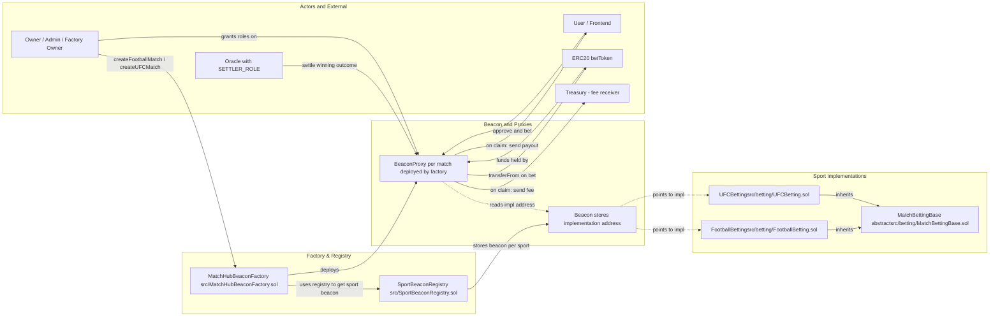
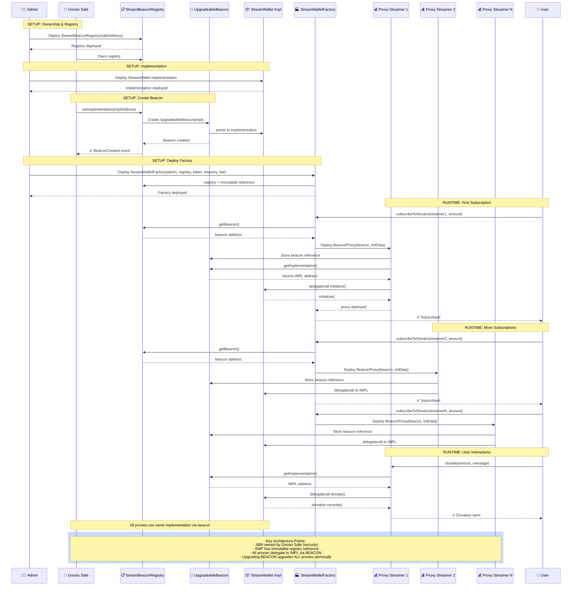
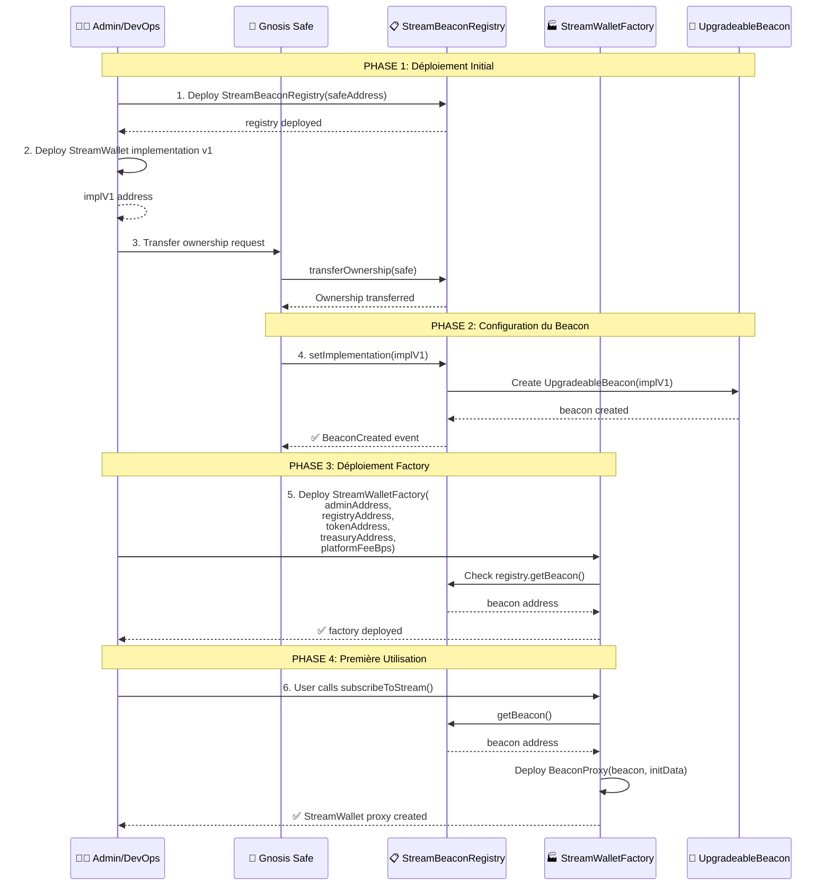
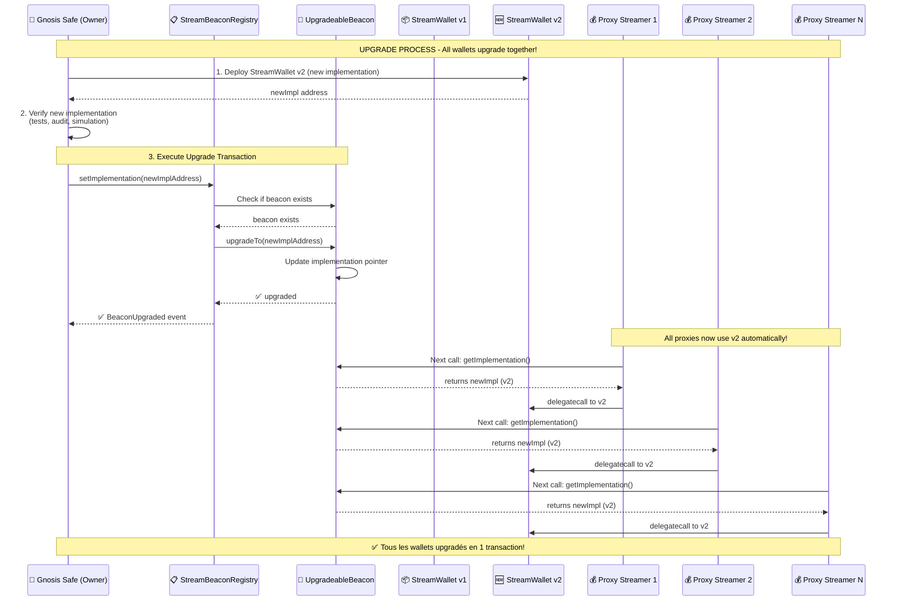
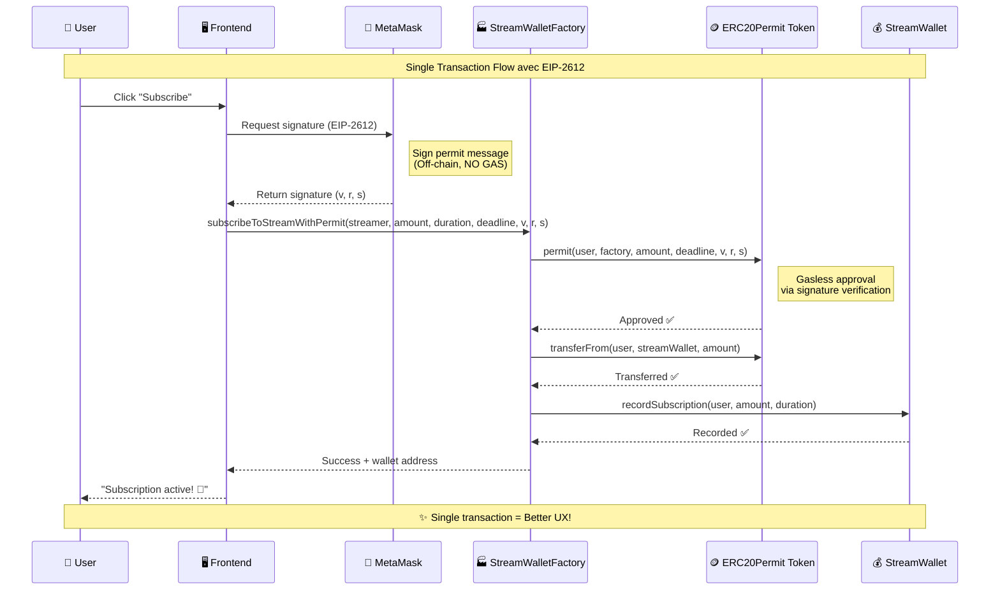

# Documentation Technique – MatchHub & MatchHubFactory

**Rôle** : Product Owner / Product Manager
**Public cible** : Équipes de développement Solidity, DevOps, QA, intégrateurs back‑end/front‑end

---

## 1. Contexte & Vision Produit

Nous offrons une plateforme décentralisée où chaque **MatchHub** représente un match sportif unique : son nom, ses marchés de paris (victoire/défaite/égalité, nombre de buts, premier buteur), ses mises en ETH, la résolution des marchés et la distribution automatique des gains.
La factory **MatchHubFactory** permet à toute adresse whitelisted de déployer facilement de nouveaux hubs, en garantissant uniformité, sécurité et upgradeabilité via le pattern UUPS+ERC‑1967.

---



---

## 2. Streaming & Smart Wallet Architecture

### 2.1 Sequence Diagram: Complete Interaction Flow

```mermaid
sequenceDiagram
    participant Viewer as 👤 Viewer/Fan
    participant Frontend as 🖥️ Frontend
    participant WalletFactory as 🏭 StreamWalletFactory
    participant StreamWallet as 💰 StreamWallet (Proxy)
    participant Token as 🪙 ERC20 Token
    participant Streamer as 🎥 Streamer
    participant Treasury as 🏦 Platform Treasury
    participant BettingProxy as 🎲 Betting Proxy
    participant Oracle as 🔮 Oracle

    %% === STREAMING: First Subscription ===
    Note over Viewer,StreamWallet: STREAMING FLOW - First Subscription
    Viewer->>Frontend: Subscribe to stream
    Frontend->>Token: Check allowance
    Token-->>Frontend: allowance = 0
    Frontend->>Viewer: Request approval
    Viewer->>Token: approve(WalletFactory, amount)
    Token-->>Viewer: Approval confirmed
    
    Frontend->>WalletFactory: subscribeToStream(streamerId, amount)
    WalletFactory->>WalletFactory: Check if wallet exists
    alt Wallet doesn't exist
        WalletFactory->>StreamWallet: Deploy new Smart-wallet
        StreamWallet-->>WalletFactory: wallet address
        WalletFactory->>StreamWallet: initialize(streamer, platformFee)
        StreamWallet-->>WalletFactory: initialized
        Note right of StreamWallet: Wallet created with:<br/>- Streamer as owner<br/>- Platform fee %<br/>- Revenue split rules
    end
    
    WalletFactory->>Token: transferFrom(viewer, StreamWallet, amount)
    Token-->>StreamWallet: Tokens received
    WalletFactory->>StreamWallet: recordSubscription(viewer, amount, duration)
    StreamWallet->>StreamWallet: Calculate split:<br/>platformFee = amount * feeBps / 10000<br/>streamerAmount = amount - platformFee
    StreamWallet->>Token: transfer(Treasury, platformFee)
    Token-->>Treasury: Platform fee received
    StreamWallet->>Token: transfer(Streamer, streamerAmount)
    Token-->>Streamer: Streamer payment received
    StreamWallet-->>WalletFactory: Subscription recorded
    WalletFactory-->>Frontend: SubscriptionCreated event
    Frontend-->>Viewer: ✅ Subscribed!

    %% === STREAMING: Donation ===
    Note over Viewer,StreamWallet: STREAMING FLOW - Donation
    Viewer->>Frontend: Send donation
    Frontend->>Token: approve(StreamWallet, donationAmount)
    Token-->>Frontend: Approved
    Frontend->>StreamWallet: donate(amount, message)
    StreamWallet->>Token: transferFrom(viewer, this, amount)
    Token-->>StreamWallet: Tokens received
    StreamWallet->>StreamWallet: Calculate split
    StreamWallet->>Token: transfer(Treasury, platformFee)
    StreamWallet->>Token: transfer(Streamer, donationAmount - platformFee)
    StreamWallet-->>Frontend: DonationReceived event
    Frontend-->>Viewer: 💝 Donation sent!
    Frontend-->>Streamer: 🎁 New donation notification

    %% === STREAMING: Revenue Withdrawal ===
    Note over Streamer,StreamWallet: STREAMING FLOW - Streamer Withdrawal
    Streamer->>Frontend: Request withdrawal
    Frontend->>StreamWallet: withdrawRevenue(amount)
    StreamWallet->>StreamWallet: Check balance & ownership
    StreamWallet->>Token: transfer(Streamer, amount)
    Token-->>Streamer: Withdrawal complete
    StreamWallet-->>Frontend: RevenueWithdrawn event
    Frontend-->>Streamer: ✅ Funds transferred

    %% === BETTING: Match Creation ===
    Note over Viewer,BettingProxy: BETTING FLOW - Match Creation
    Streamer->>Frontend: Create betting match
    Frontend->>WalletFactory: MatchHubBeaconFactory.createFootballMatch(matchId, cutoff, feeBps)
    WalletFactory->>BettingProxy: Deploy new BeaconProxy
    BettingProxy-->>WalletFactory: proxy address
    WalletFactory->>BettingProxy: initialize(owner, token, matchId, cutoff, feeBps, treasury)
    BettingProxy->>BettingProxy: Grant roles:<br/>ADMIN_ROLE → ADMIN<br/>SETTLER_ROLE → Oracle <br/>PAUSER_ROLE → ADMIN (Safe or back-end)
    BettingProxy-->>Frontend: MatchHubCreated event
    Frontend-->>Streamer: 🎲 Match created!

    %% === BETTING: Place Bet ===
    Note over Viewer,BettingProxy: BETTING FLOW - Place Bet
    Viewer->>Frontend: Place bet on HOME (amount)
    Frontend->>Token: approve(BettingProxy, amount)
    Token-->>Frontend: Approved
    Frontend->>BettingProxy: betHome(amount)
    BettingProxy->>BettingProxy: Check onlyBeforeCutoff
    BettingProxy->>BettingProxy: Update pool[HOME] += amount
    BettingProxy->>BettingProxy: Update bets[viewer][HOME] += amount
    BettingProxy->>Token: transferFrom(viewer, this, amount)
    Token-->>BettingProxy: Tokens received
    BettingProxy-->>Frontend: BetPlaced event
    Frontend-->>Viewer: ✅ Bet placed!

    %% === BETTING: Settlement ===
    Note over Oracle,BettingProxy: BETTING FLOW - Match Settlement
    Oracle->>Oracle: Match ends, determine winner
    Oracle->>Frontend: Submit settlement (winningOutcome)
    Frontend->>BettingProxy: settle(HOME)
    BettingProxy->>BettingProxy: Check SETTLER_ROLE
    BettingProxy->>BettingProxy: Set settled = true<br/>winningOutcome = HOME
    BettingProxy->>BettingProxy: Calculate totalPool & feeAmount
    BettingProxy-->>Frontend: Settled event
    Frontend-->>Viewer: 🏆 Match settled!

    %% === BETTING: Claim Payout ===
    Note over Viewer,BettingProxy: BETTING FLOW - Claim Payout
    Viewer->>Frontend: Claim winnings
    Frontend->>BettingProxy: claim()
    BettingProxy->>BettingProxy: Check settled = true
    BettingProxy->>BettingProxy: Check claimed[viewer] = false
    BettingProxy->>BettingProxy: Calculate payout:<br/>userShare = userStake / winPool<br/>payout = userShare * distributable
    BettingProxy->>Token: transfer(Treasury, fee)
    Token-->>Treasury: Platform fee received
    BettingProxy->>Token: transfer(Viewer, payout)
    Token-->>Viewer: Winnings received
    BettingProxy->>BettingProxy: Set feeBps = 0 (MVP)<br/>Set claimed[viewer] = true
    BettingProxy-->>Frontend: Claimed event
    Frontend-->>Viewer: 💰 Winnings claimed!

    %% === INTEGRATION [AS AN IDEA NOT TO IMPLEMENT] ===
    Note over Viewer,Oracle: CROSS-FEATURE INTEGRATION
    Viewer->>Frontend: Subscribe + Bet in one transaction
    Frontend->>WalletFactory: multicall([subscribe, createBet])
    WalletFactory-->>Frontend: Both actions completed
    Frontend-->>Viewer: ✅ Subscribed & Bet placed!
```



### 2.2 StreamWallet Contract (`src/streamer/StreamWallet.sol`)

Le **StreamWallet** est un contrat proxy déployé automatiquement lors de la première souscription ou donation à un stream.

#### 2.2.1 Responsabilités
- **Revenue Collection**: Collecte des subscriptions et donations
- **Automatic Split**: Répartition automatique entre streamer et plateforme (via `platformFeeBps`)
- **Streamer Control**: Le streamer est propriétaire et peut retirer ses fonds
- **Transparency**: Toutes les transactions sont tracées on-chain avec événements
- **Integration**: Peut interagir avec les contrats de betting

#### 2.2.2 Fonctions Principales
- `initialize()`: Initialise le wallet avec streamer, token, treasury, et fee
- `recordSubscription()`: Enregistre une souscription et distribue les fonds (appelé par factory)
- `donate()`: Accepte une donation avec message optionnel
- `withdrawRevenue()`: Permet au streamer de retirer ses revenus accumulés
- `isSubscribed()`: Vérifie si un utilisateur a une souscription active
- `availableBalance()`: Retourne le solde disponible pour retrait

#### 2.2.3 État Clé
- Mapping des souscriptions par utilisateur (`subscriptions`)
- Mapping des donations lifetime par donateur (`lifetimeDonations`)
- Métriques: `totalRevenue`, `totalWithdrawn`, `totalSubscribers`
- Configuration: `streamer`, `treasury`, `platformFeeBps`, `token`

### 2.3 StreamWalletFactory Contract (`src/streamer/StreamWalletFactory.sol`)

La **factory** gère le déploiement et l'interaction avec les StreamWallets via le pattern BeaconProxy.

#### 2.3.1 Responsabilités
- Déploiement automatique de wallets pour les streamers (lazy deployment)
- Gestion centralisée des souscriptions et donations
- Uniformité des wallets via Beacon pattern (upgradeability)
- Configuration globale (treasury, platform fee)

#### 2.3.2 Fonctions Principales
- `subscribeToStream()`: Souscrit à un stream (crée le wallet si nécessaire)
- `donateToStream()`: Envoie une donation (crée le wallet si nécessaire)
- `deployWalletFor()`: Déploiement manuel d'un wallet (admin only)
- `setBeacon()`, `setTreasury()`, `setPlatformFee()`: Configuration (owner only)
- `getWallet()`, `hasWallet()`: Fonctions de vue

#### 2.3.3 Architecture
- Utilise `StreamBeaconRegistry` (immutable) pour gérer l'implémentation upgradeable
- Mapping `streamerWallets` pour tracer les wallets déployés
- Pattern BeaconProxy pour upgradeability sans redeployer chaque wallet

### 2.4 Upgradeable Architecture avec Beacon Pattern

#### 2.4.1 Vue d'ensemble

Le système de streaming utilise le **Beacon Pattern** pour permettre l'upgrade de tous les StreamWallets simultanément via une seule transaction.



**Architecture Résumé:**
- **StreamBeaconRegistry**: Possédé par Gnosis Safe, gère le beacon unique
- **UpgradeableBeacon**: Pointe vers l'implémentation courante
- **StreamWalletFactory**: Référence immutable au registry, déploie les proxies
- **BeaconProxy (par streamer)**: Délègue tous les appels à l'implémentation via le beacon
- **StreamWallet Implementation**: Logique métier partagée par tous les proxies

#### 2.4.2 Composants

**1. StreamBeaconRegistry** (`src/streamer/StreamBeaconRegistry.sol`)
- **Rôle**: Gère l'UpgradeableBeacon unique pour tous les StreamWallets
- **Owner**: Gnosis Safe (multisig recommandé)
- **Fonctions clés**:
  - `setImplementation(address)`: Crée ou upgrade l'implémentation
  - `getBeacon()`: Retourne l'adresse du beacon
  - `getImplementation()`: Retourne l'implémentation courante
  - `isInitialized()`: Vérifie si le beacon existe

**2. StreamWalletFactory** (`src/streamer/StreamWalletFactory.sol`)
- **Rôle**: Déploie des BeaconProxy pour chaque streamer
- **Registry**: Référence immutable au StreamBeaconRegistry
- **Sécurité**: Ne peut pas changer le beacon (immutable), seulement le registry owner peut upgrader

**3. StreamWallet Implementation** (`src/streamer/StreamWallet.sol`)
- **Rôle**: Logique métier des wallets streamers
- **Pattern**: Upgradeable via Initializable & ReentrancyGuardUpgradeable
- **État**: Stocké dans chaque proxy individuellement

#### 2.4.3 Flux de Déploiement Initial



#### 2.4.4 Flux d'Upgrade



#### 2.4.5 Commandes de Déploiement

**Étape 1: Déployer StreamWallet Implementation**
```bash
forge create src/streamer/StreamWallet.sol:StreamWallet \
  --rpc-url $RPC_URL \
  --private-key $DEPLOYER_PK \
  --verify
```

**Étape 2: Déployer StreamBeaconRegistry**
```bash
forge create src/streamer/StreamBeaconRegistry.sol:StreamBeaconRegistry \
  --constructor-args $GNOSIS_SAFE_ADDRESS \
  --rpc-url $RPC_URL \
  --private-key $DEPLOYER_PK \
  --verify
```

**Étape 3: Configurer le Beacon (via Gnosis Safe)**
```bash
# Préparer la transaction via Safe UI ou cast
cast send $REGISTRY_ADDRESS \
  "setImplementation(address)" $STREAM_WALLET_IMPL \
  --rpc-url $RPC_URL \
  --private-key $SAFE_SIGNER_PK
```

**Étape 4: Déployer StreamWalletFactory**
```bash
forge create src/streamer/StreamWalletFactory.sol:StreamWalletFactory \
  --constructor-args \
    $ADMIN_ADDRESS \
    $REGISTRY_ADDRESS \
    $TOKEN_ADDRESS \
    $TREASURY_ADDRESS \
    500 \
  --rpc-url $RPC_URL \
  --private-key $DEPLOYER_PK \
  --verify
```

**Upgrade (via Gnosis Safe uniquement)**
```bash
# 1. Déployer nouvelle implémentation
forge create src/streamer/StreamWallet.sol:StreamWallet \
  --rpc-url $RPC_URL \
  --private-key $DEPLOYER_PK \
  --verify

# 2. Upgrader via Safe
cast send $REGISTRY_ADDRESS \
  "setImplementation(address)" $NEW_IMPL_ADDRESS \
  --rpc-url $RPC_URL \
  --private-key $SAFE_SIGNER_PK
```

#### 2.4.6 Vérifications de Sécurité

**Avant l'upgrade:**
- ✅ Tests complets sur testnet avec fork mainnet
- ✅ Audit de la nouvelle implémentation
- ✅ Vérification de la compatibilité du storage layout
- ✅ Simulation de l'upgrade avec Tenderly/Hardhat
- ✅ Approbation multisig (Gnosis Safe)

**Après l'upgrade:**
- ✅ Vérifier `registry.getImplementation()` retourne la nouvelle adresse
- ✅ Tester les fonctions critiques sur un proxy existant
- ✅ Monitor les transactions des utilisateurs
- ✅ Plan de rollback si nécessaire

#### 2.4.7 Avantages de cette Architecture

| Avantage | Description |
|----------|-------------|
| **Upgrade Atomique** | Tous les wallets upgradent simultanément en 1 transaction |
| **Gas Efficient** | Un seul beacon partagé par tous les proxies |
| **Sécurité** | Factory ne peut pas upgrader (registry immutable) |
| **Gouvernance** | Seul le Gnosis Safe peut upgrader |
| **Rollback** | Possible de revenir à l'ancienne implémentation si besoin |
| **Transparence** | Événements `BeaconCreated` et `BeaconUpgraded` on-chain |
| **Cohérence** | Même pattern que SportBeaconRegistry (betting) |

### 2.5 EIP-2612 Permit: Amélioration de l'UX

#### 2.5.1 Problème Résolu

**Avant EIP-2612:**
- Les utilisateurs devaient effectuer **2 transactions** pour souscrire ou donner:
  1. `approve(factory, amount)` - Approuver les tokens
  2. `subscribeToStream(...)` ou `donateToStream(...)` - Effectuer l'action

**Après EIP-2612:**
- Les utilisateurs effectuent **1 seule transaction** avec une signature off-chain:
  1. Signer un message de permit (gratuit, pas de gas)
  2. `subscribeToStreamWithPermit(...)` ou `donateToStreamWithPermit(...)` - Approve + action en une seule transaction

#### 2.5.2 Fonctions Permit

**StreamWalletFactory** fournit maintenant deux nouvelles fonctions:

```solidity
function subscribeToStreamWithPermit(
    address streamer,
    uint256 amount,
    uint256 duration,
    uint256 deadline,    // Timestamp d'expiration de la signature
    uint8 v,             // Signature ECDSA
    bytes32 r,           // Signature ECDSA
    bytes32 s            // Signature ECDSA
) external nonReentrant returns (address wallet)

function donateToStreamWithPermit(
    address streamer,
    uint256 amount,
    string calldata message,
    uint256 deadline,    // Timestamp d'expiration de la signature
    uint8 v,             // Signature ECDSA
    bytes32 r,           // Signature ECDSA
    bytes32 s            // Signature ECDSA
) external nonReentrant returns (address wallet)
```

#### 2.5.3 Flux Utilisateur avec Permit



#### 2.5.4 Avantages

| Avantage | Description |
|----------|-------------|
| **UX Améliorée** | 1 transaction au lieu de 2 → expérience plus fluide |
| **Gas Économisé** | ~45,000 gas économisé (pas d'appel `approve()` séparé) |
| **Sécurité** | Deadline + nonce empêchent la réutilisation de signatures |
| **Standard** | EIP-2612 supporté par tous les tokens majeurs (USDC, DAI, etc.) |
| **Flexibilité** | Les deux patterns sont supportés (approve classique + permit) |
| **Mobile-Friendly** | Moins d'interactions = meilleur pour les wallets mobiles |

#### 2.5.5 Intégration Frontend (Exemple avec ethers.js)

```javascript
// 1. Préparer les paramètres
const domain = {
  name: await token.name(),
  version: '1',
  chainId: await provider.getNetwork().then(n => n.chainId),
  verifyingContract: token.address
};

const types = {
  Permit: [
    { name: 'owner', type: 'address' },
    { name: 'spender', type: 'address' },
    { name: 'value', type: 'uint256' },
    { name: 'nonce', type: 'uint256' },
    { name: 'deadline', type: 'uint256' }
  ]
};

const value = {
  owner: userAddress,
  spender: factoryAddress,
  value: amount,
  nonce: await token.nonces(userAddress),
  deadline: Math.floor(Date.now() / 1000) + 3600 // 1 heure
};

// 2. Demander la signature (off-chain, gratuit)
const signature = await signer._signTypedData(domain, types, value);
const { v, r, s } = ethers.utils.splitSignature(signature);

// 3. Appeler la fonction avec permit (1 seule transaction)
const tx = await factory.subscribeToStreamWithPermit(
  streamerAddress,
  amount,
  duration,
  value.deadline,
  v, r, s
);

await tx.wait();
console.log('Subscription successful! 🎉');
```

#### 2.5.6 Tests

Les tests EIP-2612 couvrent:
- ✅ Subscription avec permit (single transaction)
- ✅ Donation avec permit (single transaction)
- ✅ Multiples opérations avec permit (nonce increment)
- ✅ Revert si deadline expirée
- ✅ Signature invalide revert

**Commande de test:**
```bash
forge test --match-test testSubscribeWithPermit
forge test --match-test testDonateWithPermit
forge test --match-test testPermit
```


---

## 3. Composants Principaux

### 3.1 MatchHubFactory

* **Responsabilité** : déployer des proxies UUPS pointant vers la logique `MatchHub`.
* **State**

  * `implementation` : adresse du contrat logique `MatchHub`.
  * `allHubs[]` : liste de tous les proxies déployés.
* **API Clés**

  * `constructor(address impl)`
  * `setImplementation(address newImpl)`
  * `createHub()`
  * `getAllHubs()`
* **Événements**

  * `ImplementationUpdated(newImplementation)`
  * `MatchHubCreated(proxy, owner)`
* **Sécurité**

  * `onlyOwner` sur setters
  * Rejet des adresses nulles

### 3.2 MatchHub

* **Responsabilité** : gérer un unique match et ses multiples marchés de paris.
* **State**

  * `matchName` : nom/description du match
  * `marketCount` : compteur de marchés créés
  * `markets[id]` : mapping `marketId → Market`
* **Struct Market**

  * `mtype` : `Winner | GoalsCount | FirstScorer`
  * `odds` : cote ×100 (p.ex. 150 = 1.5×)
  * `state` : `Live | Ended`
  * `result` : résultat encodé
  * `bets[user]` : struct Bet { `amount`, `selection`, `claimed` }
  * `bettors[]` : adresses ayant parié
* **API Clés**

  * `initialize(string name, address owner)`
  * `addMarket(MarketType mtype, uint256 odds)`
  * `placeBet(uint256 marketId, uint256 selection)` payable
  * `resolveMarket(uint256 marketId, uint256 result)`
  * `claim(uint256 marketId)` nonReentrant
* **Événements**

  * `MatchInitialized(name, owner)`
  * `MarketAdded(marketId, mtype, odds)`
  * `BetPlaced(marketId, user, amount, selection)`
  * `MarketResolved(marketId, result)`
  * `Payout(marketId, user, amount)`
* **Erreurs Personnalisées**

  * `InvalidMarket(marketId)`
  * `WrongState(required)`
  * `ZeroBet`, `NoBet`, `AlreadyClaimed`, `Lost`, `TransferFailed`
* **Sécurité**

  * UUPS via `_authorizeUpgrade` + `onlyOwner`
  * `ReentrancyGuard` sur `claim`
  * Checks d’état avant chaque action

---

## 3. Flux Utilisateur

```bash
# 1. Déployer la factory
forge create MatchHubFactory.sol:MatchHubFactory \
  --constructor-args <MATCHHUB_IMPL_ADDR> \
  --rpc-url <RPC> \
  --private-key $PK \
  --broadcast

# 2. Créer un nouveau match (hub)
cast send <FACTORY_ADDR> "createHub()" \
  --rpc-url <RPC> \
  --private-key $PK

# 3. Ajouter un marché
cast send <HUB_PROXY_ADDR> "addMarket(uint8,uint256)" 0 150 \
  --rpc-url <RPC> \
  --private-key $PK

# 4. Parier
cast send <HUB_PROXY_ADDR> "placeBet(uint256,uint256)" <marketId> <selection> \
  --value 1000000000000000000 \
  --rpc-url <RPC> \
  --private-key $PK

# 5. Résoudre (owner)
cast send <HUB_PROXY_ADDR> "resolveMarket(uint256,uint256)" <marketId> <result> \
  --rpc-url <RPC> \
  --private-key $PK

# 6. Réclamer (bettor)
cast send <HUB_PROXY_ADDR> "claim(uint256)" <marketId> \
  --rpc-url <RPC> \
  --private-key $PK
```

---

## 4. Stratégie d’Upgrade

1. **Déployer nouvelle implémentation**

   ```bash
   forge create MatchHub.sol:MatchHubImplV2 \
     --rpc-url <RPC> --private-key $PK --broadcast
   ```
2. **Upgrader proxy existant**

   ```solidity
   // via Foundry script ou Hardhat/Ethers
   MatchHub proxy = MatchHub(<PROXY_ADDR>);
   proxy.upgradeTo(<NEW_IMPL_ADDR>);
   ```
3. **Mettre à jour la factory**

   ```bash
   cast send <FACTORY_ADDR> "setImplementation(address)" <NEW_IMPL_ADDR> \
     --rpc-url <RPC> --private-key $PK
   ```

---

## 5. Tests & Audit

* **Tests Unitaires** : couverture 100 % sur tous les scénarios (Foundry).
* **Fuzzing** : `forge test --fuzz`.
* **Analyse Statique** : Slither, MythX.
* **Revue Manuelle** : validation des erreurs custom, events, flows critiques.

---

## 6. Roadmap

* Oracle externe pour automatiser la résolution (`resolveMarket`).
* Front‑end React/Next.js avec `ethers.js`/`wagmi`.
* DAO pour la gouvernance des propriétaires de hubs.
* Support multi‑token (WCHZ, stablecoins).

> **Note produit** : chaque hub est isolé, upgradeable et auditable individuellement, garantissant modularité et sécurité.
